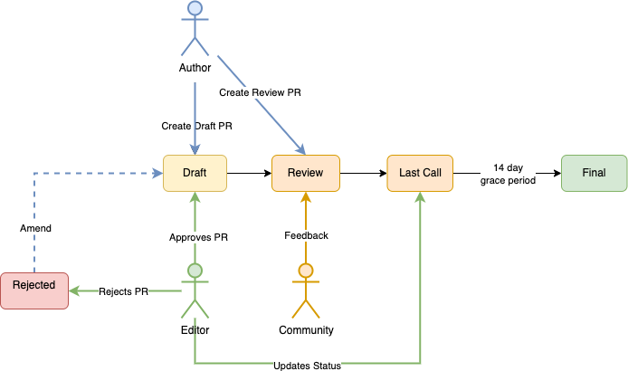

## What is an NEP?

NEP stands for Near Enhancement Proposal. An NEP is a design
document providing information to the Near community, or describing
a new feature for the Near protocol, Smart Contract standards, or it's environment. 
The NEP should provide a concise technical specification of the feature and a
rationale for the feature.

NEPs are intented to be the primary mechanism for proposing new features, interfacing
with the community on an issue and documenting design decisions that have
been integrated into Near's runtime or Smart Contract ecosystem.

As such, the NEP author is responsible for building consensus within the community and documenting dissenting opinions.

## NEP Audience

The typical primary audience for NEPs are the core developers of the Near
reference implementations, and Near Smart Contract developers.

However, other parts of the Near community may also choose to use the process
(particularly for Informational NEPs) to document expected API conventions and
to manage complex design coordination problems that require collaboration across
multiple projects.

## NEP Types

There are three kinds of NEP:

1. A **Standards Track** NEP describes a new feature or implementation
   for the Near protocol or Near Smart Contract implementation standards.

2. An **Informational** NEP describes a Near design issue, or
   provides general guidelines or information to the Near community,
   but does not propose a new feature. Informational NEPs do not
   necessarily represent a Near community consensus or
   recommendation, so users and implementers can ignore
   Informational NEPs or follow their advice.

3. A **Process** NEP describes a process surrounding Near, or
   proposes a change to (or an event in) a process. Process NEPs are
   like Standards Track NEPs but apply to areas other than the Near
   platform itself. They may propose an implementation, but not to
   Near's codebase; they often require community consensus; unlike
   Informational NEPs, they are more than recommendations, and users
   are typically not free to ignore them. Examples include
   procedures, guidelines, changes to the decision-making process, and
   changes to the tools or environment used in Near development.
   Any meta-NEP is also considered a Process NEP.

## NEP Workflow

### Start with an idea for Near

The NEP process begins with a new idea for the Near ecosystem. It is
recommended that a single NEP contain a single key proposal or new
idea. 

Each NEP must have a torch-bearer: someone who writes the NEP using the style
and format described below, shepherds the discussions in the appropriate
forums, and attempts to build community consensus around the idea. This NEP Author
should first attempt to ascertain whether the idea is
NEP-able. 

Vetting an idea publicly before going as far as writing an NEP is meant
to save the potential author time. Many ideas have been brought
forward for changing Near that have been rejected for various
reasons. Asking the Near community first if an idea is original
helps prevent too much time being spent on something that is
guaranteed to be rejected based on prior discussions. It also helps to make sure
the idea is applicable to the entire community and not just the author.
Just because an idea sounds good to the author does not
mean it will work for most people in most areas where Near is used.

In general the process is:

* Sign up for the [governance site](https://gov.near.org/) and make a post to the 
appropriate section. For instance, during the ideation phase of a standard, one might 
start a new conversation in the 
[Development » Standards section](https://gov.near.org/c/dev/standards/29).

* The forum has comment threading which allows the community and NEAR Collective 
to ideate, ask questions, wrestle with approaches, etc. If more immediate responses 
are desired, consider bringing the conversation [to Discord](https://near.chat).

Once the torch-bearer has asked the Near community as to whether an
idea has any chance of acceptance, a draft NEP should be presented to
the appropriate venue mentioned above. This gives the author a chance to flesh out the draft
NEP to make properly formatted, of high quality, and to address
initial concerns about the proposal.

## The Proposal Process
One of the primary goals of the NEP process is to prevent proposals being stuck in a limbo state of always being in progress, therefore NEP participants shall commit to always either accept or reject a `Draft` proposal.

It can be rejected for the following reasons:

* No-op proposal. It does not improve any of our values or velocity

* Unjustifiable trade-offs. It makes the trade-offs in technological values or velocity that are not justifiable. Note, that if proposal is too difficult to implement or it adds too much architectural complexity it can be rejected as impeding future velocity too much.

* Not ready. The proposal does not satisfy the required format, e.g. it does not explain all standard scenarios. Also, we don’t want the proposal discussion the be the place where the process is created, and so the authors and the proponents should come with a sufficiently ready proposal and do not expect to iterate on it with the community. They can however iterate on the proposal with the community in other open forums outside the official proposal process. Therefore, if proposal is submitted but community keeps finding gaps in the proposal, e.g. like reasonable alternatives, adversarial angles or gaps in the design, then even if author and proponents continue explaining them, after some time proposal runs out of time and is rejected.

* Duplicate. A similar proposal has been already submitted and the author did not explain the difference sufficiently.

* Spam. Someone is trying to get their proposal through by spamming;
The time-line of the proposal is the following:

### Initial phase (1 week at most)

1.1. The process is initiated by an author submitting it in `Draft` status.

1.2. The proposal is examined by the admins. If it deviates from the format the proposal's status is set to `Rejected` and allowed to be resubmitted in 1 month.

1.3. Admins invite SMEs (some SMEs recognized by admins might join voluntarily) and representatives from the affected projects.

1.4. (Optional) The stakeholders hire the auditors.

1.5. Admins update the status to `Review` to indicate readiness for the next phase.

### Discussion phase (2 months at most)

2.1. SMEs and affected projects weigh-in.

2.2. Auditors respond with their findings.

2.3. Other community members join the discussion.

2.4. Once the proposal is at the point where it is exhaustive, non-ambiguous, highly-detailed, and all findings are addressed and incorporated into the proposal, the admins make a decision on accepting or rejecting it.

2.5. If proposal runs out of time it is rejected.

### Implementation phase
3.1. Admins invite representatives from the affected projects and the implementers to discuss the timeline of rolling out the feature. Once the timeline is agreed on, the remaining process is delegated to the implementers.


## Submitting an NEP

Following the above initial discussions, the workflow, the proposal should be 
submitted as a `draft` NEP via a GitHub pull request. The draft must be written 
in NEP style as described below, else it will fail review immediately (although 
minor errors may be corrected by the editors).

The standard NEP workflow is:

* You, the NEP author, fork the `NEPs repository`, and create a file named
  ``neps/nep-9999.md`` that contains your new NEP. Use "9999" as your draft NEP
  number.

* Your first update will be to change the nep filename to match the Pull Request
  number. For example, if the PR is `305`, the NEP should be `neps/nep-0305.md`.

* In the "Type:" header field, enter "Standards Track",
  "Informational", or "Process" as appropriate, and for the "Status:"
  field enter "Draft". For full details, see `NEP Header Preamble`.

* Push this to your GitHub fork and submit a pull request.

* The NEP editors review your PR for structure, formatting, and other
  errors. For a markdown-formatted NEP, `nep-template.md` is provided as a template.
  Approval criteria are:

  * It is sound and complete. The ideas must make technical sense. The
    editors do not consider whether they seem likely to be accepted.
  * The title accurately describes the content.
  * The NEP's language (spelling, grammar, sentence structure, etc.)
    and code style should be correct and conformant.

  If the NEP isn't ready for approval, an editor will send it back to
  the author for revision, with specific instructions in the pull request.

Once the review process is complete, and the NEP editors approve or reject it (note that
this is *not* the same as accepting your NEP!), they will squash commit your
pull request onto main.

The NEP editors will not unreasonably deny publication of an NEP. Reasons for
denying NEP status include duplication of effort, being technically unsound,
not providing proper motivation or addressing backwards compatibility, or not
in keeping with the NEAR philosophy.

As updates are necessary, the NEP author can check in new versions if they
(or a collaborating developer) have write access to the `NEP repository`.

Standards Track NEPs consist of two parts, a design document and a
reference implementation. It is generally recommended that at least a
prototype implementation be co-developed with the NEP, as ideas that sound
good in principle sometimes turn out to be impractical when subjected to the
test of implementation.

## NEP Maintenance

Informational and Process NEPs may be updated over time to reflect changes to 
development practices and other details. The precise process followed in these 
cases will depend on the nature and purpose of the NEP being updated. In general, 
Standards track NEP's are no longer modified after they have reached the Final state.

## NEP Process States 

The following is the standardization process for all NEPs in all tracks:



**Idea** - An idea that is pre-draft. This is not tracked within the NEP Repository.

**Draft** - The first formally tracked stage of an NEP in development. An NEP is merged by an NEP Editor into the NEP repository when properly formatted and vetted, see `Initial Phase` in the previous section.

**Review** - An NEP Author marks an NEP as ready for and requesting Peer Review.

**Last Call** - This is the final review window for an NEP before moving to `Final`. An NEP editor will assign `Last Call` status and set a review end date (`last-call-deadline`), typically 14 days later.

If this period results in necessary normative changes it will revert the NEP to `Review`.

**Final** - This NEP represents the final standard. A Final NEP exists in a state of finality and should only be updated to correct errata and add non-normative clarifications.

**Living** - A special status for NEPs that are designed to be continually updated and not reach a state of finality. This includes most notably NEP-0001.

## What does a successful NEP look like?

Each NEP should have the following parts/sections:

1. Preamble - [RFC 822](https://www.ietf.org/rfc/rfc822.txt) style headers 
   containing meta-data about the NEP, including the NEP number, a short descriptive 
   title, the names, and optionally the contact info for each author, etc.

2. Summary - a short (~200 word) description of the technical issue being addressed.

3. Motivation - The motivation section should
   clearly explain why the existing contract ecosystem is
   inadequate to address the problem that the NEP solves. This can
   include collecting documented support for the NEP from important
   projects in the Near ecosystem. NEP submissions without
   sufficient motivation may be rejected.

4. Rationale and alternatives - The rationale fleshes out the specification by
   describing why particular design decisions were made.  It should
   describe alternate designs that were considered and related work,
   e.g. how the feature is supported in other platforms.

5. Specification - The technical specification should describe the
   syntax and semantics of the contract or protocol feature. The
   specification should be detailed enough to allow competing,
   interoperable implementations for at least the current major Near
   version.

6. Reference Implementation - The reference implementation must be
   completed before any `Standards Track` in the `Contract` category NEP 
   is given status "Final", but it need not be completed before the NEP 
   is accepted. For other Categories, this section is optional.
   
   While there is merit to the approach of reaching consensus on the 
   specification and rationale before writing code, the principle of 
   "rough consensus and running code" is still useful when it comes 
   to resolving many discussions of API details.

   The final implementation must include test code and documentation
   appropriate in a Near-compatible contract language.

   Appropriate judgement should be used when defining the reference 
   implementation, which can be included inline or reference an 
   external github repository.

   Where possible, include a `Minimum Viable Interface` expressing the 
   required behavior and types in a target Near Contract language. 
   (ie. traits and structs for rust, interfaces and classes for javascript, 
   function signatures and structs for c, etc.) Expressions of such 
   interfaces helps define the link between contract standardization 
   and implementation.

7. Security Implications - If there are security concerns in relation
   to the NEP, those concerns should be explicitly written out to make
   sure reviewers of the NEP are aware of them.

8. Drawbacks - Throughout the discussion of an NEP, various ideas
    will be proposed which are not accepted. Those rejected ideas should
    be recorded along with the reasoning as to why they were rejected.
    This both helps record the thought process behind the final version
    of the NEP as well as preventing people from bringing up the same
    rejected idea again in subsequent discussions.

    In a way this section can be thought of as a breakout section of the
    Rationale section that is focused specifically on why certain ideas
    were not ultimately pursued.

9. Unresolved Issues - While an NEP is in draft, ideas can come up which
    warrant further discussion. Those ideas should be recorded so people
    know that they are being thought about but do not have a concrete
    resolution. This helps make sure all issues required for the NEP to be
    ready for consideration are complete and reduces people duplicating
    prior discussion.

10. Future possibilities - Future possibilities describes any natural extensions 
    and evolutions to the NEP proposal and how it would affect the project. 
    Try to use this section as a tool to more fully consider all possible
    interactions with the project in your proposal.
    Also consider how the this all fits into the roadmap for the project
    and of the relevant sub-teams.

11. Copyright Waiver - All NEPs must be in the public domain. See the bottom 
    of this NEP for an example copyright waiver.


## NEP Header Preamble

Each NEP must begin with an [RFC 822](https://www.ietf.org/rfc/rfc822.txt) style 
header preamble. The headers must appear in the following order.

```
  NEP: <NEP number>
  Title: <NEP title>
  Author: <list of authors' real names and optionally, email addrs>
  DiscussionsTo: <URL of current canonical discussion thread or threads>
  Status: <Draft | Review | Last Call | Final | Living | Deprecated>
  Type: <Standards Track | Informational | Process>
  Category: if Type is "Standards Track" one of <Protocol | Contract | Runtime>
  Requires (Optional): <NEP numbers>  
  Replaces (Optional): <NEP number>
  SupersededBy (Optional): <NEP number>
  Created: <date created on, in dd-mmm-yyyy format>
```

`Title`: The NEP title header should not be more than 4-5 words, describing

`Author`: The Author header lists the names, and optionally the email addresses
of all the authors/owners of the NEP. The format of the Author header
value must be

    Random J. User <address@dom.ain>

if the email address is included, and just

    Random J. User

If there are multiple authors, each should be on a separate line
following [RFC 822](https://www.ietf.org/rfc/rfc822.txt) continuation line conventions.

`DiscussionsTo`: The DiscussionsTo header provides the URL to the current
canonical discussion thread for the NEP.

`Type`: The Type header specifies the type of NEP: Standards Track,
Informational, or Process.

`Category`: The Category header only exists iff the Type header is `Standards Track`, 
one of Protocol, Contract or Runtime.

`Created`: The Created header records the date that the NEP was assigned a
number, should be in dd-mmm-yyyy format, e.g. 03-Mar-2022.

`Requires`: NEPs may have a Requires header, indicating the NEP numbers that this
NEP depends on.

`SupersededBy`: NEPs may also have a SupersededBy header indicating that an NEP has
been rendered obsolete by a later document; the value is the number of
the NEP that replaces the current document. 

`Replaces`: A newer NEP marked with a SupercededBy header must have a Replaces header 
containing the number of the NEP that it rendered obsolete.

## Auxiliary Files

Images, diagrams and auxiliary files should be included in a subdirectory of the assets 
folder for that NEP as follows: `assets/nep-N` (where N is to be replaced with the NEP number). 
When linking to an image in the NEP, use relative links such as ../assets/nep-1/image.png

## Transferring NEP Ownership

It occasionally becomes necessary to transfer ownership of NEPs to a
new torch-bearer. In general, it is preferable to retain the original author as
a co-author of the transferred NEP, but that's really up to the
original author. A good reason to transfer ownership is because the
original author no longer has the time or interest in updating it or
following through with the NEP process. A bad
reason to transfer ownership is because the author doesn't agree with the
direction of the NEP. One aim of the NEP process is to try to build
consensus around an NEP, but if that's not possible, an author can
submit a competing NEP.

If you are interested in assuming ownership of an NEP, you can also do this via
pull request. Fork the `NEP repository`, make your ownership modification,
and submit a pull request. You should mention both the original author and
``@near/nep-editors`` in a comment on the pull request. 

## Roles, Ownership, and Accountability
The overall NEP process should balance democracy and inclusivity, with accountability. This means the proposal needs to have owners – people who carry the burden of proving “beyond reasonable doubt” that the proposed design does what it claims to do and that it does not negatively affect our technological values or impede future velocity. The owners of the proposal are the author and its potential proponents. It is their responsibility to prove that the proposal works, and it is not responsibility of others to prove that it does not work. The default decision for any protocol change should be a No.

There are defined administators who will decide when the proposal is accepted or rejected. In the long run, this will be a council elected by the stakeholders, which most likely will be only the validators and people that validators consider as an authority or experts, since validators have an ultimate control of deciding which protocol version to run on their machines. In the short term, process admins will be a preselected group of people. Admins will also be moderating the discussion once the proposal is submitted to make sure the discussion is civil and focused.

As explained above, there will be opponents and people nominated to play the opposing force and try to do the following:

* Find gaps, double-interpretations, inconsistencies
* Suggest better alternatives and ask author and proponents to justify why alternative is not better
* Find angles of attack and other kinds of abuse
* If the proposed design makes trade-offs with our technological values and velocity, then argue why these trade-offs are not justifiable
* Additionally, there are people who work on different parts of the protocol and have deep understanding of it. It makes sense to invite them into the discussion and when judgement call is needed (e.g. when the trade-offs are present) ask them to weigh-in.

To summarize, the roles are:

### Author
Election process: Self-elected by submitting a proposal.

Responsibilities: Submit the proposal following the format, address the comments from the community until proposal is accepted.

### Administrator (Editor)
Election process: Initially pre-selected, but eventually elected by the validators. They are the same for all proposals.

Responsibilities: Moderate the discussion, make the final accept/reject decision, enforce the timeline, recognize/invite subject matter experts.

### Incentivized Auditors
Election process: Funded by stakeholders, e.g. NEAR Foundation;
Responsibilities: scrutinize the proposal, the incentive model might be paying per finding.

### Subject Matter Experts (SMEs)
Election process: recognized or nominated by admins either for all proposals or for specific proposals.

Responsibilities: Present their take on the specific proposal.

### Affected projects
Election process: The author of the proposal needs to list all major projects that will be affected by the change in the proposal. Admins then invite representatives from major projects for the discussion.

Responsibilities: Explain in detail how they will be affected if the proposal is implemented.

### Community Members
Election process: none, anyone can join the discussion as proponent, opponent, or non-incentivized auditor.

Responsibilities: Add clarity to the discussion, surface issues, present alternative points of view.

### Implementers
Election process: self-elected by being one of the owners of a client implementation for our protocol.

Responsibilities: implement the change, if accepted. Very likely, they will be in sync with the validators and other stakeholders so they will have an interest in implementing the change;
Note, some roles might overlap, e.g. the implementers will also likely be the SMEs. However, certain roles should be separate to avoid conflicts of interest, e.g. the author should be separate from the admins and the auditors. If the admins want to submit a proposal themselves then they need to recuse themselves from the process.

## Style Guide

#### NEP numbers

When referring to an NEP by number, it should be written in the hyphenated 
form `NEP-X` where `X` is the NEP's assigned number.

#### RFC 2119

NEPs are encouraged to follow [RFC 2119](https://www.ietf.org/rfc/rfc2119.txt) for 
terminology and to insert the following at the beginning of the Specification section:

> The key words “MUST”, “MUST NOT”, “REQUIRED”, “SHALL”, “SHALL NOT”, “SHOULD”, “SHOULD NOT”, “RECOMMENDED”, “MAY”, and “OPTIONAL” in this document are to be interpreted as described in RFC 2119.

## References

The content of this document was derived heavily from the PEP, BIP, Rust RFC
and EIP standards boostrap documents:

* Klock, F et al. Rust: RFC-0002: RFC Process. https://github.com/rust-lang/rfcs/blob/master/text/0002-rfc-process.md
* Taaki, A. et al. Bitcoin Improvement Proposal: BIP:1, BIP Purpose and Guidelines. https://github.com/bitcoin/bips/blob/master/bip-0001.mediawiki
* Warsaw, B. et al. Python Enhancement Proposal: PEP Purpose and Guidelines. https://github.com/python/peps/blob/main/pep-0001.txt
* Becze, M. et al. Ethereum Improvement Proposal EIP1: EIP Purpose and Guidelines. https://github.com/ethereum/EIPs/blob/master/EIPS/eip-1.md

## Copyright

Copyright and related rights waived via [CC0](https://creativecommons.org/publicdomain/zero/1.0/).
