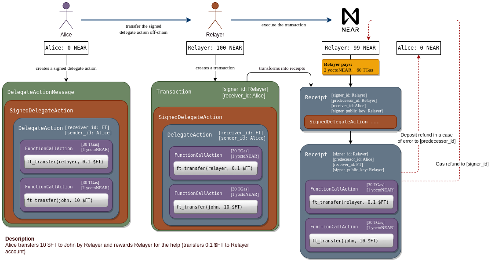

## Summary

In-protocol meta transactions allow third-party accounts to initiate and pay transaction fees on behalf of the account.

## Motivation

NEAR has been designed with simplicity of onboarding in mind. One of the large hurdles right now is that after creating an implicit or even named account the user does not have NEAR to pay gas fees to interact with apps.

For example, apps that pay user for doing work (like NEARCrowd or Sweatcoin) or free-to-play games.

[Aurora Plus](https://aurora.plus) has shown viability of the relayers that can offer some number of free transactions and a subscription model. Shifting the complexity of dealing with fees to the infrastructure from the user space.

## Rationale and alternatives

The proposed design here provides the easiest way for users and developers to onboard and to pay for user transactions.

An alternative is to have a proxy contract deployed on the user account.
This design has severe limitations as it requires the user to deploy such contract and incur additional costs for storage.

## Specification

- **User** (Sender) is the one who is going to send the `DelegateAction` to Receiver via Relayer.
- **Relayer** is the one who publishes the `DelegateAction` to the protocol.
- **User** and Relayer doesn't trust each other.

The main flow of the meta transaction will be as follows:

- User specifies `sender_id` (the user's account id), `receiver_id` (the receiver's account id) and other information (see `DelegateAction` format).
- User signs `DelegateAction` specifying the set of actions that they need to be executed.
- User forms `SignedDelegateAction` with the `DelegateAction` and the signature.
- User forms `DelegateActionMessage` with the `SignedDelegateAction`.
- User sends `DelegateActionMessage` data to the relayer.
- Relayer verifies actions specified in `DelegateAction`: the total cost and whether the user included the reward for the relayer.
- Relayer forms a `Transaction` with `receiver_id` equals to `delegate_action.sender_id` and `actions: [SignedDelegateAction { ... }]`. Signs it with its key. Note that such transactions can contain other actions toward user's account (for example calling a function).
- This transaction is processed normally. A `Receipt` is created with a copy of the actions in the transaction.
- When processing a `SignedDelegateAction`, a number of checks are done (see below), mainly a check to ensure that the `signature` matches the user account's key.
- When a `Receipt` with a valid `SignedDelegateAction` in actions arrives at the user's account, it gets executed. Execution means creation of a new Receipt with `receiver_id: AccountId` and `actions: Action` matching `receiver_id` and `actions` in the `DelegateAction`.
- The new `Receipt` looks like a normal receipt that could have originated from the user's account, with `predeccessor_id` equal to tbe user's account, `signer_id` equal to the relayer's account, `signer_public_key` equal to the relayer's public key.

## Diagram



## Limitations

- If User account exist, then deposit and gas are refunded as usual: gas is refuned to Relayer, deposit is refunded to User.
- If User account doesn't exist then gas is refunded to Relayer, deposit is burnt.
- `DelegateAction` actions mustn't contain another `DelegateAction` (`DelegateAction` can't contain the nested ones).

### DelegateAction

Delegate actions allow an account to initiate a batch of actions on behalf of a receiving account, allowing proxy actions. This can be used to implement meta transactions.

```rust
pub struct DelegateAction {
    /// Signer of the delegated actions
    sender_id: AccountId,
    /// Receiver of the delegated actions.
    receiver_id: AccountId,
    /// List of actions to be executed.
    actions: Vec<Action>,
    /// Nonce to ensure that the same delegate action is not sent twice by a relayer and should match for given account's `public_key`.
    /// After this action is processed it will increment.
    nonce: Nonce,
    /// The maximal height of the block in the blockchain below which the given DelegateAction is valid.
    max_block_height: BlockHeight,
    /// Public key that is used to sign this delegated action.
    public_key: PublicKey,
}
```

```rust
pub struct SignedDelegateAction {
    delegate_action: DelegateAction,
    /// Signature of the `DelegateAction`.
    signature: Signature,
}
```

Supporting batches of `actions` means `DelegateAction` can be used to initiate complex steps like creating new accounts, transferring funds, deploying contracts, and executing an initialization function all within the same transaction.

##### Validation

1. Validate `DelegateAction` doesn't contain a nested `DelegateAction` in actions.
2. To ensure that a `DelegateAction` is correct, on receipt the following signature verification is performed: `verify_signature(hash(delegate_action), delegate_action.public_key, signature)`.
3. Verify `transaction.receiver_id` matches `delegate_action.sender_id`.
4. Verify `delegate_action.max_block_height`. The `max_block_height` must be greater than the current block height (at the `DelegateAction` processing time).
5. Verify `delegate_action.sender_id` owns `delegate_action.public_key`.
6. Verify `delegate_action.nonce > sender.access_key.nonce`.

A `message` is formed in the following format:

```rust
struct DelegateActionMessage {
    signed_delegate_action: SignedDelegateAction
}
```

The next set of security concerns are addressed by this format:

- `sender_id` is included to ensure that the relayer sets the correct `transaction.receiver_id`.
- `max_block_height` is included to ensure that the `DelegateAction` isn't expired.
- `nonce` is included to ensure that the `DelegateAction` can't be replayed again.
- `public_key` and `sender_id` are needed to ensure that on the right account, work across rotating keys and fetch the correct `nonce`.

The permissions are verified based on the variant of `public_key`:

- `AccessKeyPermission::FullAccess`, all actions are allowed.
- `AccessKeyPermission::FunctionCall`, only a single `FunctionCall` action is allowed in `actions`.
  - `DelegateAction.receiver_id` must match to the `account[public_key].receiver_id`
  - `DelegateAction.actions[0].method_name` must be in the `account[public_key].method_names`

##### Outcomes

- If the `signature` matches the receiver's account's `public_key`, a new receipt is created from this account with a set of `ActionReceipt { receiver_id, action }` for each action in `actions`.

##### Recommendations

- Because the User doesn't trust the Relayer, the User should verify whether the Relayer has submitted the `DelegateAction` and the execution result.

### Errors

- If the Sender's account doesn't exist

```rust
/// Happens when TX receiver_id doesn't exist
AccountDoesNotExist
```

- If the `signature` does not match the data and the `public_key` of the given key, then the following error will be returned

```rust
/// Signature does not match the provided actions and given signer public key.
DelegateActionInvalidSignature
```

- If the `sender_id` doesn't match the `tx.receiver_id`

```rust
/// Receiver of the transaction doesn't match Sender of the delegate action
DelegateActionSenderDoesNotMatchTxReceiver
```

- If the current block is equal or greater than `max_block_height`

```rust
/// Delegate action has expired
DelegateActionExpired
```

- If the `public_key` does not exist for Sender account

```rust
/// The given public key doesn't exist for Sender account
DelegateActionAccessKeyError
```

- If the `nonce` does match the `public_key` for the `sender_id`

```rust
/// Nonce must be greater sender[public_key].nonce
DelegateActionInvalidNonce
```

- If `nonce` is too large

```rust
/// DelegateAction nonce is larger than the upper bound given by the block height (block_height * 1e6)
DelegateActionNonceTooLarge
```

- If the list of Transaction actions contains several `DelegateAction`

```rust
/// There should be the only one DelegateAction
DelegateActionMustBeOnlyOne
```

See the [DelegateAction specification](/specs/RuntimeSpec/Actions.md#DelegateAction) for details.

## Security Implications

Delegate actions do not override `signer_public_key`, leaving that to the original signer that initiated the transaction (e.g. the relayer in the meta transaction case). Although it is possible to override the `signer_public_key` in the context with one from the `DelegateAction`, there is no clear value in that.

See the **_Validation_** section in [DelegateAction specification](/specs/RuntimeSpec/Actions.md#DelegateAction) for security considerations around what the user signs and the validation of actions with different permissions.

## Drawbacks

- Increases complexity of NEAR's transactional model.
- Meta transactions take an extra block to execute, as they first need to be included by the originating account, then routed to the delegate account, and only after that to the real destination.
- User can't call functions from different contracts in same `DelegateAction`. This is because `DelegateAction` has only one receiver for all inner actions.
- The Relayer must verify most of the parameters before submitting `DelegateAction`, making sure that one of the function calls is the reward action. Either way, this is a risk for Relayer in general.
- User must not trust Relayer’s response and should check execution errors in Blockchain.

## Future possibilities

Supporting ZK proofs instead of just signatures can allow for anonymous transactions, which pay fees to relayers anonymously.

## Changelog

### 1.1.0 - Adjust errors to reflect deployed reality (03-Aug`2023)

- Remove the error variant `DelegateActionCantContainNestedOne` because this would already fail in the parsing stage.
- Rename the error variant `DelegateActionSenderDoesNotMatchReceiver` to `DelegateActionSenderDoesNotMatchTxReceiver` to reflect published types in [near_primitives](https://docs.rs/near-primitives/0.17.0/near_primitives/errors/enum.ActionErrorKind.html#variant.DelegateActionSenderDoesNotMatchTxReceiver).

## Copyright

Copyright and related rights waived via [CC0](https://creativecommons.org/publicdomain/zero/1.0/).
