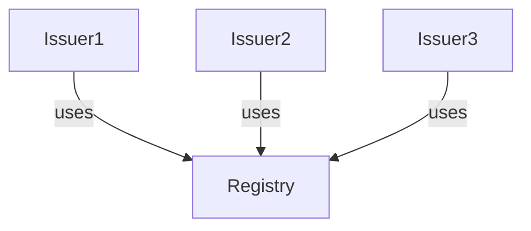
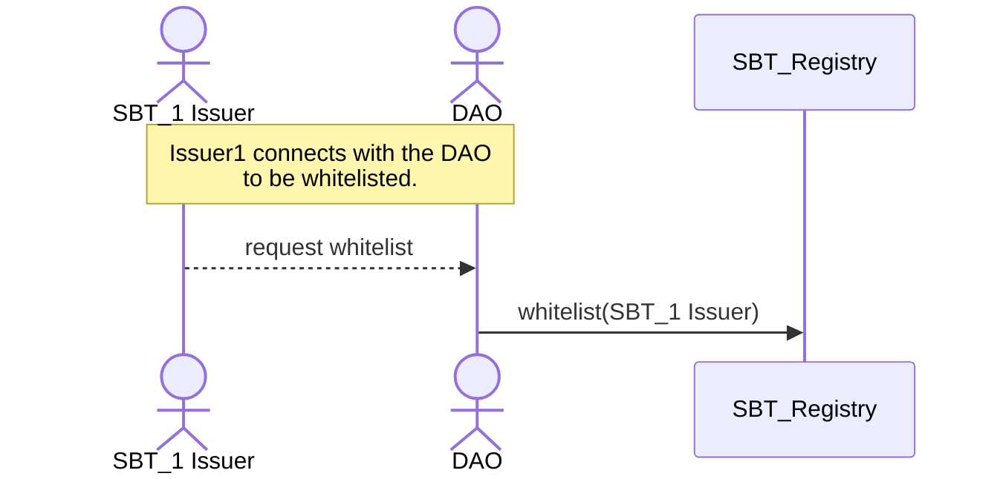
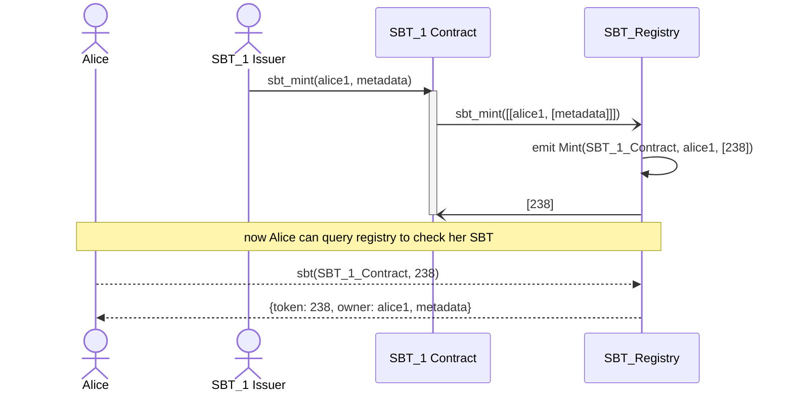
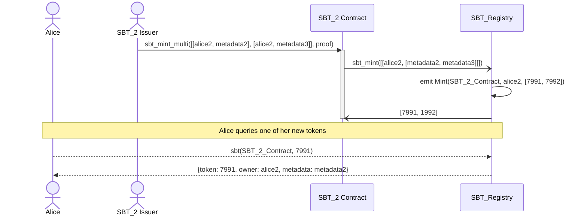
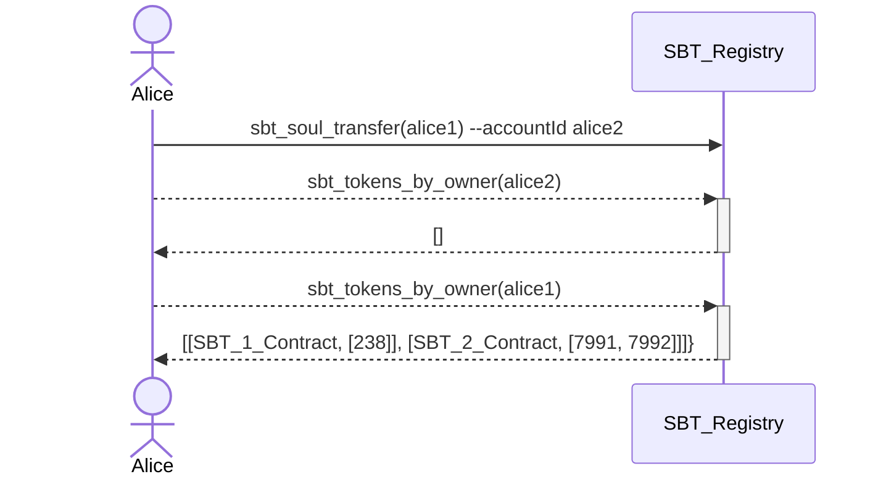

## Summary

Soulbound Token (SBT) is a form of a non-fungible token which represents an aspect of an account: _soul_. [Transferability](#transferability) is limited only to a case of recoverability or a _soul transfer_. The latter must coordinate with a registry to transfer all SBTs from one account to another, and _banning_ the source account.

SBTs are well suited for carrying proof-of-attendance, proof-of-unique-human "stamps" and other similar credibility-carriers.

## Motivation

Recent [Decentralized Society](https://www.bankless.com/decentralized-society-desoc-explained) trends open a new area of Web3 research to model various aspects of what characterizes humans. Economic and governance value is generated by humans and their relationship. SBTs can represent the commitments, credentials, and affiliations of “Souls” that encode the trust networks of the real economy to establish provenance and reputation.

> More importantly, SBTs enable other applications of increasing ambition, such as community wallet recovery, Sybil-resistant governance, mechanisms for decentralization, and novel markets with decomposable, shared rights. We call this richer, pluralistic ecosystem “Decentralized Society” (DeSoc)—a co-determined sociality, where Souls and communities come together bottom-up, as emergent properties of each other to co-create plural network goods and intelligences, at a range of scales.

Creating strong primitives is necessary to model new innovative systems and decentralized societies. Examples include reputation protocols, non-transferrable certificates, non-transferrable rights, undercollateralized lending, proof-of-personhood, proof-of-attendance, proof-of-skill, one-person-one-vote, fair airdrops & ICOs, universal basic income, non KYC identity systems, Human DAOs and methods for Sybil attack resistance.

We propose an SBT standard to model protocols described above.

_Verifiable Credentials_ (VC) could be seen as subset of SBT. However there is an important distinction: VC require set of claims and privacy protocols. It would make more sense to model VC with relation to W3 DID standard. SBT is different, it doesn't require a [resolver](https://www.w3.org/TR/did-core/#dfn-did-resolvers) nor [method](https://www.w3.org/TR/did-core/#dfn-did-methods) registry. For SBT, we need something more elastic than VC.

## Specification

Main requirement for Soulbound tokens is to bound an account to a human. A **Soul** is an account with SBTs, which are used to define account identity.
Often non transferrable NFT (an NFT token with a no-op transfer function) is used to implement SBTs. However, such model is rather shortsighted. Transferability is required to allow users to either recover their SBTs or merge between the accounts they own. At the same time, we need to limit transferability to assure that an SBTs is kept bound to the same _soul_.
We also need an efficient on way to make composed ownership queries (for example: check if an account owns SBT of class C1, C2 and C3 issued by issuer I1, I2 and I3 respectively) - this is needed to model emergent properties discussed above.

We introduce a **soul transfer**: an ability for user to move ALL SBT tokens from one account to another in a [semi atomic](#soul-transfer) way, while keeping the SBT bounded to the same _soul_. This happens when a user needs to merge his accounts (e.g. they started with a few different accounts but later decides to merge them to increase an account reputation). Soul transfer is different than a token transfer. The standard forbids a traditional token transfer functionality, where a user can transfer individual tokens. That being said, a registry can have extension functions for more advanced scenarios, which could require a governance approval.

SBT standard separates the token issuer concept from the token registry in order to meet the requirements listed above.
In the following sections we discuss the functionality of an issuer and registry.

### SBT Registry

Traditional Token model in NEAR blockchain assumes that each token has it's own balance book and implements the authorization and issuance mechanism in the same smart contract. Such model prevents atomic _soul transfer_ in the current NEAR runtime. When token balance is kept separately in each SBT smart contract, synchronizing transfer calls to all such contracts to assure atomicity is not possible at scale. We need an additional contract, the `SBT Registry`, to provide atomic transfer of all user SBTs and efficient way to ban accounts in relation to the Ban event discussed below.
This, and efficient cross-issuer queries are the main reasons SBT standards separates that token registry and token issuance concerns.

Issuer is an entity which issues new tokens and potentially can update the tokens (for example execute renewal). All standard modification options are discussed in the sections below.

Registry is a smart contract, where issuers register the tokens. Registry provides a balance book of all associated SBTs. Registry must ensure that each issuer has it's own "sandbox" and issuers won't overwrite each other. A registry provides an efficient way to query multiple tokens for a single user. This will allow implementation of use cases such us:

- SBT based identities (main use case of the `i-am-human` protocol);
- SBT classes;
- decentralized societies.



We can have multiple competing registries (with different purpose or different management scheme). An SBT issuer SHOULD opt-in to a registry before being able to use registry. Registries may develop different opt-in mechanisms (they could differ by the approval mechanism, be fully permissioned etc..). One SBT smart contract can opt-in to:

- many registries: it MUST relay all state change functions to all registries.
- or to no registry. We should think about it as a single token registry, and it MUST strictly implement all SBT Registry query functions by itself. The contract address must be part of the arguments, and it must check that it equals to the deployed account address (`require!(ctr == env::current_account_id())`). It also MUST emit related events by itself.

We recommend that each issuer will use only one registry to avoid complex reconciliation and assure single source of truth.

The registry fills a central and important role. But it is **not centralized**, as anyone can create their own registry and SBT issuers can choose which registry to use. It's also not too powerful, as almost all of the power (mint, revoke, burn, recover, etc) still remains with the SBT issuer and not with the registry.

#### Issuer authorization

A registry can limit which issuers can use registry to mint SBTs by implementing a custom issuer whitelist methods (for example simple access control list managed by a DAO) or keep it fully open (allowing any issuer minting withing the registry).

Example: an `SBT_1 Issuer` wants to mint tokens using the `SBT_Registry`. The `SBT_Registry` has a DAO which votes on adding a new issuer:



#### Personal Identifiable Information

Issuers must not include any PII into any SBT.

### Account Ban

`Ban` is an event emitted by a registry signaling that the account is banned, and can't own any SBT. Registry must return zero for every SBT supply query of a banned account. Operations which trigger soul transfer must emit Ban.

A registry can emit a `Ban` for use cases not discussed in this standard. Handling it depends on the registry governance. One example is to use social governance to identify fake accounts (like bots) - in that case the registry should allow to emit `Ban` and block a scam soul and block future transfers.
NOTE: an SBT Issuer can have it's own list of blocked accounts or allowed only accounts.

### Minting

Minting is done by issuer calling `registry.sbt_mint(tokens_to_mint)` method. Standard doesn't specify how a registry authorizes an issuer. A classical approach is a whitelist of issuers: any whitelisted issuer can mint any amount of new tokens. Registry must keep the balances and assign token IDs to newly minted tokens.

Example: Alice has two accounts: `alice1` and `alice2` which she used to mint tokens. She is getting tokens from 2 issuers that use the same registry. Alice uses her `alice1` account to interact with `SBT_1 Issuer` and receives an SBT with token ID = 238:



With `SBT_2 Issuer`, Alice uses her `alice2` account. Note that `SBT_2 Contract` has different mint function (can mint many tokens at once), and validates a proof prior to requesting the registry to mint the tokens.



### Transferability

Safeguards are set against misuse of SBT transfer and keep the _soul bound_ property. SBT transfer from one account to another should be strictly limited to:

- **revocation** allows issuer to invalidate or burn an SBT in case a token issuance should be reverted (for example the recipient is a Sybil account, that is an account controlled by an entity trying to create the false appearance);
- **recoverability** in case a user's private key is compromised due to extortion, loss, etc. Users cannot recover an SBT only by themselves. Users must connect with issuer to request recoverability or use more advanced mechanism (like social recoverability). The recovery function provides additional economical cost preventing account trading: user should always be able to recover his SBT, and move to another, not banned account.
- **soul transfer** - moving all SBT tokens from a source account (issued by all issuers) to a destination account. During such transfer, SBT registry emits `SoulTransfer` and `Ban` events. The latter signals that the account can't host nor receive any SBT in the future, effectively burning the identity of the source account. This creates an inherit cost for the source account: it's identity can't be used any more. Registry can have extension functions for more advanced scenarios, which could require a governance mechanism. `SoulTransfer` event can also trigger similar actions in other registries (specification for this is out of the scope of this NEP).

This becomes especially important for proof-of-human stamps that can only be issued once per user.

#### Revocation

An issuer can revoke SBTs by calling `registry.sbt_revoke(tokens_to_revoke, burn)`. Example: when a related certificate or membership should be revoked, when an issuer finds out that there was an abuse or a scam, etc...). Registry, when receiving `sbt_revoke` request from an issuer must always emit the `Revoke` event. Registry must only accept revoke requests from a valid issuer, and only revoke tokens from that issuer. If `burn=true` is set in the request, then the token should be burned and `Burn` event must be emitted. Otherwise (when `burn=false`) the registry must update token metadata and set expire date to a time in the past. Registry must not ban nor emit `Ban` event when revoking a contract. That would create an attack vector, when a malicious registry would thread the registry by banning accounts.

#### Recoverability

Standard defines issuer recoverability. At minimum, the standard registry exposes `sbt_recover` method, which allows issuer to reassign a token issued by him from one account to another.

SBT recovery MUST not trigger `SoulTransfer` nor `Ban` event: malicious issuer could compromise the system by faking the token recovery and take over all other SBTs from a user. Only the owner of the account can make a Soul Transfer transaction and merge 2 accounts they owns.

#### Recoverability within an SBT Registry

SBT registry can define it's own mechanism to atomically recover all tokens related to one account and execute soul transfer to another account, without going one by one through each SBT issuer (sometimes that might be even not possible). Below we list few ideas a Registry can use to implement recovery:

- KYC based recovery
- Social recovery


SBT Registry based recovery is not part of this specification.

#### Soul Transfer

The basic use case is described above. Registry MUST provide a permissionless method to allow any user to execute soul transfer. It is essential part of the standard, but the exact interface of the method is not part of the standard, because registries may adopt different mechanism and require different arguments.

Soul transfers must be _semi atomic_. That is, the holder account must be non operational (in terms of SBT supply) until the soul transfer is completed. Given the nature of NEAR blockchain, where transactions are limited by gas, big registries may require to implement the Soul Transfer operation in stages. Source and destination accounts should act as a non-soul accounts while the soul transfer operation is ongoing. For example, in the first call, contract can lock the account, and do maximum X amount of transfers. If the list of to be transferred SBTs has not been exhausted, the contract should keep locking the account and remember the last transferred SBT. Subsequent calls by the same user will resume the operation until the list is exhausted.
Soul Transfer must emit the `SoulTransfer` event.

Example: Alice has two accounts: `alice1` and `alice2` which she used to mint tokens (see [mint diagram](#minting)). She decides to merge the accounts by doing Soul Transfer.



Implementation Notes:

- There is a risk of conflict. The standard requires that one account can't have more than one SBT of the same (issuer, class) pair.
- When both `alice1` and `alice2` have SBT of the same (issuer, class) pair, then the transfer should fail. One of the accounts should burn conflicting tokens to be able to continue the soul transfer.
- Soul transfer may require extra confirmation before executing a transfer. For example, if `alice1` wants to do a soul transfer to `alice2`, the contract my require `alice2` approval before continuing the transfer.
- Other techniques may be used to enforce that the source account will be deleted.

### Renewal

Soulbound tokens can have an _expire date_. It is useful for tokens which are related to real world certificates with expire time, or social mechanisms (e.g. community membership). Such tokens SHOULD have an option to be renewable. Examples include mandatory renewal with a frequency to check that the owner is still alive, or renew membership to a DAO that uses SBTs as membership gating.
Registry defines `sbt_renew` method allowing issuers to update the token expire date. The issuer can set the _expire date_ in the past. This is useful if an issuer wants to invalidate the token without removing it.

### Burning tokens

Registry MAY expose a mechanism to allow an account to burn an unwanted token. The exact mechanism is not part of the standard and it will depend on the registry implementation. We only define a standard `Burn` event, which must be emitted each time a token is removed from existence. Some registries may forbid accounts to burn their tokens in order to preserve specific claims. Ultimately, NEAR is a public blockchain, and even if a token is burned, it's trace will be preserved.

### Token Class (multitoken approach)

SBT tokens can't be fractionized. Also, by definition, there should be only one SBT per token class per user. Examples: user should not be able to receive few badges of the same class, or few proof of attendance to the same event.
However, we identify a need for having to support token classes (aka multitoken interface) in a single contract:

- badges: one contract. Each badge will have a class (community lead, OG...), and each token will belong to a specific class;
- certificates: one issuer can create certificates of a different class (eg school department can create diplomas for each major and each graduation year).

We also see a trend in the NFT community and demand for market places to support multi token contracts.

- In Ethereum community many projects are using [ERC-1155 Multi Token Standard](https://eips.ethereum.org/EIPS/eip-1155). NFT projects are using it for fraction ownership: each token id can have many fungible fractions.
- NEAR [NEP-245](https://github.com/near/NEPs/blob/master/neps/nep-0245.md) has elaborated similar interface for both bridge compatibility with EVM chains as well as flexibility to define different token types with different behavior in a single contract. [DevGovGigs Board](https://near.social/#/mob.near/widget/MainPage.Post.Page?accountId=devgovgigs.near&blockHeight=87938945) recently also shows growing interest to move NEP-245 adoption forward.
- [NEP-454](https://github.com/near/NEPs/pull/454) proposes royalties support for multi token contracts.

We propose that the SBT Standard will support the multi-token idea from the get go. This won't increase the complexity of the contract (in a traditional case, where one contract will only issue tokens of the single class, the `class` argument is simply ignored in the state, and in the functions it's required to be of a constant value, eg `1`) but will unify the interface.
It's up to the smart contract design how the token classes is managed. A smart contract can expose an admin function (example: `sbt_new_class() -> ClassId`) or hard code the pre-registered classes.

Finally, we require that each token ID is unique within the smart contract. This will allow us to query token only by token ID, without knowing it's class.

## Smart contract interface

For the Token ID type we propose `u64` rather than `U128`. `u64` capacity is more than 1e19. If we will mint 10'000 SBTs per second, then it will take us 58'494'241 years to fill the capacity.
Today, the JS integer limit is `2^53-1 ~ 9e15`. Similarly, when minting 10'000 SBTs per second, it will take us 28'561 years to reach the limit. So, we don't need u128 nor the String type. However, if for some reason, we will need to get u64 support for JS, then we can always add another set of methods which will return String, so making it compatible with NFT standard (which is using `U128`, which is a string). Also, it's worth to note, that in 28'000 years JS (if it will still exists) will be completely different.
The number of combinations for a single issuer is much higher in fact: the token standard uses classes. So technically that makes the number of all possible combinations for a single issuer equal `(2^64)^2 ~ 1e38`. For "today" JS it is `(2^53-1)^2 ~ 1e31`.

Token IDs MUST be created in a sequence to make sure the ID space is not exhausted locally (eg if a registry would decide to introduce segments, it would potentially get into a trap where one of the segments is filled up very quickly).

```rust
// TokenId and ClassId must be positive (0 is not a valid ID)
pub type TokenId = u64;
pub type ClassId = u64;

pub struct Token {
    pub token: TokenId,
    pub owner: AccountId,
    pub metadata: TokenMetadata,
}
```

The Soulbound Token follows the NFT [NEP-171](https://github.com/near/NEPs/blob/master/neps/nep-0171.md) interface, with few differences:

- token ID is `u64` (as discussed above).
- token class is `u64`, it's required when minting and it's part of the token metadata.
- `TokenMetadata` doesn't have `title`, `description`, `media`, `media_hash`, `copies`, `extra`, `starts_at` nor `updated_at`. All that attributes except the `updated_at` can be part of the document stored at `reference`. `updated_at` can be tracked easily by indexers.
- We don't have traditional transferability.
- We propose to use more targeted events, to better reflect the event nature. Moreover events are emitted by the registry, so we need to include issuer contract address in the event.

All time related attributes are defined in milliseconds (as per NEP-171).

```rust
/// IssuerMetadata defines contract wide attributes, which describes the whole contract.
/// Must be provided by the Issuer contract. See the `SBTIssuer` trait.
pub struct IssuerMetadata {
    /// Version with namespace, example: "sbt-1.0.0". Required.
    pub spec: String,
    /// Issuer Name, required, ex. "Mosaics"
    pub name: String,
    /// Issuer symbol which can be used as a token symbol, eg Ⓝ, ₿, BTC, MOSAIC ...
    pub symbol: String,
    /// Icon content (SVG) or a link to an Icon. If it doesn't start with a scheme (eg: https://)
    /// then `base_uri` should be prepended.
    pub icon: Option<String>,
    /// URI prefix which will be prepended to other links which don't start with a scheme
    /// (eg: ipfs:// or https:// ...).
    pub base_uri: Option<String>,
    /// JSON or an URL to a JSON file with more info. If it doesn't start with a scheme
    /// (eg: https://) then base_uri should be prepended.
    pub reference: Option<String>,
    /// Base64-encoded sha256 hash of JSON from reference field. Required if `reference` is included.
    pub reference_hash: Option<Base64VecU8>,
}

/// ClassMetadata defines SBT class wide attributes, which are shared and default to all SBTs of
/// the given class. Must be provided by the Issuer contract. See the `SBTIssuer` trait.
pub struct ClassMetadata {
    /// Issuer class name. Required to be not empty.
    pub name: String,
    /// If defined, should be used instead of `IssuerMetadata::symbol`.
    pub symbol: Option<String>,
    /// An URL to an Icon. To protect fellow developers from unintentionally triggering any
    /// SSRF vulnerabilities with URL parsers, we don't allow to set an image bytes here.
    /// If it doesn't start with a scheme (eg: https://) then `IssuerMetadata::base_uri`
    /// should be prepended.
    pub icon: Option<String>,
    /// JSON or an URL to a JSON file with more info. If it doesn't start with a scheme
    /// (eg: https://) then base_uri should be prepended.
    pub reference: Option<String>,
    /// Base64-encoded sha256 hash of JSON from reference field. Required if `reference` is included.
    pub reference_hash: Option<Base64VecU8>,
}

/// TokenMetadata defines attributes for each SBT token.
pub struct TokenMetadata {
    pub class: ClassId, // token class. Required. Must be non zero.
    pub issued_at: Option<u64>, // When token was issued or minted, Unix time in milliseconds
    pub expires_at: Option<u64>, // When token expires, Unix time in milliseconds
    /// JSON or an URL to a JSON file with more info. If it doesn't start with a scheme
    /// (eg: https://) then base_uri should be prepended.
    pub reference: Option<String>,
    /// Base64-encoded sha256 hash of JSON from reference field. Required if `reference` is included.
    pub reference_hash: Option<Base64VecU8>,
}


trait SBTRegistry {
    /**********
     * QUERIES
     **********/

    /// Get the information about specific token ID issued by `issuer` SBT contract.
    fn sbt(&self, issuer: AccountId, token: TokenId) -> Option<Token>;

    /// Get the information about list of token IDs issued by the `issuer` SBT contract.
    /// If token ID is not found `None` is set in the specific return index.
    fn sbts(&self, issuer: AccountId, token: Vec<TokenId>) -> Vec<Option<Token>>;

    /// Query class ID for each token ID issued by the SBT `issuer`.
    /// If token ID is not found, `None` is set in the specific return index.
    fn sbt_classes(&self, issuer: AccountId, tokens: Vec<TokenId>) -> Vec<Option<ClassId>>;

    /// Returns total amount of tokens issued by `issuer` SBT contract, including expired
    /// tokens. If a revoke removes a token, it must not be included in the supply.
    fn sbt_supply(&self, issuer: AccountId) -> u64;

    /// Returns total amount of tokens of given class minted by `issuer`. See `sbt_supply` for
    /// information about revoked tokens.
    fn sbt_supply_by_class(&self, issuer: AccountId, class: ClassId) -> u64;

    /// Returns total supply of SBTs for a given owner. See `sbt_supply` for information about
    /// revoked tokens.
    /// If `class` is specified, returns only owner supply of the given class (either 0 or 1).
    fn sbt_supply_by_owner(
        &self,
        account: AccountId,
        issuer: AccountId,
        class: Option<ClassId>,
    ) -> u64;

    /// Query sbt tokens issued by a given contract.
    /// `limit` specifies the upper limit of how many tokens we want to return.
    /// If `from_token` is not specified, then `from_token` should be assumed
    /// to be the first valid token id. If `with_expired` is set to `true` then all the tokens are returned
    /// including expired ones otherwise only non-expired tokens are returned.
    fn sbt_tokens(
        &self,
        issuer: AccountId,
        from_token: Option<u64>,
        limit: Option<u32>,
        with_expired: bool,
    ) -> Vec<Token>;

    /// Query SBT tokens by owner.
    /// `limit` specifies the upper limit of how many tokens we want to return.
    /// If `from_class` is not specified, then `from_class` should be assumed to be the first
    /// valid class id. If `with_expired` is set to `true` then all the tokens are returned
    /// including expired ones otherwise only non-expired tokens are returned.
    /// Returns list of pairs: `(Contract address, list of token IDs)`.
    fn sbt_tokens_by_owner(
        &self,
        account: AccountId,
        issuer: Option<AccountId>,
        from_class: Option<u64>,
        limit: Option<u32>,
        with_expired: bool,
    ) -> Vec<(AccountId, Vec<OwnedToken>)>;

    /// checks if an `account` was banned by the registry.
    fn is_banned(&self, account: AccountId) -> bool;

    /*************
     * Transactions
     *************/

    /// Creates a new, unique token and assigns it to the `receiver`.
    /// `token_spec` is a vector of pairs: owner AccountId and TokenMetadata.
    /// Each TokenMetadata must have non zero `class`.
    /// Must be called by an SBT contract.
    /// Must emit `Mint` event.
    /// Must provide enough NEAR to cover registry storage cost.
    // #[payable]
    fn sbt_mint(&mut self, token_spec: Vec<(AccountId, Vec<TokenMetadata>)>) -> Vec<TokenId>;

    /// sbt_recover reassigns all tokens issued by the caller, from the old owner to a new owner.
    /// Must be called by a valid SBT issuer.
    /// Must emit `Recover` event once all the tokens have been recovered.
    /// Requires attaching enough tokens to cover the storage growth.
    /// Returns the amount of tokens recovered and a boolean: `true` if the whole
    /// process has finished, `false` when the process has not finished and should be
    /// continued by a subsequent call. User must keep calling the `sbt_recover` until `true`
    /// is returned.
    // #[payable]
    fn sbt_recover(&mut self, from: AccountId, to: AccountId) -> (u32, bool);

    /// sbt_renew will update the expire time of provided tokens.
    /// `expires_at` is a unix timestamp (in miliseconds).
    /// Must be called by an SBT contract.
    /// Must emit `Renew` event.
    fn sbt_renew(&mut self, tokens: Vec<TokenId>, expires_at: u64);

    /// Revokes SBT by burning the token or updating its expire time.
    /// Must be called by an SBT contract.
    /// Must emit `Revoke` event.
    /// Must also emit `Burn` event if the SBT tokens are burned (removed).
    fn sbt_revoke(&mut self, tokens: Vec<TokenId>, burn: bool);

    /// Similar to `sbt_revoke`. Allows SBT issuer to revoke all tokens by holder either by
    /// burning or updating their expire time. When an owner has many tokens from the issuer,
    /// the issuer may need to call this function multiple times, until all tokens are revoked.
    /// Retuns true if all the tokens were revoked, false otherwise.
    /// If false is returned issuer must call the method until true is returned
    /// Must be called by an SBT contract.
    /// Must emit `Revoke` event.
    /// Must also emit `Burn` event if the SBT tokens are burned (removed).
    fn sbt_revoke_by_owner(&mut self, owner: AccountId, burn: bool) -> bool;

    /// Allows issuer to update token metadata reference and reference_hash.
    /// * `updates` is a list of triples: (token ID, reference, reference base64-encoded sha256 hash).
    /// Must emit `token_reference` event.
    /// Panics if any of the token IDs don't exist.
    fn sbt_update_token_references(
        &mut self,
        updates: Vec<(TokenId, Option<String>, Option<Base64VecU8>)>,
    );
}
```

Example **Soul Transfer** interface:

```rust
    /// Transfers atomically all SBT tokens from one account to another account.
    /// The caller must be an SBT holder and the `recipient` must not be a banned account.
    /// Returns the amount of tokens transferred and a boolean: `true` if the whole
    /// process has finished, `false` when the process has not finished and should be
    /// continued by a subsequent call.
    /// Emits `Ban` event for the caller at the beginning of the process.
    /// Emits `SoulTransfer` event only once all the tokens from the caller were transferred
    /// and at least one token was trasnfered (caller had at least 1 sbt).
    /// + User must keep calling the `sbt_soul_transfer` until `true` is returned.
    /// + If caller does not have any tokens, nothing will be transfered, the caller
    ///   will be banned and `Ban` event will be emitted.
    #[payable]
    fn sbt_soul_transfer(
        &mut self,
        recipient: AccountId,
    ) -> (u32, bool);
```

### SBT Issuer interface

SBTIssuer is the minimum required interface to be implemented by issuer. Other methods, such as a mint function, which requests the registry to proceed with token minting, is specific to an Issuer implementation (similarly, mint is not part of the FT standard).

The issuer must provide metadata object of the Issuer. Optionally, Issuer can also provide metadata object for each token class.
Issuer level (contract) metadata, must provide information common to all tokens and all classes defined by the issuer. Class level metadata, must provide information common to all tokens of a given class. Information should be deduplicated and denormalized whenever possible.
Example: The issuer can set a default icon for all tokens (SBT) using `IssuerMetadata::icon` and additionally it can customize an icon of a particular token via `TokenMetadata::icon`.

```rust
pub trait SBTIssuer {
    /// Returns contract metadata.
    fn sbt_metadata(&self) -> IssuerMetadata;
    /// Returns SBT class metadata, or `None` if the class is not found.
    fn sbt_class_metadata(&self, class: ClassId) -> Option<ClassMetadata>;
}
```

SBT issuer smart contracts may implement NFT query interface to make it compatible with NFT tools. In that case, the contract should proxy the calls to the related registry. Note, we use U64 type rather than U128. However, SBT issuer must not emit NFT related events.

```rust
trait SBTNFT {
    fn nft_total_supply(&self) -> U64;
    // here we index by token id instead of by class id (as done in `sbt_tokens_by_owner`)
    fn nft_tokens_for_owner(&self, account_id: AccountId, from_index: Option<U64>, limit: Option<u64>) -> Vec<Token>;
    fn nft_supply_for_owner(&self, account_id: AccountId) -> U64;
}
```

### Events

Event design principles:

- Events don't need to repeat all function arguments - these are easy to retrieve by indexer (events are consumed by indexers anyway).
- Events must include fields necessary to identify subject matters related to use case.
- When possible, events should contain aggregated data, with respect to the standard function related to the event.

```typescript
// only valid integer numbers (without rounding errors).
type u64 = number;

type Nep393Event {
  standard: "nep393";
  version: "1.0.0";
  event: "mint" | "recover" | "renew" | "revoke" | "burn" | "ban" | "soul_transfer" | "token_reference" ;
  data: Mint | Recover | Renew | Revoke | Burn | Ban[] | SoulTransfer | TokenReference;
}

/// An event emitted by the Registry when new SBT is created.
type Mint {
  issuer: AccountId;    // SBT Contract minting the tokens
  tokens: (AccountId, u64[])[];  // list of pairs (token owner, TokenId[])
}

/// An event emitted when a recovery process succeeded to reassign SBTs, usually due to account
/// access loss. This action is usually requested by the owner, but executed by an issuer,
/// and doesn't trigger Soul Transfer. Registry reassigns all tokens assigned to `old_owner`
/// that were ONLY issued by the `ctr` SBT Contract (hence we don't need to enumerate the
/// token IDs).
/// Must be emitted by an SBT registry.
type Recover {
  issuer: AccountId         // SBT Contract recovering the tokens
  old_owner: AccountId;  // current holder of the SBT
  new_owner: AccountId;  // destination account.
}

/// An event emitted when existing tokens are renewed.
/// Must be emitted by an SBT registry.
type Renew {
  issuer: AccountId;  // SBT Contract renewing the tokens
  tokens: u64[];  // list of token ids.
}

/// An event emitted when existing tokens are revoked.
/// Revoked tokens will continue to be listed by the registry but they should not be listed in
/// a wallet. See also `Burn` event.
/// Must be emitted by an SBT registry.
type Revoke {
  issuer: AccountId;  // SBT Contract revoking the tokens
  tokens: u64[];  // list of token ids.
}

/// An event emitted when existing tokens are burned and removed from the registry.
/// Must be emitted by an SBT registry.
type Burn {
  issuer: AccountId;  // SBT Contract burning the tokens
  tokens: u64[];  // list of token ids.
}

/// An event emitted when an account is banned within the emitting registry.
/// Registry must add the `account` to a list of accounts that are not allowed to get any SBT
/// in the future.
/// Must be emitted by an SBT registry.
type Ban = AccountId;

/// An event emitted when soul transfer is happening: all SBTs owned by `from` are transferred
/// to `to`, and the `from` account is banned (can't receive any new SBT).
/// Must be emitted by an SBT registry.
/// Registry MUST also emit `Ban` whenever the soul transfer happens.
type SoulTransfer {
  from: AccountId;
  to: AccountId;
}

/// An event emitted when an issuer updates token metadata reference of existing SBTs.
/// Must be emitted by an SBT registry.
type TokenReference {
  issuer: AccountId;  // Issuer account
  tokens: u64[];  // list of token ids.
}

/// An event emitted when existing token metadata references are updated.
type TokenReference = u64[];  // list of token ids.
```

Whenever a recovery is made in a way that an existing SBT is burned, the `Burn` event MUST be emitted. If `Revoke` burns token then `Burn` event MUST be emitted instead of `Revoke`.

### Example SBT Contract functions

Although the transaction functions below are not part of the SBT smart contract standard (depending on a use case, they may have different parameters), we present here an example interface for SBT issuance and we also provide a reference implementation.
These functions must relay calls to an SBT registry, which will emit appropriate events.
We recommend that all functions related to an event will take an optional `memo: Option<String>` argument for accounting purposes.

```rust
trait SBT {
    /// Must provide enough NEAR to cover registry storage cost.
    // #[payable]
    fn sbt_mint(
        &mut self,
        account: AccountId,
        metadata: TokenMetadata,
        memo: Option<String>,
    ) -> TokenId;

    /// Creates a new, unique token and assigns it to the `receiver`.
    /// `token_spec` is a vector of pairs: owner AccountId and TokenMetadata.
    /// Must provide enough NEAR to cover registry storage cost.
    // #[payable]
    fn sbt_mint_multi(
        &mut self,
        token_spec: Vec<(AccountId, TokenMetadata)>,
        memo: Option<String>,
    ) -> Vec<TokenId>;

    // #[payable]
    fn sbt_recover(&mut self, from: AccountId, to: AccountId, memo: Option<String>);

    fn sbt_renew(&mut self, tokens: Vec<TokenId>, expires_at: u64, memo: Option<String>);

    fn sbt_revoke(token: Vec<u64>, memo: Option<String>) -> bool;
}
```

## Reference Implementation

- Common [type definitions](https://github.com/near-ndc/i-am-human/tree/master/contracts/sbt) (events, traits).
- [I Am Human](https://github.com/near-ndc/i-am-human) registry and issuers.

## Consequences

Being fully compatible with NFT standard is a desirable. However, given the requirements related to _soul transfer_ we didn't find an applaudable solution. Also we decided to use u64 as a Token ID, diverging further from the NFT NEP-171 standard.

Given that our requirements are much striker, we had to reconsider the level of compatibility with NEP-171 NFT.
There are many examples where NFT standards are improperly implemented. Adding another standard with different functionality but equal naming will cause lots of problems and misclassifications between NFT and SBT.

### Positive

- Template and set of guidelines for creating SBT tokens.
- Ability to create SBT aggregators.
- An SBT standard with recoverability mechanism provides a unified model for multiple primitives such as non KYC identities, badges, certificates etc...
- SBT can be further used for "lego" protocols, like: Proof of Humanity (discussed for NDC Governance), undercollateralized lending, role based authentication systems, innovative economic and social applications...
- Standard recoverability mechanism.
- SBT are considered as a basic primitive for Decentralized Societies.
- new way to implement Sybil attack resistance.

### Neutral

- The API partially follows the NEP-171 (NFT) standard. The proposed design is to have native SBT API and make it possible for issuer contracts to support NFT based queries if needed (such contract will have a limitation of only issuing SBTs with one `ClassId` only).

### Negative

- New set of events to be handled by the indexer and wallets.
- Complexity of integration with a registry: all SBT related transactions must go through Registry.

### Privacy Notes

> Blockchain-based systems are public by default. Any relationship that is recorded on-chain is immediately visible not just to the participants, but also to anyone in the entire world. Some privacy can be retained by having multiple pseudonyms: a family Soul, a medical Soul, a professional Soul, a political Soul each carrying different SBTs. But done naively, it could be very easy to correlate these Souls to each other.
> The consequences of this lack of privacy are serious. Indeed, without explicit measures taken to protect privacy, the “naive” vision of simply putting all SBTs on-chain may well make too much information public for many applications.

-- Decentralized Society

There are multiple ways how an identity can be doxxed using chain data. SBT, indeed provides more data about account.
The standard allows for few anonymization methods:

- not providing any data in the token metadata (reference...) or encrypt the reference.
- anonymize issuers (standard allows to have many issues for the same entity) and mix it with different class ids. These are just a numbers.

Perfect privacy can only be done with solid ZKP, not off-chain walls.

Implementations must not store any personal information on chain.

## Changelog

### v1.0.0

The Contract Standards Working Group members approved this NEP on June 30, 2023 ([meeting recording](https://youtu.be/S1An5CDG154)).

#### Benefits

- SBTs as any other kind of a token are essential primitive to represent real world use cases. This standards provides a model and a guideline for developers to build SBT based solutions.
- Token standards are key for composability.
- Wallet and tools needs a common interface to operate tokens.

#### Concerns

| #   | Concern                                                                                                                                                                                                                                    | Resolution                                                                                                                                                                                                                                                                                                                                                           | Status   |
| --- | ------------------------------------------------------------------------------------------------------------------------------------------------------------------------------------------------------------------------------------------ | -------------------------------------------------------------------------------------------------------------------------------------------------------------------------------------------------------------------------------------------------------------------------------------------------------------------------------------------------------------------- | -------- |
| 1   | [Robert] Should we Emit NEP-171 Mint and NEP-171 Burn by the SBT contract (in addition to SBT native events emitted by the registry)? If the events will be emitted by registry, then we need new events to include the contract address.  | Don't emit NFT events. SBT is not NFT. Support: @alexastrum                                                                                                                                                                                                                                                                                                          | resolved |
| 2   | [Robert] remove `memo` in events. The `memo` is already part of the transaction, and should not be needed to identify transactions. Processes looking for events, can easily track transaction through event and recover `memo` if needed. | Removed, consequently also removed from registry transactions . Support: @alexastrum                                                                                                                                                                                                                                                                                 | resolved |
| 3   | [Token Spam](https://github.com/near/NEPs/pull/393/#discussion_r1163938750)                                                                                                                                                                | We have a `Burn` event. Added example `sbt_burn` function, but keeping it not as a part of required interface. Event should be enough.                                                                                                                                                                                                                               | resolved |
| 4   | [Multiple registries](https://github.com/near/NEPs/pull/393/#discussion_r1163951624). Registry source of truth [comment](https://github.com/near/NEPs/pull/393/#issuecomment-1531766643)                                                   | This is a part of the design: permissionless approach. [Justification for registry](https://github.com/near/NEPs/pull/393/#issuecomment-1540621077)                                                                                                                                                                                                                  | resolved |
| 5   | [Robert] Approve the proposed multi-token                                                                                                                                                                                                  | Support: @alexastrum                                                                                                                                                                                                                                                                                                                                                 | resolved |
| 6   | [Robert] Use of milliseconds as a time unit.                                                                                                                                                                                               | Use milliseconds.                                                                                                                                                                                                                                                                                                                                                    | resolved |
| 7   | Should a `burn` function be part of a standard or a recommendation?                                                                                                                                                                        | We already have the Burn event. A call method should not be part of the standard interface (similarly to FT and NFT).                                                                                                                                                                                                                                                | resolved |
| 8   | [Robert] Don't include `sbt_soul_transfer` in the standard interface, [comment](https://github.com/near/NEPs/pull/393#issuecomment-1506969996).                                                                                            | Moved outside of the required interface.                                                                                                                                                                                                                                                                                                                             | resolved |
| 9   | [Privacy](https://github.com/near/NEPs/pull/393/#issuecomment-1504309947)                                                                                                                                                                  | Concerns have been addressed: [comment-1](https://github.com/near/NEPs/pull/393/#issuecomment-1504485420) and [comment2](https://github.com/near/NEPs/pull/393/#issuecomment-1505958549)                                                                                                                                                                             | resolved |
| 10  | @frol [suggested](https://github.com/near/NEPs/pull/393/#discussion_r1247879778) to use a struct in `sbt_recover` and `sbt_soul_transfer`.                                                                                                 | Motivation to use pair `(number, bool)` rather than follow a common Iterator Pattern. Rust uses `Option` type for that, that works perfectly for languages with native Option type, but creates a "null" problem for anything else. Other common way to implement Iterator is the presented pair, which doesn't require extra type definition and reduces code size. | new      |


### v1.1.0


In v1.0.0 we defined Issuer (an entity authorized to mint SBTs in the registry) and SBT Class. We also defined Issuer Metadata and Token Metadata, but we didn't provide interface for class metadata. This was implemented in the reference implementation (in one of the subsequent revisions), but was not backported to the NEP. This update:

- Fixes the name of the issuer interface from `SBTContract` to `SBTIssuer`. The original name is wrong and we oversight it in reviews. We talk everywhere about the issuer entity and issuer contract (even the header is SBT Issuer interface).
- Renames `ContractMetadata` to `IssuerMetadata`.
- Adds `ClassMetadata` struct and `sbt_class_metadata` function to the `SBTIssuer` interface.

Reference implementation: [ContractMetadata, ClassMetadata, TokenMetadata](https://github.com/near-ndc/i-am-human/blob/registry/v1.8.0/contracts/sbt/src/metadata.rs#L18) and [SBTIssuer interface](https://github.com/near-ndc/i-am-human/blob/registry/v1.8.0/contracts/sbt/src/lib.rs#L49).

#### Benefits

- Improves the documentation and meaning of the issuer entity.
- Adds missing `ClassMetadata`.
- Improves issuer, class and token metadata documentation.

## Copyright

[Creative Commons Attribution 4.0 International Public License (CC BY 4.0)](https://creativecommons.org/licenses/by/4.0/)
