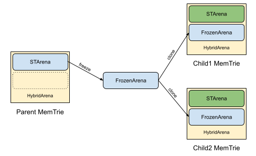

## Summary

This proposal introduces a new resharding implementation and shard layout for production networks.

The primary objective of Resharding V3 is to increase chain capacity by splitting overutilized shards. A secondary aim is to lay the groundwork for supporting Dynamic Resharding, Instant Resharding, and Shard Merging in future updates.

## Motivation

The sharded architecture of the NEAR Protocol is a cornerstone of its design, enabling parallel and distributed execution that significantly boosts overall throughput. Resharding plays a pivotal role in this system, allowing the network to adjust the number of shards to accommodate growth. By increasing the number of shards, resharding ensures the network can scale seamlessly, alleviating existing congestion, managing rising traffic demands, and welcoming new participants. This adaptability is essential for maintaining the protocol's performance, reliability, and capacity to support a thriving, ever-expanding ecosystem.

Resharding V3 is a significantly redesigned approach, addressing limitations of the previous versions, [Resharding V1][NEP-040] and [Resharding V2][NEP-508]. The earlier solutions became obsolete due to major protocol changes since Resharding V2, including the introduction of Stateless Validation, Single Shard Tracking, and Mem-Trie.

## Specification

Resharding will be scheduled in advance by the NEAR developer team. The new shard layout will be hardcoded into the `neard` binary and linked to the protocol version. As the protocol upgrade progresses, resharding will be triggered during the post-processing phase of the last block of the epoch. At this point, the state of the parent shard will be split between two child shards. From the first block of the new protocol version onward, the chain will operate with the new shard layout.

There are two key dimensions to consider: state storage and protocol features, along with additional details.

1. **State Storage**: Currently, the state of a shard is stored in three distinct formats: the state, the flat state, and the mem-trie. Each of these representations must be resharded. Logically, resharding is an almost instantaneous event that occurs before the first block under the new shard layout. However, in practice, some of this work may be deferred to post-processing, as long as the chain's view reflects a fully resharded state.

2. **Protocol Features**: Several protocol features must integrate smoothly with the resharding process, including:

    * **Stateless Validation**: Resharding must be validated and proven through stateless validation mechanisms.
    * **State Sync**: Nodes must be able to synchronize the states of the child shards post-resharding.
    * **Cross-Shard Traffic**: Receipts sent to the parent shard may need to be reassigned to one of the child shards.
    * **Receipt Handling**: Delayed, postponed, buffered, and promise-yield receipts must be correctly distributed between the child shards.
    * **ShardId Semantics**: The shard identifiers will become abstract identifiers where today they are numbers in the `0..num_shards` range.
    * **Congestion Info**: `CongestionInfo` in the chunk header will be recalculated for the child shards at the resharding boundary. Proof must be compatible with Stateless Validation.

### State Storage - MemTrie

MemTrie is the in-memory representation of the trie that the runtime uses for all trie accesses. It is kept in sync with the Trie representation in the state.

Currently, it isn't mandatory for nodes to have the MemTrie feature enabled, but going forward with Resharding V3, all nodes will be required to have MemTrie enabled for resharding to happen successfully.

For resharding, we need an efficient way to split the MemTrie into two child tries based on the boundary account. This splitting happens at the epoch boundary when the new epoch is expected to have the two child shards. The requirements for MemTrie splitting are:

* **Instantaneous Splitting**: MemTrie splitting needs to happen efficiently within the span of one block. The child tries need to be available for processing the next block in the new epoch.
* **Compatibility with Stateless Validation**: We need to generate a proof that the MemTrie split proposed by the chunk producer is correct.
* **State Witness Size Limits**: The proof generated for splitting the MemTrie needs to comply with the size limits of the state witness sent to all chunk validators. This prevents us from iterating through all trie keys for delayed receipts, etc.

With the Resharding V3 design, there's no protocol change to the structure of MemTries; however, implementation constraints required us to introduce the concept of a Frozen MemTrie. More details are in the [implementation](#state-storage---memtrie-1) section below.

Based on these requirements, we developed an algorithm to efficiently split the parent trie into two child tries. Trie entries can be divided into three categories based on whether the trie keys have an `account_id` prefix and the total number of such trie keys. Splitting of these keys is handled differently.

#### TrieKey with AccountID Prefix

This category includes most trie keys like `TrieKey::Account`, `TrieKey::ContractCode`, `TrieKey::PostponedReceipt`, etc. For these keys, we can efficiently split the trie based on the boundary account trie key. We only need to read all the intermediate nodes that form part of the split key. In the example below, if "pass" is the split key, we access all the nodes along the path of `root` ➔ `p` ➔ `a` ➔ `s` ➔ `s`, while not needing to touch other intermediate nodes like `o` ➔ `s` ➔ `t` in key "post". The accessed nodes form part of the state witness, as those are the only nodes needed by validators to verify that the resharding split is correct. This limits the size of the witness to effectively O(depth) of the trie for each trie key in this category.


#### Singleton TrieKey

This category includes the trie keys `TrieKey::DelayedReceiptIndices`, `TrieKey::PromiseYieldIndices`, and `TrieKey::BufferedReceiptIndices`. These are just a single entry (or O(num_shard) entries) in the trie and are small enough to read and modify efficiently for the child tries.

#### Indexed TrieKey

This category includes the trie keys `TrieKey::DelayedReceipt`, `TrieKey::PromiseYieldTimeout`, and `TrieKey::BufferedReceipt`. The number of entries for these keys can potentially be arbitrarily large, making it infeasible to iterate through all entries. In the pre-stateless validation world, where we didn't care about state witness size limits, for Resharding V2 we could iterate over all delayed receipts and split them into the respective child shards.

For Resharding V3, these are handled by one of two strategies:

* **Duplication Across Child Shards**: `TrieKey::DelayedReceipt` and `TrieKey::PromiseYieldTimeout` are handled by duplicating entries across both child shards, as each entry could belong to either child shard. More details are in the [Delayed Receipts](#delayed-receipt-handling) and [Promise Yield](#promiseyield-receipt-handling) sections below.
* **Assignment to Lower Index Child**: `TrieKey::BufferedReceipt` is independent of the `account_id` and can be sent to either of the child shards, but not both. We copy the buffered receipts and the associated metadata to the child shard with the lower index. More details are in the [Buffered Receipts](#buffered-receipt-handling) section below.

### State Storage - Flat State

Flat State is a collection of key-value pairs stored on disk, with each entry containing a reference to its `ShardId`. When splitting a shard, every item inside its Flat State must be correctly reassigned to one of the new child shards; however, due to technical limitations, such an operation cannot be completed instantaneously.

Flat State's main purposes are allowing the creation of State Sync snapshots and the construction of Mem Tries. Fortunately, these two operations can be delayed until resharding is completed. Note also that with Mem Tries enabled, the chain can move forward even if the current status of Flat State is not in sync with the latest block.

For these reasons, the chosen strategy is to reshard Flat State in a long-running background task. The new shards' states must converge with their Mem Tries representation in a reasonable amount of time.

Splitting a shard's Flat State is performed in multiple steps:

1. A post-processing "split" task is created instantaneously during the last block of the old shard layout.
2. The "split" task runs in parallel with the chain for a certain amount of time. Inside this routine, every key-value pair belonging to the shard being split (also called the parent shard) is copied into either the left or the right child Flat State. Entries linked to receipts are handled in a special way.
3. Once the task is completed, the parent shard's Flat State is cleaned up. The child shards' Flat States have their state in sync with the last block of the old shard layout.
4. Child shards must apply the delta changes from the first block of the new shard layout until the final block of the canonical chain. This operation is done in another background task to avoid slowdowns while processing blocks.
5. Child shards' Flat States are now ready and can be used to take State Sync snapshots and to reload Mem Tries.

### State Storage - State

Each shard’s Trie is stored in the `State` column of the database, with keys prefixed by `ShardUId`, followed by a node's hash. This structure uniquely identifies each shard’s data. To avoid copying all entries under a new `ShardUId` during resharding, a mapping strategy allows child shards to access ancestor shard data without directly creating new entries.

A naive approach to resharding would involve copying all `State` entries with a new `ShardUId` for a child shard, effectively duplicating the state. This method, while straightforward, is not feasible because copying a large state would take too much time. Resharding needs to appear complete between two blocks, so a direct copy would not allow the process to occur quickly enough.

To address this, Resharding V3 employs an efficient mapping strategy, using the `DBCol::ShardUIdMapping` column to link each child shard’s `ShardUId` to the closest ancestor’s `ShardUId` holding the relevant data. This allows child shards to access and update state data under the ancestor shard’s prefix without duplicating entries.

Initially, `ShardUIdMapping` is empty, as existing shards map to themselves. During resharding, a mapping entry is added to `ShardUIdMapping`, pointing each child shard’s `ShardUId` to the appropriate ancestor. Mappings persist as long as any descendant shard references the ancestor’s data. Once a node stops tracking all children and descendants of a shard, the entry for that shard can be removed, allowing its data to be garbage collected.

This mapping strategy enables efficient shard management during resharding events, supporting smooth transitions without altering storage structures directly.

#### Integration with Cold Storage (Archival Nodes)

Cold storage uses the same mapping strategy to manage shard state during resharding:

* When state data is migrated from hot to cold storage, it retains the parent shard’s `ShardUId` prefix, ensuring consistency with the mapping strategy.
* While copying data for the last block of the epoch where resharding occurred, the `DBCol::StateShardUIdMapping` column is copied into cold storage. This ensures that mappings are updated alongside the shard state data.
* These mappings are permanent in cold storage, aligning with its role in preserving historical state.

This approach minimizes complexity while maintaining consistency across hot and cold storage.

#### State cleanup

Since [Stateless Validation][NEP-508], all shards tracking is no longer required. But apparently, we do not have shard cleanup implemented (in case a node stopped tracking one shard and started tracking another one). In this NEP, we propose such cleanup that will handle cleanup after resharding by the way.

When garbage collection clears the last block of an epoch on the canonical chain, we check what shards were tracked in that epoch by checking what shards exists in `TrieChanges` at this block. In the same way, we collect shards that were tracked in following epochs up to the current one. We only remove shard State if:
- It was tracked in the old epoch (for which we just garbage collected the last block).
- It was not tracked later, it is not tracked currently, and it won't be tracked in the next epoch.

The only change required for it to work with Resharding, is that instead of looking at tracked shards, we look at `ShardUId` prefixes that they use. A parent shard State won't be garbage collected, as long as it exists in `DBCol::StateShardUIdMapping` (any descendant shard mapping to it). And when we stop tracking all descendant shards, then we clean up the parent shard's (and all its descendants) State, and remove all mappings to the parent from `DBCol::StateShardUIdMapping`.

#### Negative refcounts

Note that some trie keys (e.g. `TrieKey::DelayedReceipt`) are duplicated among children shards, but the corresponding State is not duplicated. `DBCol::State` column is reference counted, which means some data will be reference counted once, but referenced by both children. That would result in negative refcounts when the data is later removed by both children. To mitigate it, we change the RocksDB `refcount_merge` behavior so that negative refcounts are clamped to 0.

### Stateless Validation

Since only a fraction of nodes track the split shard, it is necessary to prove the transition from the state root of the parent shard to the new state roots for the child shards to other validators. Without this proof, chunk producers for the split shard could collude and provide invalid state roots, potentially compromising the protocol, such as by minting tokens out of thin air.

The design ensures that generating and verifying this state transition is negligible in time compared to applying a chunk. As detailed in the [State Storage - MemTrie](#state-storage---memtrie) section, the generation and verification logic involves a constant number of trie lookups. Specifically, we implement the `retain_split_shard(boundary_account, RetainMode::{Left, Right})` method for the trie, which retains only the keys in the trie that belong to the left or right child shard. Internally, this method uses `retain_multi_range(intervals)`, where `intervals` is a vector of trie key intervals to retain. Each interval corresponds to a unique trie key type prefix byte (`Account`, `AccessKey`, etc.) and defines an interval from the empty key to the `boundary_account` key for the left shard, or from the `boundary_account` to infinity for the right shard.

The `retain_multi_range` method is recursive. Based on the current trie key prefix covered by the current node, it either:

* Returns the node if the subtree is fully contained within an interval.
* Returns an "empty" node if the subtree is outside all intervals.
* Descends into all children and constructs a new node with children returned by recursive calls.

This implementation is agnostic to the trie storage used for retrieving nodes and applies to both MemTries and partial storage (state proof).

* Calling it for MemTrie generates a proof and a new state root.
* Calling it for partial storage generates a new state root. If the method does not fail with an error indicating that a node was not found in the proof, it means the proof was sufficient, and it remains to compare the generated state root with the one proposed by the chunk producer.

### State Witness

The resharding state transition becomes one of the `implicit_transitions` in `ChunkStateWitness`. It must be validated between processing the last chunk (potentially missing) in the old epoch and the first chunk (potentially missing) in the new epoch. The `ChunkStateTransition` fields correspond to the resharding state transition: the `block_hash` stores the hash of the last block of the parent shard, the `base_state` stores the resharding proof, and the `post_state_root` stores the proposed state root.

This results in **two** state transitions corresponding to the same block hash. On the chunk producer side, the first transition is stored for the `(block_hash, parent_shard_uid)` pair, and the second one is stored for the `(block_hash, child_shard_uid)` pair.

The chunk validator, having all the blocks, identifies whether the implicit transition corresponds to applying a missing chunk or resharding independently. This is implemented in `get_state_witness_block_range`, which iterates from `state_witness.chunk_header.prev_block_hash()` to the block that includes the last chunk for the (parent) shard, if it exists.

Then, in `validate_chunk_state_witness`, if the implicit transition corresponds to resharding, the chunk validator calls `retain_split_shard` and proves the state transition from the parent to the child shard.

### State Sync

Changes to the state sync protocol are not typically considered protocol changes requiring a version bump, as they concern downloading state that is not present locally rather than the rules for executing blocks and chunks. However, it is helpful to outline some planned changes to state sync related to resharding.

When nodes sync state (either because they have fallen far behind the chain or because they will become a chunk producer for a new shard in a future epoch), they first identify a point in the chain to sync to. They then download the tries corresponding to that point in the chain and apply all chunks from that point until they are caught up. Currently, the tries downloaded initially correspond to the `prev_state_root` field of the last new chunk before the first block of the current epoch. This means the state downloaded is from some point in the previous epoch.

The proposed change is to move the initial state download point to one in the current epoch rather than the previous one. This keeps shard IDs consistent throughout the state sync logic, simplifies the resharding implementation, and reduces the size of the state to be downloaded. Suppose the previous epoch's shard `S` was split into shards `S'` and `S''` in the current epoch, and a chunk producer that was not tracking shard `S` or any of its children in the current epoch will become a chunk producer for `S'` in the next epoch. With the old state sync algorithm, that chunk producer would download the pre-split state for shard `S`. Then, when it is done, it would need to perform the resharding that all other nodes had already done. While this is not a correctness issue, it simplifies the implementation if we instead download only the state for shard `S'`, allowing the node to download only the state belonging to `S'`, which is much smaller.

### Cross-Shard Traffic

When the shard layout changes, it is crucial to handle cross-shard traffic correctly, especially in the presence of missing chunks. Care must be taken to ensure that no receipt is lost or duplicated. There are two important receipt types that need to be considered: outgoing receipts and incoming receipts.

*Note: This proposal reuses the approach taken by Resharding V2.*

#### Outgoing Receipts

Each new chunk in a shard contains a list of outgoing receipts generated during the processing of the previous chunk in that shard.

In cases where chunks are missing at the resharding boundary, both child shards could theoretically include the outgoing receipts from their shared ancestor chunk. However, this naive approach would lead to the duplication of receipts, which must be avoided.

The proposed solution is to reassign the outgoing receipts from the parent chunk to only one of the child shards. Specifically, the child shard with the lower shard ID will claim all outgoing receipts from the parent, while the other child will receive none. This ensures that all receipts are processed exactly once.

#### Incoming Receipts

To process a chunk in a shard, it is necessary to gather all outgoing receipts from other shards that are targeted at this shard. These receipts must then be included as incoming receipts.

In the presence of missing chunks, the new chunk must collect receipts from all previous blocks, spanning the period since the last new chunk in this shard. This range may cross the resharding boundary.

When this occurs, the chunk must also consider receipts that were previously targeted at its parent shard. However, it must filter these receipts to include only those where the recipient lies within the current shard, discarding those where the recipient belongs to the sibling shard in the new shard layout. This filtering process ensures that every receipt is processed exactly once and in the correct shard.

### Delayed Receipt Handling

The delayed receipts queue contains all incoming receipts that could not be executed as part of a block due to resource constraints like compute cost, gas limits, etc. The entries in the delayed receipt queue can belong to any of the accounts within the shard. During a resharding event, we ideally need to split the delayed receipts across both child shards according to the associated `account_id` with the receipt.

The singleton trie key `DelayedReceiptIndices` holds the `start_index` and `end_index` associated with the delayed receipt entries for the shard. The trie key `DelayedReceipt { index }` contains the actual delayed receipt associated with some `account_id`. These are processed in a FIFO queue order during chunk execution.

Note that the delayed receipt trie keys do not have the `account_id` prefix. In Resharding V2, we followed the trivial solution of iterating through all the delayed receipt queue entries and assigning them to the appropriate child shard. However, due to constraints on the state witness size limits and instant resharding, this approach is no longer feasible for Resharding V3.

For Resharding V3, we decided to handle the resharding by duplicating the entries of the delayed receipt queue across both child shards. This is beneficial from the perspective of state witness size and instant resharding, as we only need to access the delayed receipt queue root entry in the trie. However, it breaks the assumption that all delayed receipts in a shard belong to the accounts within that shard.

To resolve this, with the new protocol version, we changed the implementation of the runtime to discard executing delayed receipts that don't belong to the `account_id` on that shard.

Note that no delayed receipts are lost during resharding, as all receipts get executed exactly once based on which of the child shards the associated `account_id` belongs to.

### PromiseYield Receipt Handling

Promise Yield was introduced as part of NEP-519 to enable deferring replies to the caller function while the response is being prepared. As part of the Promise Yield implementation, it introduced three new trie keys: `PromiseYieldIndices`, `PromiseYieldTimeout`, and `PromiseYieldReceipt`.

* `PromiseYieldIndices`: This is a singleton key that holds the `start_index` and `end_index` of the keys in `PromiseYieldTimeout`.
* `PromiseYieldTimeout { index }`: Along with the `receiver_id` and `data_id`, this stores the `expires_at` block height until which we need to wait to receive a response.
* `PromiseYieldReceipt { receiver_id, data_id }`: This is the receipt created by the account.

An account can call the `promise_yield_create` host function that increments the `PromiseYieldIndices` along with adding a new entry into the `PromiseYieldTimeout` and `PromiseYieldReceipt`.

The `PromiseYieldTimeout` is sorted by time of creation and has an increasing value of `expires_at` block height. In the runtime, we iterate over all the expired receipts and create a blank receipt to resolve the entry in `PromiseYieldReceipt`.

The account can call the `promise_yield_resume` host function multiple times, and if this is called before the expiry period, we use this to resolve the promise yield receipt. Note that the implementation allows for multiple resolution receipts to be created, including the expiry receipt, but only the first one is used for the actual resolution of the promise yield receipt.

We use this implementation quirk to facilitate the resharding implementation. The resharding strategy for the three trie keys is:

* **Duplicate Across Both Child Shards**:
  * `PromiseYieldIndices`
  * `PromiseYieldTimeout { index }`
* **Split Based on Prefix**:
  * `PromiseYieldReceipt { receiver_id, data_id }`: Since this key has the `account_id` prefix, we can split the entries across both child shards based on the prefix.

After duplication of the `PromiseYieldIndices` and `PromiseYieldTimeout`, when the entries of `PromiseYieldTimeout` eventually get dequeued at the expiry height, the following happens:

* If the promise yield receipt associated with the dequeued entry **is not** part of the child trie, we create a timeout resolution receipt, and it gets ignored.
* If the promise yield receipt associated with the dequeued entry **is** part of the child trie, the promise yield implementation continues to work as expected.

This means we don't have to make any special changes in the runtime for handling the resharding of promise yield receipts.

### Buffered Receipt Handling

Buffered Receipts were introduced as part of NEP-539 for cross-shard congestion control. As part of the implementation, it introduced two new trie keys: `BufferedReceiptIndices` and `BufferedReceipt`.

* `BufferedReceiptIndices`: This is a singleton key that holds the `start_index` and `end_index` of the keys in `BufferedReceipt` for each `shard_id`.
* `BufferedReceipt { receiving_shard, index }`: This holds the actual buffered receipt that needs to be sent to the `receiving_shard`.

Note that the targets of the buffered receipts belong to external shards, and during a resharding event, we would need to handle both the set of buffered receipts in the parent shard and the set of buffered receipts in other shards that target the parent shard.

#### Handling Buffered Receipts in Parent Shard

Since buffered receipts target external shards, it is acceptable to assign buffered receipts to either of the child shards. For simplicity, we assign all the buffered receipts to the child shard with the lower index, i.e., copy `BufferedReceiptIndices` and `BufferedReceipt` to the child shard with the lower index while keeping `BufferedReceiptIndices` empty for the child shard with the higher index.

#### Handling Buffered Receipts that Target Parent Shard

This scenario is slightly more complex. At the boundary of resharding, we may have buffered receipts created before the resharding event targeting the parent shard. At the same time, we may also have buffered receipts generated after the resharding event that directly target the child shard. The receipts from both the parent and child buffered receipts queue need to be appropriately sent to the child shard depending on the `account_id`, while respecting the outgoing limits calculated by the bandwidth scheduler and congestion control.

The flow of handling buffered receipts before Resharding V3 is as follows:

1. Calculate `outgoing_limit` for each shard.
2. For each shard, try to forward as many in-order receipts as possible from the buffer while respecting `outgoing_limit`.
3. Apply chunk and `try_forward` newly generated receipts. The newly generated receipts are forwarded if we have enough limit; otherwise, they are put in the buffered queue.

The solution for Resharding V3 is to first try draining the parent queue before moving on to draining the child queue. The modified flow would look like this:

1. Calculate `outgoing_limit` for both child shards using congestion info from the parent.
2. Forwarding receipts:
    * First, try to forward as many in-order receipts as possible from the parent shard buffer. Stop either when we drain the parent buffer or when we exhaust the `outgoing_limit` of either of the child shards.
    * Next, try to forward as many in-order receipts as possible from the child shard buffer.
3. Applying chunk and `try_forward` newly generated receipts remains the same.

The minor downside to this approach is that we don't have guarantees between the order of receipt generation and the order of receipt forwarding, but that's already the case today with buffered receipts.

### Congestion Control

Along with having buffered receipts, each chunk also publishes a `CongestionInfo` to the chunk header that contains information about the congestion of the shard during block processing.

```rust
pub struct CongestionInfoV1 {
    /// Sum of gas in currently delayed receipts.
    pub delayed_receipts_gas: u128,
    /// Sum of gas in currently buffered receipts.
    pub buffered_receipts_gas: u128,
    /// Size of borsh serialized receipts stored in state because they
    /// were delayed, buffered, postponed, or yielded.
    pub receipt_bytes: u64,
    /// If fully congested, only this shard can forward receipts.
    pub allowed_shard: u16,
}
```

After a resharding event, it is essential to properly initialize the congestion info for the child shards. Here is how each field is handled:

#### `delayed_receipts_gas`

Since the resharding strategy for delayed receipts is to duplicate them across both child shards, we simply copy the value of `delayed_receipts_gas` to both shards.

#### `buffered_receipts_gas`

Given that the strategy for buffered receipts is to assign all buffered receipts to the lower index child, we copy the `buffered_receipts_gas` from the parent to the lower index child and set `buffered_receipts_gas` to zero for the higher index child.

#### `receipt_bytes`

This field is more complex as it includes information from both delayed receipts and buffered receipts. To calculate this field accurately, we need to know the distribution of `receipt_bytes` across both delayed receipts and buffered receipts. The current solution is to store metadata about the total `receipt_bytes` for buffered receipts in the trie. This way, we have the following:

* For the child with the lower index, `receipt_bytes` is the sum of both delayed receipts bytes and buffered receipts bytes, hence `receipt_bytes = parent.receipt_bytes`.
* For the child with the higher index, `receipt_bytes` is just the bytes from delayed receipts, hence `receipt_bytes = parent.receipt_bytes - parent.buffered_receipt_bytes`.

#### `allowed_shard`

This field is calculated using a round-robin mechanism, which can be independently determined for both child shards. Since we are changing the [ShardId semantics](#shardid-semantics), we need to update the implementation to use `ShardIndex` instead of `ShardID`, which is simply an assignment for each `shard_id` to the contiguous index `[0, num_shards)`.

### ShardId Semantics

Currently, shard IDs are represented as numbers within the range `[0, n)`, where `n` is the total number of shards. These shard IDs are sorted in the same order as the account ID ranges assigned to them. While this approach is straightforward, it complicates resharding operations, particularly when splitting a shard in the middle of the range. Such a split requires reindexing all subsequent shards with higher IDs, adding complexity to the process.

In this NEP, we propose updating the ShardId semantics to allow for arbitrary identifiers. Although ShardIds will remain integers, they will no longer be restricted to the `[0, n)` range, and they may appear in any order. The only requirement is that each ShardId must be unique. In practice, during resharding, the ID of a parent shard will be removed from the ShardLayout, and the new child shards will be assigned unique IDs - `max(shard_ids) + 1` and `max(shard_ids) + 2`.

## Reference Implementation

### Overview
<!-- markdownlint-disable MD029 -->

1. Any node tracking a shard must determine if it should split the shard in the last block before the epoch where resharding should happen.

```pseudocode
should_split_shard(block, shard_id):
    shard_layout = epoch_manager.shard_layout(block.epoch_id())
    next_shard_layout = epoch_manager.shard_layout(block.next_epoch_id())
    if epoch_manager.is_next_block_epoch_start(block) && 
        shard_layout != next_shard_layout &&
        next_shard_layout.shard_split_map().contains(shard_id):
        return Some(next_shard_layout.split_shard_event(shard_id))
    return None
```

2. This logic is triggered during block post-processing, which means that the block is valid and is being persisted to disk.

```pseudocode
on chain.postprocess_block(block):
    next_shard_layout = epoch_manager.shard_layout(block.next_epoch_id())
    if let Some(split_shard_event) = should_split_shard(block, shard_id):
        resharding_manager.split_shard(split_shard_event)
```

3. The event triggers changes in all state storage components.

```pseudocode
on resharding_manager.split_shard(split_shard_event, next_shard_layout):
    set State mapping
    start FlatState resharding
    process MemTrie resharding:
        freeze MemTrie, create HybridMemTries
        for each child shard:
            mem_tries[parent_shard].retain_split_shard(boundary_account)
```

4. `retain_split_shard` leaves only keys in the trie that belong to the left or right child shard. It retains trie key intervals for the left or right child as described above. Simultaneously, the proof is generated. In the end, we get a new state root, hybrid MemTrie corresponding to the child shard, and the proof. Proof is saved as state transition for pair `(block, new_shard_uid)`.

5. The proof is sent as one of the implicit transitions in `ChunkStateWitness`.

6. On the chunk validation path, the chunk validator determines if resharding is part of the state transition using the same `should_split_shard` condition.

7. It calls `Trie(state_transition_proof).retain_split_shard(boundary_account)`, which should succeed if the proof is sufficient and generates a new state root.

8. Finally, it checks that the new state root matches the state root proposed in `ChunkStateWitness`. If the whole `ChunkStateWitness` is valid, then the chunk validator sends an endorsement, which also endorses the resharding.

### State Storage - MemTrie

The current implementation of MemTrie uses a memory pool (`STArena`) to allocate and deallocate nodes, with internal pointers in this pool referencing child nodes. Unlike the State representation of the Trie, MemTries do not work with node hashes but with internal memory pointers directly. Additionally, MemTries are not thread-safe, and one MemTrie exists per shard.

As described in the [MemTrie](#state-storage---memtrie) section above, we need an efficient way to split the MemTrie into two child MemTries within the span of one block. The challenge lies in the current implementation of MemTrie, which is not thread-safe and cannot be shared across two shards.

A naive approach to creating two MemTries for the child shards would involve iterating through all entries of the parent MemTrie and populating these values into the child MemTries. However, this method is prohibitively time-consuming.

The solution to this problem is to introduce the concept of a Frozen MemTrie (with a `FrozenArena`), which is a cloneable, read-only, thread-safe snapshot of a MemTrie. By calling the `freeze` method on an existing MemTrie, we convert it into a Frozen MemTrie. This process consumes the original MemTrie, making it no longer available for node allocation and deallocation.

Along with `FrozenArena`, we also introduce a `HybridArena`, which effectively combines a base `FrozenArena` with a top layer of `STArena` that supports allocating and deallocating new nodes into the MemTrie. Newly allocated nodes can reference nodes in the `FrozenArena`. This Hybrid MemTrie serves as a temporary MemTrie while the flat storage is being constructed in the background.

While Frozen MemTries facilitate instant resharding, they come at the cost of memory consumption. Once a MemTrie is frozen, it continues to consume the same amount of memory as it did at the time of freezing, as it does not support memory deallocation. If a node tracks only one of the child shards, a Frozen MemTrie would continue to use the same amount of memory as the parent trie. Therefore, Hybrid MemTries are only a temporary solution, and we rebuild the MemTrie for the children after resharding is completed.

Additionally, a node would need to support twice the memory footprint of a single trie. After resharding, there would be two copies of the trie in memory: one from the temporary Hybrid MemTrie used for block production and another from the background MemTrie under construction. Once the background MemTrie is fully constructed and caught up with the latest block, we perform an in-place swap of the Hybrid MemTrie with the new child MemTrie and deallocate the memory from the Hybrid MemTrie.

During a resharding event at the epoch boundary, when we need to split the parent shard into two child shards, we follow these steps:

1. **Freeze the Parent MemTrie**: Create a read-only frozen arena representing a snapshot of the state at the time of freezing (after post-processing the last block of the epoch). The parent MemTrie is no longer required in runtime going forward.
2. **Clone the Frozen MemTrie**: Clone the Frozen MemTrie cheaply for both child MemTries to use. This does not clone the parent arena's memory but merely increases the reference count.
3. **Create Hybrid MemTries for Each Child**: Create a new MemTrie with `HybridArena` for each child. The base of the MemTrie is the read-only `FrozenArena`, while all new node allocations occur in a dedicated `STArena` memory pool for each child MemTrie. This temporary MemTrie is used while Flat Storage is being built in the background.
4. **Rebuild MemTrie**: Once resharding is completed, we use it to load a new MemTrie and catch up to the latest block.
5. **Swap and Clean Up**: After the new child MemTrie has caught up to the latest block, we perform an in-place swap in the client and discard the Hybrid MemTrie.



### State Storage - Flat State

Resharding the Flat State is a time-consuming operation that runs in parallel with block processing for several block heights. Therefore, several important aspects must be considered during implementation:

* **Flat State's Status Persistence**: Flat State's status should be resilient to application crashes.
* **Correct Block Height**: The parent shard's Flat State should be split at the correct block height.
* **Convergence with Mem Trie**: New shards' Flat States should eventually converge to the same representation the chain uses to process blocks (MemTries).
* **Chain Forks Handling**: Resharding should work correctly in the presence of chain forks.
* **Retired Shards Cleanup**: Retired shards should be cleaned up.

Note that the Flat States of the newly created shards will not be available until resharding is completed. This is acceptable because the temporary MemTries are built instantly and can satisfy all block processing needs.

The main component responsible for carrying out resharding on Flat State is the [FlatStorageResharder](https://github.com/near/nearcore/blob/f4e9dd5d6e07089dfc789221ded8ec83bfe5f6e8/chain/chain/src/flat_storage_resharder.rs#L68).

#### Flat State's Status Persistence

Every shard's Flat State has a status associated with it and stored in the database, called `FlatStorageStatus`. We propose extending the existing object by adding a new enum variant named `FlatStorageStatus::Resharding`. This approach has two benefits. First, the progress of any Flat State resharding is persisted to disk, making the operation resilient to a node crash or restart. Second, resuming resharding on node restart shares the same code path as Flat State creation (see `FlatStorageShardCreator`), reducing code duplication.

`FlatStorageStatus` is updated at every committable step of resharding. The commit points are as follows:

* Beginning of resharding, at the last block of the old shard layout.
* Scheduling of the "split parent shard" task.
* Execution, cancellation, or failure of the "split parent shard" task.
* Execution or failure of any "child catchup" task.

#### Splitting a Shard's Flat State

When the shard layout changes at the end of an epoch, we identify a **resharding block** corresponding to the last block of the current epoch. A task to split the parent shard's Flat State is scheduled to occur after the resharding block becomes final. The finality condition is necessary to avoid splitting on a block that might be excluded from the canonical chain, which would lock the node into an erroneous state.

Inside the split task, we iterate over the Flat State and copy each element into either child. This routine is performed in batches to lessen the performance impact on the node.

Finally, if the split completes successfully, the parent shard's Flat State is removed from the database, and the child shards' Flat States enter a catch-up phase.

One current technical limitation is that, upon a node crash or restart, the "split parent shard" task will start copying all elements again from the beginning.

A reference implementation of splitting a Flat State can be found in [FlatStorageResharder::split_shard_task](https://github.com/near/nearcore/blob/fecce019f0355cf89b63b066ca206a3cdbbdffff/chain/chain/src/flat_storage_resharder.rs#L295).

#### Assigning Values from Parent to Child Shards

Key-value pairs in the parent shard's Flat State are inherited by children according to the following rules:

**Elements inherited by the child shard tracking the `account_id` contained in the key:**

* `ACCOUNT`
* `CONTRACT_DATA`
* `CONTRACT_CODE`
* `ACCESS_KEY`
* `RECEIVED_DATA`
* `POSTPONED_RECEIPT_ID`
* `PENDING_DATA_COUNT`
* `POSTPONED_RECEIPT`
* `PROMISE_YIELD_RECEIPT`

**Elements inherited by both children:**

* `DELAYED_RECEIPT_OR_INDICES`
* `PROMISE_YIELD_INDICES`
* `PROMISE_YIELD_TIMEOUT`
* `BANDWIDTH_SCHEDULER_STATE`

**Elements inherited only by the lowest index child:**

* `BUFFERED_RECEIPT_INDICES`
* `BUFFERED_RECEIPT`

#### Bringing Child Shards Up to Date with the Chain's Head

Child shards' Flat States build a complete view of their content at the height of the resharding block sometime during the new epoch after resharding. At that point, many new blocks have already been processed, and these will most likely contain updates for the new shards. A catch-up step is necessary to apply all Flat State deltas accumulated until now.

This phase of resharding does not require extra steps to handle chain forks. The catch-up task does not start until the parent shard splitting is done, ensuring the resharding block is final. Additionally, Flat State deltas can handle forks automatically.

The catch-up task commits batches of Flat State deltas to the database. If the application crashes or restarts, the task will resume from where it left off.

Once all Flat State deltas are applied, the child shard's status is changed to `Ready`, and cleanup of Flat State delta leftovers is performed.

A reference implementation of the catch-up task can be found in [FlatStorageResharder::shard_catchup_task](https://github.com/near/nearcore/blob/fecce019f0355cf89b63b066ca206a3cdbbdffff/chain/chain/src/flat_storage_resharder.rs#L564).

#### Failure of Flat State Resharding

In the current proposal, any failure during Flat State resharding is considered non-recoverable. `neard` will attempt resharding again on restart, but no automatic recovery is implemented.

### State Storage - State Mapping

To enable efficient shard state management during resharding, Resharding V3 uses the `DBCol::ShardUIdMapping` column. This mapping allows child shards to reference ancestor shard data, avoiding the need for immediate duplication of state entries.

#### Mapping Application in Adapters

The core of the mapping logic is applied in `TrieStoreAdapter` and `TrieStoreUpdateAdapter`, which act as layers over the general `Store` interface. Here’s a breakdown of the key functions involved:

* **Key Resolution**:

  The `get_key_from_shard_uid_and_hash` function is central to determining the correct `ShardUId` for state access. At a high level, operations use the child shard's `ShardUId`, but within this function, the `DBCol::ShardUIdMapping` column is checked to determine if an ancestor `ShardUId` should be used instead.

  ```rust
  fn get_key_from_shard_uid_and_hash(
      store: &Store,
      shard_uid: ShardUId,
      hash: &CryptoHash,
  ) -> [u8; 40] {
      let mapped_shard_uid = store
          .get_ser::<ShardUId>(DBCol::StateShardUIdMapping, &shard_uid.to_bytes())
          .expect("get_key_from_shard_uid_and_hash() failed")
          .unwrap_or(shard_uid);
      let mut key = [0; 40];
      key[0..8].copy_from_slice(&mapped_shard_uid.to_bytes());
      key[8..].copy_from_slice(hash.as_ref());
      key
  }
  ```

  This function first attempts to retrieve a mapped ancestor `ShardUId` from `DBCol::ShardUIdMapping`. If no mapping exists, it defaults to the provided child `ShardUId`. This resolved `ShardUId` is then combined with the `node_hash` to form the final key used in `State` column operations.

* **State Access Operations**:

  The `TrieStoreAdapter` and `TrieStoreUpdateAdapter` use `get_key_from_shard_uid_and_hash` to correctly resolve the key for both reads and writes. Example methods include:

  ```rust
  // In TrieStoreAdapter
  pub fn get(&self, shard_uid: ShardUId, hash: &CryptoHash) -> Result<Arc<[u8]>, StorageError> {
      let key = get_key_from_shard_uid_and_hash(self.store, shard_uid, hash);
      self.store.get(DBCol::State, &key)
  }

  // In TrieStoreUpdateAdapter
  pub fn increment_refcount_by(
      &mut self,
      shard_uid: ShardUId,
      hash: &CryptoHash,
      data: &[u8],
      increment: NonZero<u32>,
  ) {
      let key = get_key_from_shard_uid_and_hash(self.store, shard_uid, hash);
      self.store_update.increment_refcount_by(DBCol::State, key.as_ref(), data, increment);
  }
  ```

  The `get` function retrieves data using the resolved `ShardUId` and key, while `increment_refcount_by` manages reference counts, ensuring correct tracking even when accessing data under an ancestor shard.

#### Mapping Retention and Cleanup

Mappings in `DBCol::ShardUIdMapping` persist as long as any descendant relies on an ancestor’s data. To manage this, the `set_shard_uid_mapping` function in `TrieStoreUpdateAdapter` adds a new mapping during resharding:

```rust
fn set_shard_uid_mapping(&mut self, child_shard_uid: ShardUId, parent_shard_uid: ShardUId) {
    let mapped_parent_shard_uid = store
          .get_ser::<ShardUId>(DBCol::StateShardUIdMapping, &parent_shard_uid.to_bytes())
          .expect("set_shard_uid_mapping() failed")
          .unwrap_or(parent_shard_uid);
    self.store_update.set(
        DBCol::StateShardUIdMapping,
        child_shard_uid.to_bytes().as_ref(),
        &borsh::to_vec(&mapped_parent_shard_uid).expect("Borsh serialize cannot fail"),
    )
}
```

When a node stops tracking all descendants of a shard, garbage collection would eventually clear the last block of the last epoch where the last descendant was tracked. The descendant would then appear in the result of:

```rust
fn get_potential_shards_for_cleanup(..., last_block_of_gced_epoch) -> Result<Vec<ShardUId>> {
 let mut tracked_shards = vec![];
    for shard_uid in shard_layout.shard_uids() {
        if chain_store_update
            .store()
            .exists(DBCol::TrieChanges, &get_block_shard_uid(&last_block_of_gced_epoch, &shard_uid))?
        {
            tracked_shards.push(shard_uid);
        }
    }
    tracked_shards
}
```

Then, `gc_state()` would be called, it would map the descendant `ShardUId` to the parent `ShardUId`, so that now the parent shard is a potential shard for cleanup. Then we would detect that since `gced_epoch` nobody used the parent `ShardUId` as a database key prefix, so we can remove the State under this prefix (including parent and all descendants) and associated entries from `DBCol::StateShardUIdMapping`. 

```rust
fn gc_state(potential_shards_for_cleanup, gced_epoch, shard_tracker, store_update) {
    let mut potential_shards_to_cleanup: HashSet<ShardUId> = potential_shards_for_cleanup
        .iter()
        .map(|shard_uid| get_shard_uid_mapping(&store, *shard_uid))
        .collect();

    for epoch in gced_epoch+1..current_epoch {
        let shard_layout = get_shard_layout(epoch);
        let last_block_of_epoch = get_last_block_of_epoch(epoch);
        for shard_uid in shard_layout.shard_uids() {
            if !store
                .exists(DBCol::TrieChanges, &get_block_shard_uid(last_block_of_epoch, &shard_uid))?
            {
                continue;
            }
            let mapped_shard_uid = get_shard_uid_mapping(&store, shard_uid);
            potential_shards_to_cleanup.remove(&mapped_shard_uid);
        }
    }

    for shard_uid in shard_tracker.get_shards_tracks_this_or_next_epoch() {
        let mapped_shard_uid = get_shard_uid_mapping(&store, shard_uid);
        potential_shards_to_cleanup.remove(&mapped_shard_uid);
    }
    let shards_to_cleanup = potential_shards_to_cleanup;

    for kv in store.iter_ser::<ShardUId>(DBCol::StateShardUIdMapping) {
        let (child_shard_uid, parent_shard_uid) = kv?;
        if shards_to_cleanup.contains(&parent_shard_uid) {
            store_update.delete(DBCol::StateShardUIdMapping, &child_shard_uid);
        }
    }
    for shard_uid_prefix in shards_to_cleanup {
        store_update.delete_shard_uid_prefixed_state(shard_uid_prefix);
    }
}
```

For archival nodes, mappings are retained permanently to ensure access to the historical state of all shards.


### State Sync

The state sync algorithm defines a `sync_hash` used in many parts of the implementation. This is always the first block of the current epoch, which the node should be aware of once it has synced headers to the current point in the chain. A node performing state sync first makes a request for a `ShardStateSyncResponseHeader` corresponding to that `sync_hash` and the Shard ID of the shard it's interested in. Among other things, this header includes the last new chunk before `sync_hash` in the shard and a `StateRootNode` with a hash equal to that chunk's `prev_state_root` field. Then the node downloads the nodes of the trie with that `StateRootNode` as its root. Afterwards, it applies new chunks in the shard until it's caught up.

As described above, the state we download is the state in the shard after applying the second-to-last new chunk before `sync_hash`, which belongs to the previous epoch (since `sync_hash` is the first block of the new epoch). To move the point in the chain of the initial state download to the current epoch, we could either move the `sync_hash` forward or change the state sync protocol (perhaps changing the meaning of the `sync_hash` and the fields of the `ShardStateSyncResponseHeader`, or somehow changing these structures more significantly). The former is an easier first implementation, as it would not require any changes to the state sync protocol other than to the expected `sync_hash`. We would just need to move the `sync_hash` to a point far enough along in the chain so that the `StateRootNode` in the `ShardStateSyncResponseHeader` refers to the state in the current epoch. Currently, we plan on implementing it that way, but we may revisit making more extensive changes to the state sync protocol later.

## Security Implications

### Fork Handling

In theory, it's possible that more than one candidate block finishes the last epoch with the old shard layout. For previous implementations, it didn't matter because the resharding decision was made at the beginning of the previous epoch. Now, the decision is made at the epoch boundary, so the new implementation handles this case as well.

### Proof Validation

With single shard tracking, nodes can't independently validate new state roots after resharding because they don't have the state of the shard being split. That's why we generate resharding proofs, whose generation and validation may be a new weak point. However, `retain_split_shard` is equivalent to a constant number of lookups in the trie, so its overhead is negligible. Even if the proof is invalid, it will only imply that `retain_split_shard` fails early, similar to other state transitions.

## Alternatives

In the solution space that would keep the blockchain stateful, we also considered an alternative to handle resharding through the mechanism of `Receipts`. The workflow would be to:

* Create an empty `target_shard`.
* Require `source_shard` chunk producers to create special `ReshardingReceipt(source_shard, target_shard, data)` where `data` would be an interval of key-value pairs in `source_shard` along with the proof.
* Then, `target_shard` trackers and validators would process that receipt, validate the proof, and insert the key-value pairs into the new shard.

However, `data` would occupy most of the state witness capacity and introduce the overhead of proving every single interval in `source_shard`. Moreover, the approach to sync the target shard "dynamically" also requires some form of catch-up, which makes it much less feasible than the chosen approach.

Another question is whether we should tie resharding to epoch boundaries. This would allow us to move from the resharding decision to completion much faster. But for that, we would need to:

* Agree if we should reshard in the middle of the epoch or allow "fast epoch completion," which has to be implemented.
* Keep chunk producers tracking "spare shards" ready to receive items from split shards.
* On resharding event, implement a specific form of state sync, on which source and target chunk producers would agree on new state roots offline.
* Then, new state roots would be validated by chunk validators in the same fashion.

While it is much closer to Dynamic Resharding (below), it requires many more changes to the protocol. The considered idea works well as an intermediate step toward that, if needed.

## Future Possibilities

* **Dynamic Resharding**: In this proposal, resharding is scheduled in advance and hardcoded within the `neard` binary. In the future, we aim to enable the chain to dynamically trigger and execute resharding autonomously, allowing it to adjust capacity automatically based on demand.
* **Fast Dynamic Resharding**: In the Dynamic Resharding extension, the new shard layout is configured for the second upcoming epoch. This means that a full epoch must pass before the chain transitions to the updated shard layout. In the future, our goal is to accelerate this process by finalizing the previous epoch more quickly, allowing the chain to adopt the new layout as soon as possible.
* **Shard Merging**: In this proposal, the only allowed resharding operation is shard splitting. In the future, we aim to enable shard merging, allowing underutilized shards to be combined with neighboring shards. This would allow the chain to free up resources and reallocate them where they are most needed.

## Consequences

### Positive

* The protocol can execute resharding even while only a fraction of nodes track the split shard.
* State for new shard layouts is computed in a matter of minutes instead of hours, greatly increasing ecosystem stability during resharding. As before, from the point of view of NEAR users, it is instantaneous.

### Neutral

N/A

### Negative

* The storage components need to handle the additional complexity of controlling the shard layout change.

### Backwards Compatibility

Resharding is backwards compatible with existing protocol logic.

## Unresolved Issues (Optional)

```text
[Explain any issues that warrant further discussion. Considerations

* What parts of the design do you expect to resolve through the NEP process before this gets merged?
* What parts of the design do you expect to resolve through the implementation of this feature before stabilization?
* What related issues do you consider out of scope for this NEP that could be addressed in the future independently of the solution that comes out of this NEP?]
```

## Changelog

```text
[The changelog section provides historical context for how the NEP developed over time. Initial NEP submission should start with version 1.0.0, and all subsequent NEP extensions must follow [Semantic Versioning](https://semver.org/). Every version should have the benefits and concerns raised during the review. The author does not need to fill out this section for the initial draft. Instead, the assigned reviewers (Subject Matter Experts) should create the first version during the first technical review. After the final public call, the author should then finalize the last version of the decision context.]
```

### 1.0.0 - Initial Version

> Placeholder for the context about when and who approved this NEP version.

#### Benefits

> List of benefits filled by the Subject Matter Experts while reviewing this version:

* Benefit 1
* Benefit 2

#### Concerns

> Template for Subject Matter Experts review for this version:
> Status: New | Ongoing | Resolved

|    # | Concern | Resolution | Status |
| ---: | :------ | :--------- | -----: |
|    1 |         |            |        |
|    2 |         |            |        |

## Copyright

Copyright and related rights waived via [CC0](https://creativecommons.org/publicdomain/zero/1.0/).


<!-- links --> 

[NEP-040]: https://github.com/near/NEPs/blob/master/specs/Proposals/0040-split-states.md
[NEP-508]: https://github.com/near/NEPs/blob/master/neps/nep-0508.md
[NEP-509]: https://github.com/near/NEPs/blob/master/neps/nep-0509.md
