<!-- NEP Header Preamble

Each NEP must begin with an RFC 822 style header preamble. The headers must appear in the following order:

NEP: The NEP title in no more than 4-5 words.

Title: NEP title

Author: List of author name(s) and optional contact info. Examples FirstName LastName <satoshi@fakenews.org>, FirstName LastName (@GitHubUserName)>

Status: The NEP status -- New | Approved | Deprecated.

DiscussionsTo (Optional): URL of current canonical discussion thread, e.g. GitHub Pull Request link.

Type: The NEP type -- Protocol | Contract Standard | Wallet Standard | DevTools Standard.

Requires (Optional): NEPs may have a Requires header, indicating the NEP numbers that this NEP depends on.

Replaces (Optional): A newer NEP marked with a SuperceededBy header must have a Replaces header containing the number of the NEP that it rendered obsolete.

SupersededBy (Optional): NEPs may also have a SupersededBy header indicating that a NEP has been rendered obsolete by a later document; the value is the number of the NEP that replaces the current document.

Version: The version number. A new NEP should start with 1.0.0, and future NEP Extensions must follow Semantic Versioning.

Created: The Created header records the date that the NEP was assigned a number, should be in ISO 8601 yyyy-mm-dd format, e.g. 2022-12-31.

LastUpdated: The Created header records the date that the NEP was assigned a number, should be in ISO 8601 yyyy-mm-dd format, e.g. 2022-12-31.

See example above -->

## Summary

Bandwidth scheduler decides how many bytes of receipts a shard is allowed to send to different
shards at every block height. Chunk application produces outgoing receipts that will be sent to
other shards. Bandwidth scheduler looks at how many receipts every shard wants to send to other
shards and decides how much can be sent between each pair of shards. It makes sure that every shard
receives and sends a reasonable amount of data at every height. Sending or receiving too much data
could cause performance problems and witness size issues. We have an existing mechanism to limit how
much is sent between shards, but it's very rudimentary and inefficient. Bandwidth scheduler is a
better solution to the problem.

## Motivation

### Why do we need cross-shard bandwidth limits?

NEAR is a sharded blockchain - every shard is expected to do a limited amount of work at every
height. Scaling is mostly achieved by adding more shards. This also means that we cannot expect a
shard to send or receive more than X MB of data at every height. Without cross-shard bandwidth
limits there could be a situation where this isn't respected - a shard could be forced to send or
receive a ton of data at a single height. There could be a situation where all of the shards decide
to send a ton of data to a single receiver shard, or a situation where one sender shard generates a
lot of outgoing receipts to other shards. This problem gets worse as the number of shards increases,
with 6 shards it isn't that bad, but 50 shards sending receipts to a single shard would definitely
overwhelm the receiver.

There are two kinds of problems that can happen when too much data is being sent:

- Nodes might not be able to transfer all of the receipts in time and chunk producers might not have
  the data needed to produce a chunk, causing chunk misses.
- With stateless validation all of the incoming receipts are kept inside `ChunkStateWitness`. The
  protocol is very sensitive to the size of `ChunkStateWitness` - when `ChunkStateWitness` becomes
  too large, the nodes are not able to distribute it in time and there are chunk misses, in extreme
  cases a shard can even stall. We have to make sure that the size of incoming receipts is limited
  to avoid witness size issues and attacks. There are plans to make the protocol more resilient to
  large witness size, but that is still work in progress.

We need some kind of cross-shard bandwidth limits to avoid these problems.

### Existing solution

There is already a rudimentary solution in place, added together with stateless validation in
[NEP-509](https://github.com/near/NEPs/blob/master/neps/nep-0509.md) to limit witness size.

In this solution each shard is usually allowed to send 100KiB (`outgoing_receipts_usual_size_limit`)
of receipts to another shard, but there's one special shard that is allowed to send 4.5MiB
(`outgoing_receipts_big_size_limit`). The special allowed shard is switched on every height in a
round robin fashion. If a shards wants to send less than 100KiB it can just do it, but for larger
transfers the sender needs to wait until it's the allowed shard to send the receipts. A node can
only send more than 100KiB on its turn. See the PR for a more detailed description of the solution:
https://github.com/near/nearcore/pull/11492

This solution was simple enough to be implemented before stateless validation launch, but there are
issues with this approach:

- Small throughput. If we take two shards - `1` and `2`, then `1` is able to send at most 5MiB of
  data to `2` every 6 blocks (assuming 6 shards). That's only 800KiB / height, even though in theory
  NEAR could support 5MiB / height (assuming that other shards aren't sending much). That's a lot
  unused throughput that we can't make use of because of the overly restrictive limits. There are
  some use cases that could make use of higher throughput, e.g NEAR DA, although to be fair last I
  heard NEAR DA was moving to a design that doesn't require a lot of cross-shard bandwidth.
- High latency and bad scalability. A big receipt has to wait for up to `num_shards` heights before
  it can be sent. This is much higher than it could be, with bandwidth scheduler a receipt never has
  to wait more than one height (assuming that other shards aren't sending much). Even worse is that
  the more shards there are, the higher the latency. With 60 shards a receipt might need to wait for
  60 blocks before it is processed. This solution doesn't scale at all.

Bandwidth scheduler addresses pain points of the current solution, enabling higher throughput and
scalability.

## Specification

The main source of wasted bandwidth in the current algorithm is that assigning bandwidth doesn't
take into account the needs of individual shards. When shard `1` needs to send 500KiB and shard `2`
needs to send 20KiB, the algorithm can assign all of the bandwidth to shard `2` even though it
doesn't really need it, it just happened to be the allowed shard at this height. This is wasteful,
it would be much better if the algorithm could see how much bandwidth each shard needs and give to
each according to their needs. This is the general idea behind the new solution: each shard requests
bandwidth according to its needs and bandwidth scheduler divides the bandwidth between everyone that
requested it. The bandwidth scheduler would be able to see that shard `2` needs 500KiB of bandwidth
and it'd give all the bandwidth to `2`.

The flow will look like this:

- A chunk is applied and produces outgoing receipts to other shards.
- The shard calculates the current limits and sends as many receipts as it's allowed to.
- The receipts that can't be sent due to limits are buffered (saved to state), they will be sent at
  a later height.
- The shard calculates how much bandwidth it needs to send the buffered receipts and creates a
  `BandwidthRequest` with this information (there's one `BandwidthRequest` for each pair of shards).
- The list of `BandwidthRequest` from this shard is included in the chunk header and distributed to
  other nodes.
- When the next chunk is applied it gathers all the `BandwidthRequests` from chunk headers at the
  previous height(s) and uses `BandwidthScheduler` to calculate the current bandwidth limits in a
  deterministic way. The same calculation is performed on all shards and all shards arrive at the
  same bandwidth limits.
- The chunk is applied and produces outgoing receipts, receipts are sent until they hit the limits
  set by `BandwidthScheduler`.

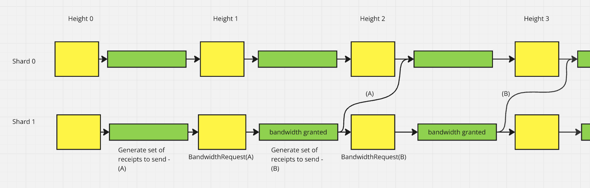

Details will be explained in the following sections.

### `BandwidthRequest`

A `BandwidthRequest` describes the receipts that a shard would like to send to another shard. A
shard looks at its queue of buffered receipts to another shard and generates a `BandwidthRequest`
which describes how much bandwidth the shard would like to have. In the simplest version a
`BandwidthRequest` could be a single integer containing the total size of buffered receipts, but
there is a problem with this simple representation - it doesn't say anything about the size of
individual receipts. Let's say that two shards want to send 4MB of data each to another shard, but
the incoming limit is 5MB. Should we assign 2.5MB of bandwidth to each of the sender shards? That
would work if the shards want to send a lot of small receipts, but it wouldn't work when each shard
wants to send a single 4MB receipt. A shard can't send a part of the 4MB receipt, it's either the
whole receipt or nothing. The scheduler should assign 2.5MB/2.5MB of bandwidth when the receipts are
small and 4MB/0MB when they're large. The simple version doesn't have enough information for the
scheduler to make the right decision, so we'll use a richer representation.

The richer representation is a list of possible bandwidth grants that make sense for this pair of
shards. For example when the outgoing buffer contains a single `4MB` receipt, the only bandwidth
grant that makes sense is `4MB`. Granting more or less bandwidth wouldn't change how many receipts
can be sent. In that case the bandwidth request would contain a single possible grant: `4MB`. It
tells the bandwidth scheduler that for this pair of shards it can either grant `4MB` or nothing at
all, other options don't really make sense. On the other hand if the outgoing buffer contains 4000
small receipts, 1kB each, there are many possible bandwidth grants that make sense. With so many
small receipts the scheduler could grant 1kB, 2kB, 3kB, ..., 4000kB and each of those options would
result in a different number of receipts being sent. However having 4000 options in the request
would make the request pretty large. To deal with this we'll specify a list of 40 predefined options
that can be requested in a bandwidth request. An option is requested when granting this much
bandwidth would result in more receipts being sent.

Let's take a look at an example. Let's say that the predefined list of values that can be requested
is:

```rust
[100kB, 200kB, 300kB, ..., 3900kB, 4MB]
```

And the outgoing receipts buffer has receipts with these sizes (receipts will be sent from left to
right):

```rust
[20kB, 150kB, 60kB, 400kB, 1MB, 50kB, 300kB]
```

The cumulative sum (sum from 0 to i) of sizes is:

```rust
[20kB, 170kB, 230kB, 630kB, 1630kB, 1680kB, 1980kB]
```

The bandwidth grant options in the generated `BandwidthRequest` will be:

```rust
[100kB, 200kB, 300kB, 700kB, 1700kB, 2000kB]
```

Explanation:

- Granting 100kB of bandwidth will allow to send the first receipt.
- Granting 200kB of bandwidth will allow to send the first two receipts.
- Granting 300kB will allow to send the first three receipts.
- Granting 400kB would give the same result as 300kB, so it's not included in the options
- Granting 700kB would allow to send the first four receipts
- etc etc

Conceptually a `BandwidthRequest` looks like this:

```rust
struct BandwidthRequest {
    /// Requesting bandwidth to this shard
    to_shard: ShardId,
    /// Please grant me one of the options listed here.
    possible_bandwidth_grants: Vec<u64>
}
```

A list of such requests will be included in the chunk header:

```rust
struct ChunkHeader {
    bandwidth_requests: Vec<BandwidthRequest>
}
```

With this representation the `BandwidthRequest` struct could be quite big, up to about ~320 bytes.
We will use a more efficient representation to bring its size down to only 7 bytes. First we could
use `u16` instead `u64` for the `ShardId`, NEAR currently has only 6 shards and it'll take a while
to reach 65536. There's no need to handle 10**18 shards. Second we can use a bitmap for the
`possible_bandwidth_grants` field. The list of predefined options that can be requested will be
computed deterministically on all nodes. The bitmap will have 40 bits, the `n-th` bit is `1` when
the `n-th` value from the predefined list is requested.

So the actual representation of a `BandwidthRequest` looks something like this:

```rust
struct BandwidthRequest {
    to_shard: u16,
    requested_values_bitmap: [u8; 5]
}
```

It's important to keep the size of `BandwidthRequest` small because bandwidth requests are included
in the chunk header, and the chunk header shouldn't be too large.

### Base bandwidth

In current mainnet traffic most of the time the size of outgoing receipts is small, under 50kB. It'd
be nice if a shard was able to send them out without having to make a bandwidth request. It'd lower
the latency (no need to wait for a grant) and make chunk headers smaller. That's why there's a
concept of `base_bandwidth`. Bandwidth scheduler grants `base_bandwidth` of bandwidth for each pair
of shards by default. This means that a shard doesn't need to make a request when it has less than
`base_bandwidth` of receipts, it can just send them out immediately. Actual bandwidth grants based
on bandwidth request happen after granting the base bandwidth.

On current mainnet (with 6 shards) the base bandwidth is 61_139 (61kB)

`base_bandwidth` is automatically calculated based on `max_shard_bandwidth`, `max_single_grant` and
the number of shards. It gets smaller as the number of shards increases. See the next section for details.

### `BandwidthSchedulerParams`

The `BandwidthSchedulerParams` struct keeps parameters used throughout the bandwidth scheduler
algorithm:

```rust
pub type Bandwidth = u64;

/// Parameters used in the bandwidth scheduler algorithm.
pub struct BandwidthSchedulerParams {
    /// This much bandwidth is granted by default.
    /// base_bandwidth = (max_shard_bandwidth - max_single_grant) / (num_shards - 1)
    pub base_bandwidth: Bandwidth,
    /// The maximum amount of data that a shard can send or receive at a single height.
    pub max_shard_bandwidth: Bandwidth,
    /// The maximum amount of bandwidth that can be granted on a single link.
    /// Should be at least as big as `max_receipt_size`.
    pub max_single_grant: Bandwidth,
    /// Maximum size of a single receipt.
    pub max_receipt_size: Bandwidth,
    /// Maximum bandwidth allowance that a link can accumulate.
    pub max_allowance: Bandwidth,
}
```

The values are:

```rust
max_shard_bandwidth = 4_500_000;
max_single_grant = 4_194_304
max_allowance = 4_500_000;
max_receipt_size = 4_194_304;
base_bandwidth = min(100_000, (max_shard_bandwidth - max_single_grant) / (num_shards - 1)) = 61_139
```

A shard must be able to send out `max_single_grant` on one link and `base_bandwidth` on all other
links without exceeding `max_shard_bandwidth`. So it must hold that:

```rust
base_bandwidth * (num_shards - 1) + max_single_grant <= max_shard_bandwidth
```

That's why base bandwidth is calculated by taking the bandwidth that would remain available after
granting `max_single_grant` on one link and dividing it equally between the other links.

There's also a limit which makes sure that `base_bandwidth` stays under 100kB, even when the number
of shards is low. There are some tests which have a low number of shards, and having a lower base
bandwidth allows us to fully test the bandwidth scheduler in those tests.

### `BandwidthRequestValues`

The `BandwidthRequestValues` struct represents the predefined list of values that can be requested
in a `BandwidthRequest`:

```rust
pub struct BandwidthRequestValues {
    pub values: [Bandwidth; 40],
}
```

The values are calculated using a linear interpolation between `base_bandwidth` and
`max_single_grant`, like this:

```rust
values[-1] = base_bandwidth // (here -1 is the imaginary element before 0, not the last element)
values[values.len() - 1] = max_single_grant
values[i] = linear interpolation between values[-1] and values[values.len() - 1]
```

The exact code is:

```rust
/// Performs linear interpolation between min and max.
/// interpolate(100, 200, 0, 10) = 100
/// interpolate(100, 200, 5, 10) = 150
/// interpolate(100, 200, 10, 10) = 200
fn interpolate(min: u64, max: u64, i: u64, n: u64) -> u64 {
    min + (max - min) * i / n
}

let values_len: u64 =
    values.len().try_into().expect("Converting usize to u64 shouldn't fail");
for i in 0..values.len() {
    let i_u64: u64 = i.try_into().expect("Converting usize to u64 shouldn't fail");

    values[i] = interpolate(
        params.base_bandwidth,
        params.max_single_grant,
        i_u64 + 1,
        values_len,
    );
}
```

The final `BandwidthRequestValues` on current mainnet (6 shards) look like this:

```rust
[
    164468, 267797, 371126, 474455, 577784, 681113, 784442, 887772, 991101, 1094430,
    1197759, 1301088, 1404417, 1507746, 1611075, 1714405, 1817734, 1921063, 2024392,
    2127721, 2231050, 2334379, 2437708, 2541038, 2644367, 2747696, 2851025, 2954354,
    3057683, 3161012, 3264341, 3367671, 3471000, 3574329, 3677658, 3780987, 3884316,
    3987645, 4090974, 4194304
]
```

### Generating bandwidth requests

To generate a bandwidth request the sender shard has to look at the receipts stored in the outgoing
buffer to another shard and pick bandwidth grant options that make sense. In this context "makes
sense" means that having this much bandwidth would cause the sender to send more receipts than the
previous requested option, as described in the `BandwidthRequest` section.

The simplest implementation would be to actually walk through the list of outgoing receipts
(starting from the ones that will be sent the soonest) and request values that allow to send more
receipts.

```rust
/// Generate a bitmap of bandwidth requests based on the size of receipts stored in the outgoing buffer.
/// Returns a bitmap with requests.
fn make_request_bitmap_slow(
    buffered_receipt_sizes: Vec<u64>,
    bandwidth_request_values: &BandwidthRequestValues,
) -> BandwidthRequestBitmap {
  let mut requested_values_bitmap = BandwidthRequestBitmap::new(); // [u8; 5]

    let mut total_size = 0;
    let values = &bandwidth_request_values.values;
    for receipt_size in buffered_receipt_sizes {
        total_size += receipt_size;

        for i in 0..values.len() {
            if values[i] >= total_size {
                requested_values_bitmap.set_bit(i, true);
                break;
            }
        }
    }

    requested_values_bitmap
}
```

But this is very inefficient. Walking over all buffered receipts could take a lot of time and it'd
require reading a lot of state from the Trie, which would make the `ChunkStateWitness` very large.

We need a more efficient algorithm. To achieve this we will add some additional metadata about the
outgoing buffer, which keeps coarse information about the receipt sizes. We will group consecutive
receipts into `ReceiptGroups`. A single `ReceiptGroup` aims to have total size and gas under some
threshold. If adding a new receipt to the group would cause it to exceed the threshold, a new group
is started. The threshold can only be exceeded when a single receipt has size or gas above the group
threshold.

The size threshold is set to 100kB, the gas threshold is currently infinite.

```rust
pub struct ReceiptGroupsConfig {
    /// All receipt groups aim to have a size below this threshold.
    /// A group can be larger that this if a single receipt has size larger than the limit.
    /// Set to 100kB
    pub size_upper_bound: ByteSize,
    /// All receipt groups aim to have gas below this threshold.
    /// Set to Gas::MAX
    pub gas_upper_bound: Gas,
}
```

A `ReceiptGroup` keeps only the total size and gas of receipts in this group:

```rust
pub struct ReceiptGroupV0 {
    /// Total size of receipts in this group.
    /// Should be no larger than `max_receipt_size`, otherwise the bandwidth
    /// scheduler will not be able to grant the bandwidth needed to send
    /// the receipts in this group.
    pub size: u64,
    /// Total gas of receipts in this group.
    pub gas: u128,
}
```

All the groups are kept inside a `ReceiptGroupsQueue`, which is a Trie queue similar to the delayed
receipts queue. `ReceiptGroupsQueue` additionally keeps information about the total size, gas and
number of receipts in the queue. There's one `ReceiptGroupsQueue` per outgoing buffer.

```rust
pub struct ReceiptGroupsQueue {
    /// Corresponds to receipts stored in the outgoing buffer to this shard.
    receiver_shard: ShardId,
    /// Persistent data, stored in the trie.
    data: ReceiptGroupsQueueDataV0,
}

pub struct ReceiptGroupsQueueDataV0 {
    /// Indices of the receipt groups TrieQueue.
    pub indices: TrieQueueIndices,
    /// Total size of all receipts in the queue.
    pub total_size: u64,
    /// Total gas of all receipts in the queue.
    pub total_gas: u128,
    /// Total number of receipts in the queue.
    pub total_receipts_num: u64,
}
```

When a new receipt is added to the outgoing buffer, we try to add it to the last group in the
`ReceiptGroupsQueue`. If there are no groups or adding the receipt would cause the last group to go
over the threshold, a new group is created. When a receipt is removed from the outgoing buffer, we
remove the receipt from the first group in the `ReceiptGroupsQueue` and remove the group if there
are no more receipts in it.

To generate a bandwidth request, we will walk over the receipt groups and request the values that
will allow to send more receipts. Just like in `make_request_bitmap_slow`, only using
`receipt_group_sizes` instead of `buffered_receipt_sizes`.

It's important to note that `size_upper_bound` is less than difference between two consecutive
values in `BandwidthRequestValues` . Thanks to this the requests are just as good as they would be
if they were generated directly using individual receipt sizes.


#### Example

Let's say that there are five buffered receipts with sizes:

```rust
5kB, 30kB, 40kB, 120kB, 20kB
```

They would be grouped into groups of at most 100kB, like this:

```rust
(5kB, 30kB, 40kB), (120kB), (20kB)
```

So the resulting groups would be:

```rust
75kB, 120kB, 20kB
```

And the bandwidth request will produced by walking over groups with sizes `35kB`, `120kB`, `70kB`,
not the individual receipts.


Now let's say that the first receipt with size `5kB` is forwarded. In that case it would be removed
from the first group, and the groups would look like this:

```rust
(30kB, 40kB), (120kB), (20kB)
```

When a new receipt is buffered, it's added to the last group, let's add a `50kB` receipt, after that
the groups would look like this:

```rust
(30kB, 40kB), (120kB), (20kB, 50kB)
```

When adding a new receipt would cause a group to go over the threshold, a new groups is started. So
if we added another 50kB receipt, the groups would become:

```rust
(30kB, 40kB), (120kB), (20kB, 50kB), (50kB)
```

#### Trie columns

Two new trie columns are added to keep the receipt groups.

- `BUFFERED_RECEIPT_GROUPS_QUEUE_DATA` - keeps `ReceiptGroupsQueueDataV0` for every outgoing buffer
- `BUFFERED_RECEIPT_GROUPS_QUEUE_ITEM` - keeps the individual `ReceiptGroup` items from receipt group queues

#### Protocol Upgrade

There's a bit of additional complexity around the protocol upgrade boundary. The receipt groups are
built for receipts that were buffered after protocol upgrade, but existing receipts that were
buffered before the upgrade won't have corresponding receipt groups. Eventually the old buffered
receipts will get sent out and we'll have full metadata for all receipts, but in the meantime we
won't be able to make a proper bandwidth request without having groups for all of the buffered
receipts. To deal with this we will pretend that there's one receipt with size `max_receipt_size` in
the buffer until the metadata is fully initialized. Requesting `max_receipt_size` is a safe bet -
it's enough to send out any buffered receipt. The effect will be similar to the previous approach -
one shard will be granted most of the bandwidth (exactly `max_receipt_size`), while other will be
waiting for their turn to be the "allowed shard". Once all of the old buffered receipts are sent out
we can start making proper requests using the receipt groups.

### `BandwidthScheduler`

`BandwidthScheduler` is an algorithm which looks at all of the `BandwidthRequests` submitted by
shards and grants some bandwidth on every link (pair of shards). A shard can send only as much data
as the grant allows, the remaining receipts stay in the buffer.

Bandwidth scheduler tries to ensure that:

- Every shard sends out at most `max_shard_bandwidth` bytes of receipts at every height.
- Every shard receives at most `max_shard_bandwidth` bytes of receipts at every height.
- The bandwidth is assigned in a fair way. At full load every link (pair of shards) sends and
  receives the same amount of bandwidth on average, there are no favorites.
- Bandwidth utilization is high.

The algorithm works in 4 stages:

1) Give out a fair share of allowance to every link.
2) Grant base bandwidth on every link. Decrease allowance by granted bandwidth.
3) Process bandwidth requests. Order all bandwidth requests by the link's allowance. Take the
   request with the highest allowance and try to grant the first proposed value. Check if it's
   possible to grant the value without violating any restrictions. If yes, grant the bandwidth and
   decrease the allowance accordingly. Then remove the granted value from the request and put it
   back into the queue with new allowance. If no, remove the request from the queue, it will not be
   fulfilled. Requests with the same allowance are processed in a random order.
4) Distribute remaining bandwidth. If there's some bandwidth left after granting base bandwidth and
   processing all requests, distribute it over all links in a fair manner to improve bandwidth
   utilization.


#### Allowance

There is a concept of "allowance" - every link (pair of sender and receiver shards) has an
allowance. Allowance is a way to ensure fairness. Every link receives a fair amount of allowance on
every height. When bandwidth is granted on a link, the link's allowance is decreased by the granted
amount. Requests on links with higher allowance have priority over requests on links with lower
allowance. Links that send more than their fair share are deprioritized, which keeps things fair.
It's a similar idea to the [Token Bucket](https://en.wikipedia.org/wiki/Token_bucket). Link
allowances are persisted in the state trie, as they're used to track fairness across multiple
heights.

An intuitive way to think about allowance is that it keeps track of how much each link sent recently
and lowers priority of links that recently sent a lot of receipts, which gives other a fair chance.

Imagine a situation where one link wants to send a 2MB receipt at every height, and other links want
to send a ton of small receipts to the same shard. Without allowance, the link with 2MB receipts
would always get 2MB of bandwidth assigned, and other links would get less than that, which would be
unfair. Thanks to allowance, the scheduler will grant some bandwidth to the 2MB link, but then it
will decrease the allowance on that link, which will deprioritize it and other links will get their
fair share.

When multiple requests have the same allowance, they are processed in random order. The randomness
is deterministic, the scheduler uses `ChaCha20Rng` seeded using the previous block hash and requests
with equal allowance are shuffled used this random generator.

```rust
ChaCha20Rng::from_seed(prev_block_hash.0)
...
requests.shuffle(&mut self.rng);
```

The fair share of allowance that is given out on every height is:

```rust
fair_link_bandwidth = max_shard_bandwidth / num_shards
```

The reasoning is that in an ideal, fair world, every link would send the same amount of bandwidth.
There would be `max_bandwidth / num_shards` sent on every link, fully saturating all senders and
receivers. Allowance measures the deviation from this perfect world.


Link allowance never gets larger than `max_allowance` (currently 4.5MB). When a link's allowance
reaches `max_allowance` we stop adding allowance there until the link uses up some of the
accumulated one. Without `max_allowance` a link that sends very little for a long time could
accumulate an enormous amount of allowance and it could have priority over other links for a very
long time. Capping the allowance at some value keeps the allowance fresh, information from the
latest blocks should be what matters most.

#### Example

<details>
<summary>
Here's an example, click to expand.
</summary>

Let's say that there are 3 shards. The `BandwidthSchedulerParams` look like this:

```rust
BandwidthSchedulerParams {
    base_bandwidth: 100_000,
    max_shard_bandwidth: 4_500_000,
    max_single_grant: 4_194_304,
    max_receipt_size: 4_194_304,
    max_allowance: 4_500_000,
}
```

And `BandwidthRequestValues` are:

```rust
[
    210000, 320000, 430000, 540000, 650000, 760000, 870000, 980000, 1090000, 1200000,
    1310000, 1420000, 1530000, 1640000, 1750000, 1860000, 1970000, 2080000, 2190000,
    2300000, 2410000, 2520000, 2630000, 2740000, 2850000, 2960000, 3070000, 3180000,
    3290000, 3400000, 3510000, 3620000, 3730000, 3840000, 3950000, 4060000, 4194304
]
```

(Note that these values are slightly different from the ones that would be generated by linear
interpolation, but for the sake of the example let's say that they look like this, the slight
difference doesn't really matter and it's easier to work with round numbers)

Shard 2 is fully congested and only the allowed shard (shard 1) is allowed to send receipts to it.

The outgoing buffers look like this, shards want to send receipts with these sizes:

- 0->1 [3.9MB]
- 1->1 [200kB, 200kB, 200kB]
- 1->2 [2MB]
- 2->2 [500kB]

Bandwidth requests request values from the predefined list (`BandwidthRequestValues`), in this
example the requests would be:

- 0->1 [3950kB]
- 1->1 [210kB, 430kB, 650kB]
- 1->2 [2.08MB]
- 2->2 [540kB]

Every link has some allowance, in this example let's say that all links start with the same allowance (4MB)

| Link | Allowance |
| ---- | --------- |
| 0->0 | 4MB       |
| 0->1 | 4MB       |
| ...  | 4MB       |

All shards start with sender and receiver budgets set to `max_shard_bandwidth` (4.5MB). Budgets
describe how much more a shard can send or receive:

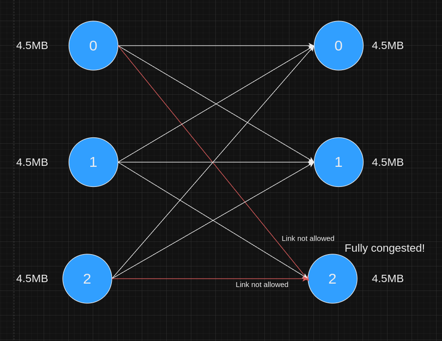

First step of the algorithm is to give out a fair share of allowance on every link.
In an ideally fair world every link would send the same amount of data at every height, so the fair share of allowance is:

```rust
fair_link_bandwidth = max_shard_bandwidth / num_shards = 4.5MB/3 = 1.5MB
```

So every link receives `1.5MB` of allowance. But allowance can't get larger than `max_allowance`, which is set to `4.5MB`, so the allowance is set to `4.5MB` on all links:

| Link | Allowance |
| ---- | --------- |
| 0->0 | 4.5MB     |
| 0->1 | 4.5MB     |
| ...  | 4.5MB     |

The next step is to grant base bandwidth. Every (allowed) link is granted `base_bandwidth = 100kB`:

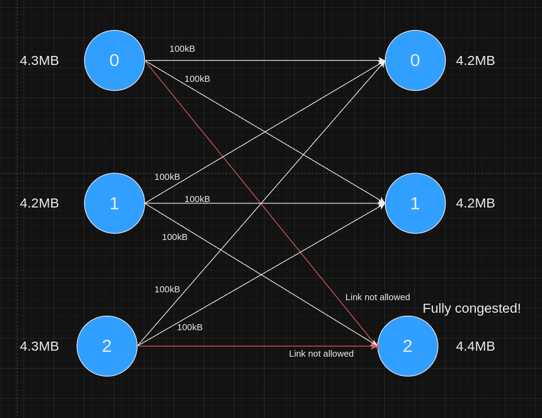

This grant is subtracted from the link's allowance, we assume that all of the granted base bandwidth
will be used for sending receipts. So the allowances change to:

| Link | Allowance |
| ---- | --------- |
| 0->2 | 4.5MB     |
| 2->2 | 4.5MB     |
| 0->0 | 4.4MB     |
| 0->1 | 4.4MB     |
| ...  | 4.4MB     |

The next step is to process the bandwidth requests. Requests are processed in the order of
decreasing link allowance, so the first one to be processed is `(2->2 [540kB])`

This request can't be granted because the link `(2->2)` is not allowed. The request is rejected.

The remaining requests have the same link allowance, so they'll be processed in random order.

Let's first process the request `(0->1 [3950kB])`. Sender and receiver have enough budget to grant
this much bandwidth and the link is allowed, so the bandwidth is granted. The grant on `(0->1)` is
increased from `100kB` to `3950kB`. Allowance on `(0->1)` is reduced by `3850kB`:

| Link | Allowance |
| ---- | --------- |
| 0->1 | 550kB     |
| ...  | ...       |

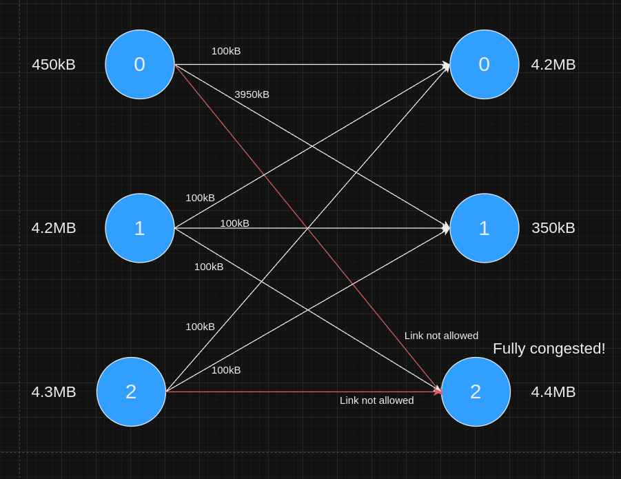

Then' let's process `(1->1 [210kB, 430kB, 650kB])`. Can we increase the grant on `(1->1)` to 210kB?
Yes, let's do that. The bandwidth is granted and the allowance for `(1->1)` decreased. The `210kB`
option is removed from the request and the request is reinserted into the priority queue with the
lower allowance.

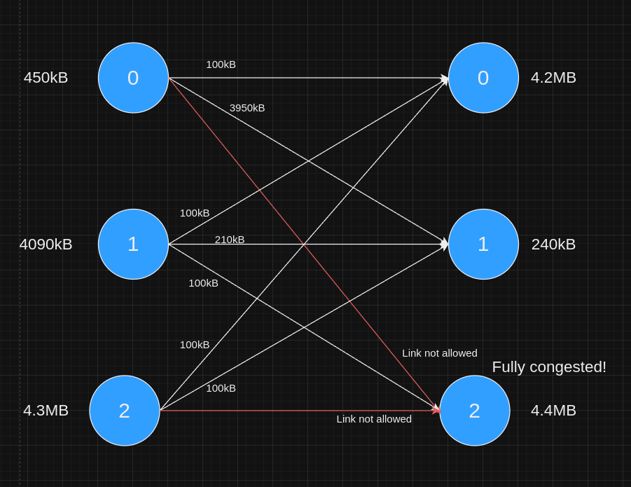

| Link | Allowance |
| ---- | --------- |
| 0->1 | 550kB     |
| 1->1 | 4090kB    |
| ...  | ...       |


Now let's process `(1->2 [2.08MB])`. The bandwidth can be granted without any issues.

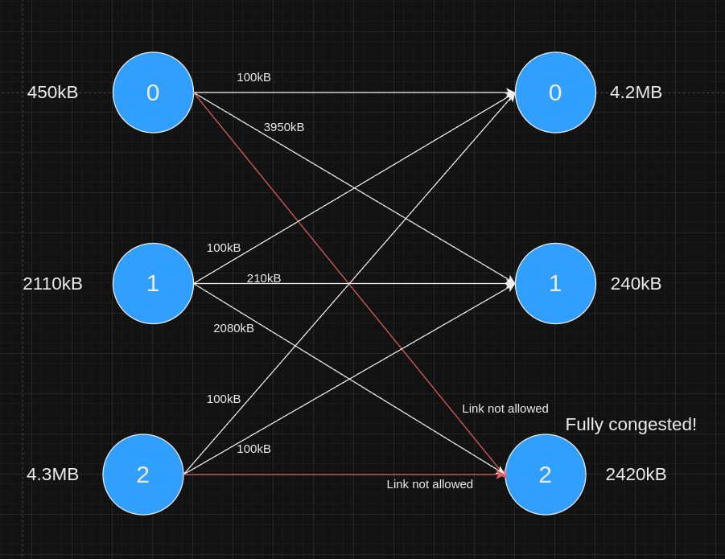

| Link | Allowance |
| ---- | --------- |
| 0->1 | 550kB     |
| 1->1 | 4090kB    |
| 1->2 | 2420kB    |
| ...  | ...       |

Then `(1->1 [430kB, 650kB])` is taken back out of the priority queue. Is it ok to increase the grant
on `(1->1)` to 430kB? Yes, do it. Then the `430kB` option is removed from the request, and the request is requeued.

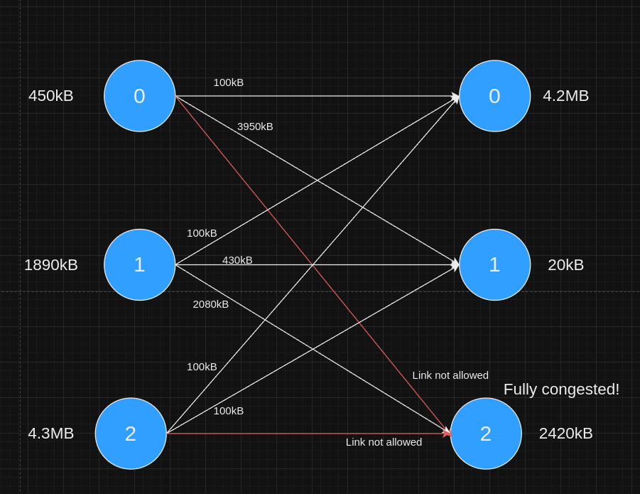

| Link | Allowance |
| ---- | --------- |
| 0->1 | 550kB     |
| 1->1 | 3870kB    |
| 1->2 | 2420kB    |
| ...  | ...       |


Finally `(1->1 [650kB])` is taken out of the queue, but the request can't be granted because it
would exceed the incoming limit for shard 1.

The final grants are:

| Link | Granted Bandwidth |
| ---- | ----------------- |
| 0->0 | 100kB             |
| 0->1 | 3950kB            |
| 0->2 | 0B                |
| 1->0 | 100kB             |
| 1->1 | 430kB             |
| 1->2 | 2080kB            |
| 2->0 | 100kB             |
| 2->1 | 100kB             |
| 2->2 | 0B                |


Notice how the big receipt sent on `(0->1)` and smaller receipts sent on `(1->1)` compete for the
incoming budget of shard 1. Let's imagine a scenario where `(0->1)` always sends `3.9MB` receipts
and `(1->1)` always sends many `200kB` receipts. Without allowance we would grant the first value
from both bandwidth requests, which would mean that `(0->1)` always gets to send the `3.9MB` receipt
and `(1->1)` gets to send a few `200kB` receipts. This isn't fair, much more data would be sent on
the `(0->1)` link. With allowance the priority for `(0->1)` sharply drops after granting `3.9MB` and
`(1->1)` has the space to send a fair amount of receipts.

---

</details>

All shards run the `BandwidthScheduler` algorithm with the same inputs and calculate the same
bandwidth grants. The scheduler has to be run at every height, even on missing chunks, to ensure
that scheduler state stays identical on all shards. `nearcore` has existing infrastructure
(`apply_old_chunk`) to run things on missing chunks, there are implicit state transitions that are
used for distributing validator rewards. Scheduler reuses this infrastructure to run the algorithm
and modify the state on every height.

### `BandwidthSchedulerState`

`BandwidthScheduler` keeps some persistent state that is modified with each run. The state is stored
in the shard state trie. Each shard has identical `BandwidthSchedulerState` stored in the trie, all
shards run the same algorithm with the same inputs and state and arrive at identical new state that
is saved to the trie.

`BandwidthSchedulerState` contains current allowance for every pair of shards. Allowance is used to
ensure fairness across many heights, so it has to be persisted across heights.

```rust
pub enum BandwidthSchedulerState {
    V1(BandwidthSchedulerStateV1),
}

pub struct BandwidthSchedulerStateV1 {
    /// Allowance for every pair of (sender, receiver). Used in the scheduler algorithm.
    /// Bandwidth scheduler updates the allowances on every run.
    pub link_allowances: Vec<LinkAllowance>,
    /// Sanity check hash to assert that all shards run bandwidth scheduler in the exact same way.
    /// Hash of previous scheduler state and (some) scheduler inputs.
    pub sanity_check_hash: CryptoHash,
}

pub struct LinkAllowance {
    /// Sender shard
    pub sender: ShardId,
    /// Receiver shard
    pub receiver: ShardId,
    /// Link allowance, determines priority for granting bandwidth.
    pub allowance: Bandwidth,
}
```

There's also `sanity_check_hash`. It's not used in the algorithm, it's only used for a sanity check
to assert that scheduler state stays the same on all shards. It's calculated using the previous
`sanity_check_hash` and the current list of shards:

```rust
let mut sanity_check_bytes = Vec::new();
sanity_check_bytes.extend_from_slice(scheduler_state.sanity_check_hash.as_ref());
sanity_check_bytes.extend_from_slice(CryptoHash::hash_borsh(&all_shards).as_ref());
scheduler_state.sanity_check_hash = CryptoHash::hash_bytes(&sanity_check_bytes);
```

It would be nicer to hash all of the inputs to bandwidth scheduler, but that could require hashing
tens of kilobytes of data, which could take a bit of cpu time, so it's not done. The sanity check
still checks that all shards ran the algorithm the same number of times and with the same shards.

A new trie column is introduced to keep the scheduler state:

```rust
pub const BANDWIDTH_SCHEDULER_STATE: u8 = 15;
```

### Congestion control

Bandwidth scheduler limits only the size of outgoing receipts, the gas is limited by congestion
control. It's important to make sure that these two are integrated properly. Situations where one
limit allows sending receipts, but the other doesn't could lead to liveness issues. To avoid
liveness problems, the scheduler checks which shards are fully congested, and doesn't grant any
bandwidth on links to these shards (except for the allowed sender shard). This prevents situations
where the scheduler would grant bandwidth on some link, but no receipts would be sent because of
congestion. There is a guarantee that for every bandwidth grant, the shard will be able to send at
least one receipt, which is enough to ensure liveness. There can still be unlucky coincidences where
the scheduler grants a lot of bandwidth on a link, but the shard can send only a few receipts
because of the gas limit enforced by congestion control. This is not ideal, in the future we might
consider merging these two algorithm into one better algorithm, but it is good enough for now.

### Missing chunks

When a chunk is missing, the incoming receipts that were aimed at this chunk are redirected to the
first non-missing chunk on this shard. The non-missing chunk will be forced to consume incoming
receipts meant for two chunks, or even more if there were multiple missing chunks in a row. This is
dangerous because the size of receipts sent to multiple chunks could be bigger than one chunk can
handle. We need to make sure that `BandwidthScheduler` is aware of this problem and stops sending
data when there are missing chunks on the target shard.

`BandwidthScheduler` can see when another chunk is missing and it can refrain from sending new
receipts until the old ones have been processed. When a chunk is applied, it has access to the block
that contains this chunk. It can take a look at other shards and see if their chunks are missing in
the current block or not. If a chunk is missing, then the previously sent receipts haven't been
processed and the scheduler won't send new ones.

In the code this condition looks like this:

```rust
fn calculate_is_link_allowed(
    sender_index: ShardIndex,
    receiver_index: ShardIndex,
    shards_status: &ShardIndexMap<ShardStatus>,
) -> bool {
    let Some(receiver_status) = shards_status.get(&receiver_index) else {
        // Receiver shard status unknown - don't send anything on the link, just to be safe.
        return false;
    };

    if receiver_status.last_chunk_missing {
        // The chunk was missing, receipts sent previously were not processed.
        // Don't send anything to avoid accumulation of incoming receipts on the receiver shard.
        return false;
    }
    // ...
}
```

It's forbidden to send receipts on a link if the last chunk on the receiver shard is missing.

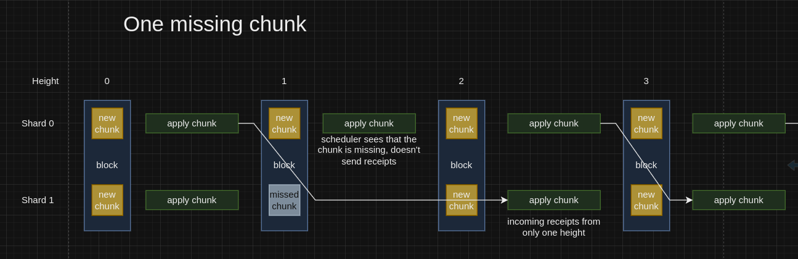
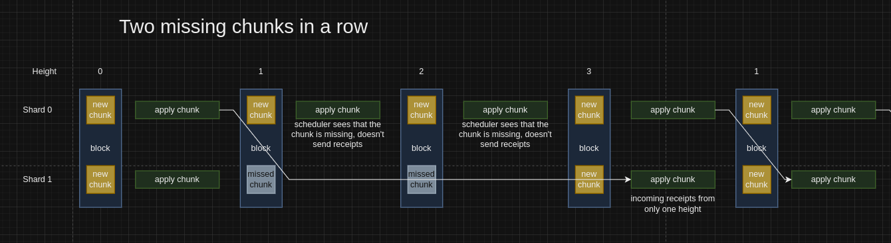

Sadly this condition isn't enough to ensure that a chunk never receives more than
`max_shard_bandwidth` of receipts. This is because receipts sent from a chunk aren't included as
incoming receipts until the next non-missing chunk on the sender shard appears. A chunk producer
can't include incoming receipts until it has the `prev_outgoing_receipts_root` to prove the incoming
receipts against. Because of this there can be a situation where the bandwidth scheduler allows to
send some receipts, but they don't arrive immediately because chunks are missing on the sender
shard. In the meantime other shards might send other receipts and in the end the receiver can
receive receipts sent at multiple shards, which could add up to more than `max_shard_bandwidth`.

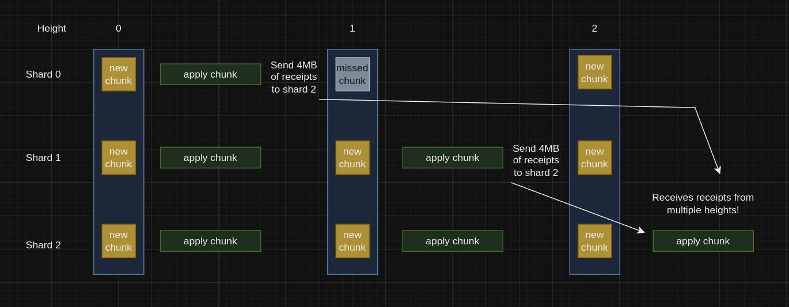

This is still an improvement over the previous solution which allowed to send receipts to shards
with missing chunks for up to `max_congestion_missed_chunks = 5` chunks. In the worst-worst case
scenario a single chunk might receive `num_shards * max_shard_bandwidth` of receipts at once, but
it's highly unlikely to happen. A lot of missing chunks and receipts would have to align for that
too happen. To trigger it an attacker would need to have precise control over missing chunks on all
shards, which they shouldn't have. A future version of bandwidth scheduler might solve this problem
fully, for example by looking at how much was granted but not received and refusing to send more,
but it's out of scope for the initial version of the bandwidth scheduler. The whole environment
might change soon, SPICE might remove the concept of missing chunks altogether, for now we can live
with this problem.

### Resharding

During resharding the list of existing shards changes. Bandwidth scheduler assumes that sender and
receiver shards are from the same layout, but this is not true for one height at the resharding
boundary where senders are from the old layout, but receivers are from the new one. Ideally the
bandwidth scheduler would make sure that bandwidth is properly granted when the sets of senders and
receivers are different, but this not implemented for now. The grants will be slightly wrong (but
still within limits) on the resharding boundary. They will be wrong for only one block height, after
resharding the senders and receivers will be the same again and the scheduler will work properly
again. The amount of work needed to properly support resharding exceeds the benefits, we can live
with a slight hiccup for one height at the resharding boundary.

To properly handle resharding we would have to:

- Use different ShardLayouts for sender shards and receiver shards
- Interpret bandwidth requests using the `BandwidthSchedulerParams` that they were created with
- Make sure that `BandwidthSchedulerParams` are correct on the resharding boundary

It's doable, but it's out of scope for the initial version of the bandwidth scheduler.

There's one additional complication with generating bandwidth requests. When a parent shard is split
into two children, the parent disappears from the current `ShardLayout`, but other shards might
still have buffered receipts aimed at the parent shard. Bandwidth scheduler will not grant any
bandwidth to send receipts to a shard that doesn't exist, which would prevent these buffered
receipts from being sent, they'd be stuck in the buffer forever. To deal with that we have to do two
things. First thing is to redirect receipts aimed at the parent to the proper child shard. When we
try to forward a receipt from the buffer aimed at the parent, we will determine which child the
receipt should go to and forward it to this child, using bandwidth limits meant for sending receipts
to the child shard. Second thing is to generate bandwidth requests using both the parent buffer and
the child buffer. A shard can't send any receipts from the parent buffer without a bandwidth grant,
so we have to somehow include the parent buffer in the bandwidth requests, even though the parent
doesn't exist in the current `ShardLayout`. This is done by merging (conceptually) parent and child
buffers when generating a bandwidth request. First we walk over receipt groups in the parent buffer,
then the receipt groups in the child buffer. This way the bandwidth grants to the child will include
receipts aimed at the parent.

### Distributing remaining bandwidth

After bandwidth scheduler processes all of the bandwidth requests, there's usually some leftover
budget for sending and receiving data between shards. It'd be wasteful to not use the remaining
bandwidth, so the scheduler will distribute it between all the links. Granting extra bandwidth helps
to lower latency, it might allow a shard to send out a new receipt without having to make a
bandwidth request.

The algorithm for distributing remaining bandwidth works as follows:

1) Calculate how much more each shard could send and receive, call it `bandwidth_left`
2) Calculate how many active links there are to each sender and receiver. A link is active if
   receipts can be sent on it, i.e. it's not forbidden because of congestion or missing chunks. Call
   this number `links_num`.
3) Order all senders and receivers by `average_link_bandwidth = bandwidth_left/links_num`, in
   increasing order. Ignore shards that don't have any bandwidth or links.
4) Walk over all senders (as ordered in (3)), for each sender walk over all receivers (as ordered in
   (3)) and try to grant some bandwidth on this link
5) Grant `min(sender.bandwidth_left / sender.links_num, receiver.bandwidth_left /
   receiver.links_num)` on the link
6) Decrease `sender.links_num` and `receiver.links_num` by one.

The algorithm is a bit tricky, but the intuition behind it is that if a shard can send 3MB more, and
there are 3 active links connected to this shard, then it should send about 1MB on every one of
these links. But it has to respect how much each of the receiver shards can receive. If one of them
can receive only 500kB we can't grant 1MB on this link. That's why the algorithm takes the minimum
of how much the sender should send and how much the receiver should receive. Sender and receiver
negotiate the highest amount of data that can be sent between them. Shards are ordered by
`average_link_bandwidth` to ensure high utilization - it gives the guarantee that all shards
processed later will be able to send/receive at least as much as the shard being processed now.

<details>
<summary>
Here's an example, click to expand
</summary>

Let's say there are three shards, each shard could send and receive a bit more data (called the remaining budget):

| Shard | Sending budget | Receiving budget |
| ----- | -------------- | ---------------- |
| 0     | 300kB          | 700kB            |
| 1     | 4.5MB          | 100kB            |
| 2     | 1.5MB          | 4.5MB            |

Shard 2 is fully congested, which means that only the allowed shard (shard 1) can send receipts to it.
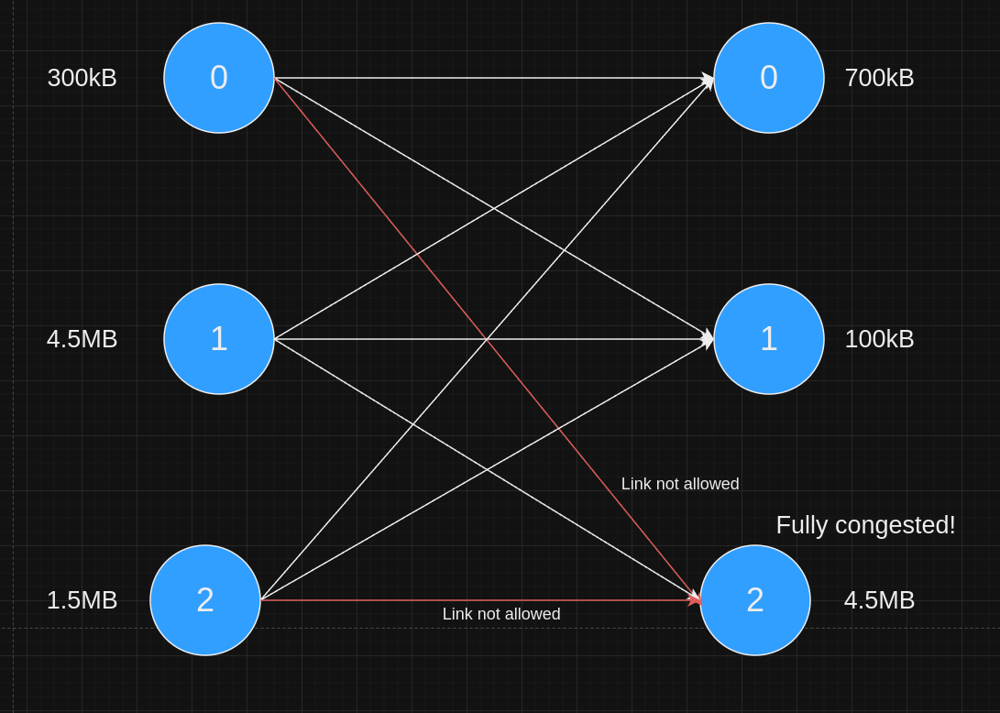

First let's calculate how many active links there are to each shard.
Active links are links that are not forbidden:

| Shard | Active sending links | Active receiving links |
| ----- | -------------------- | ---------------------- |
| 0     | 2                    | 3                      |
| 1     | 3                    | 3                      |
| 2     | 2                    | 1                      |

Average link bandwidth is calculated as the budget divided by the number of active links.

| Shard | Average sending bandwidth | Average receiving bandwidth |
| ----- | ------------------------- | --------------------------- |
| 0     | 300kB/2 = 150kB           | 700kB/3 = 233kB             |
| 1     | 4.5MB/3 = 1.5MB           | 100kB/3 = 33kB              |
| 2     | 1.5MB/2 = 750kB           | 4.5MB/1 = 4.5MB             |

Now let's order senders and receivers by their average link bandwidth

| Sender shard | Average link bandwidth |
| ------------ | ---------------------- |
| 0            | 150KB                  |
| 2            | 750kB                  |
| 1            | 1.5MB                  |

| Receiver shard | Average link bandwidth |
| -------------- | ---------------------- |
| 1              | 33kB                   |
| 0              | 233kB                  |
| 2              | 4.5MB                  |

And now let's distribute the bandwidth, process senders in the order of increasing average link
bandwidth and for every sender process the receiver in the same order:

Link (0 -> 1): Sender proposes 300kB/2 = 150kB. Receiver proposes 100kB/3 = 33kB. Grant 33kB

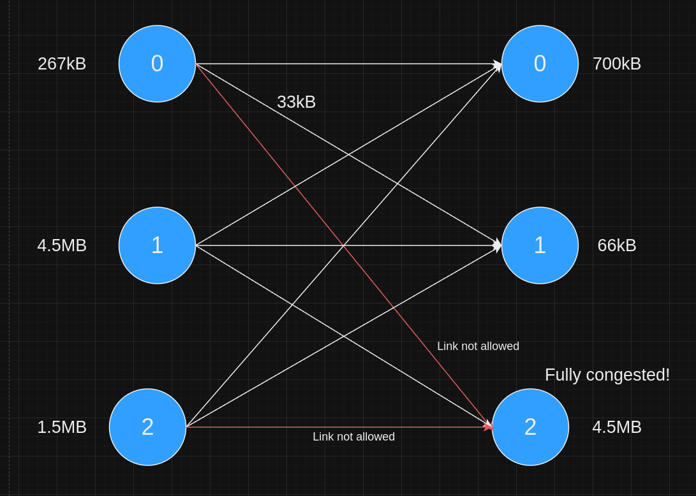

Link (0 -> 0): Sender proposes 267kB/1 = 267kB. Receiver proposes 700kB/3 = 233kB. Grant 233kB

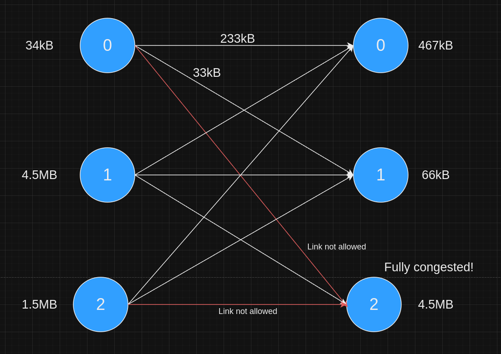

Link (0 -> 2): This link is not allowed. Nothing is granted.

Link (2 -> 1): Sender proposes 1.5MB/2 = 750kB. Receiver proposes 66kB/2 = 33kB. Grant 33kB

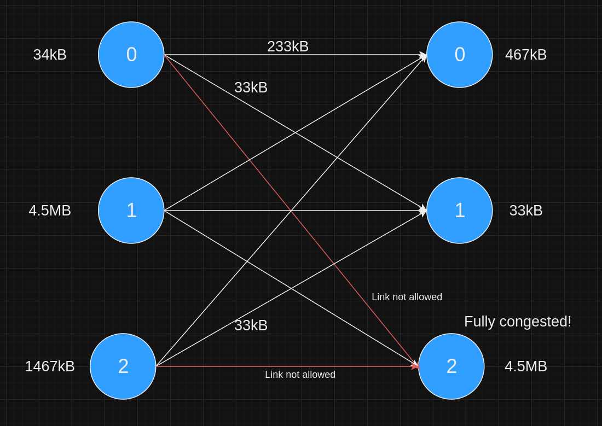

Link (2 -> 0): Sender proposes 1467kB/1 = 1467kB. Receiver proposes 467kB/2 = 233kB. Grant 233kB

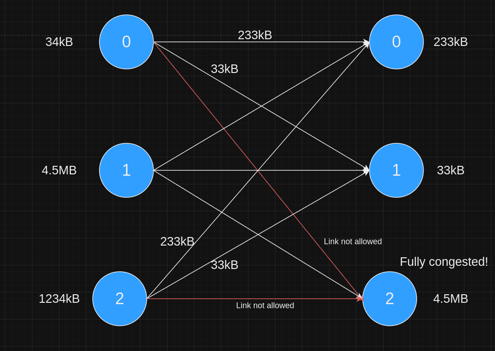

Link (2 -> 2): This link is not allowed. Nothing is granted.

Link (1 -> 1): Sender proposes 4.5MB/3 = 1.5MB. Receiver proposes 33kB/1. Grant 33kB

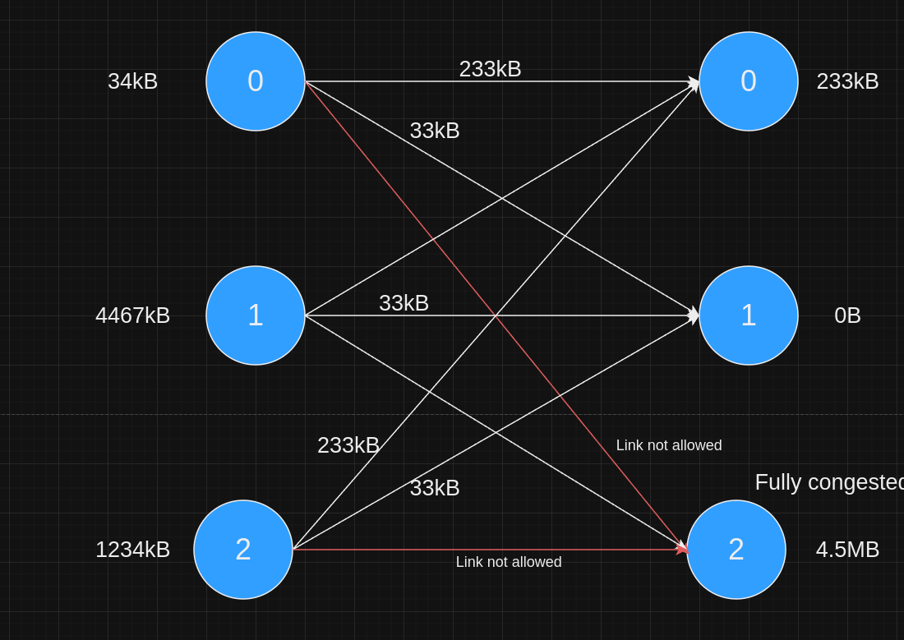

Link (1 -> 0): Sender proposes 4467kB/2 = 2233kB. Receiver proposes 233kB/1 = 233kB. Grant 233kB

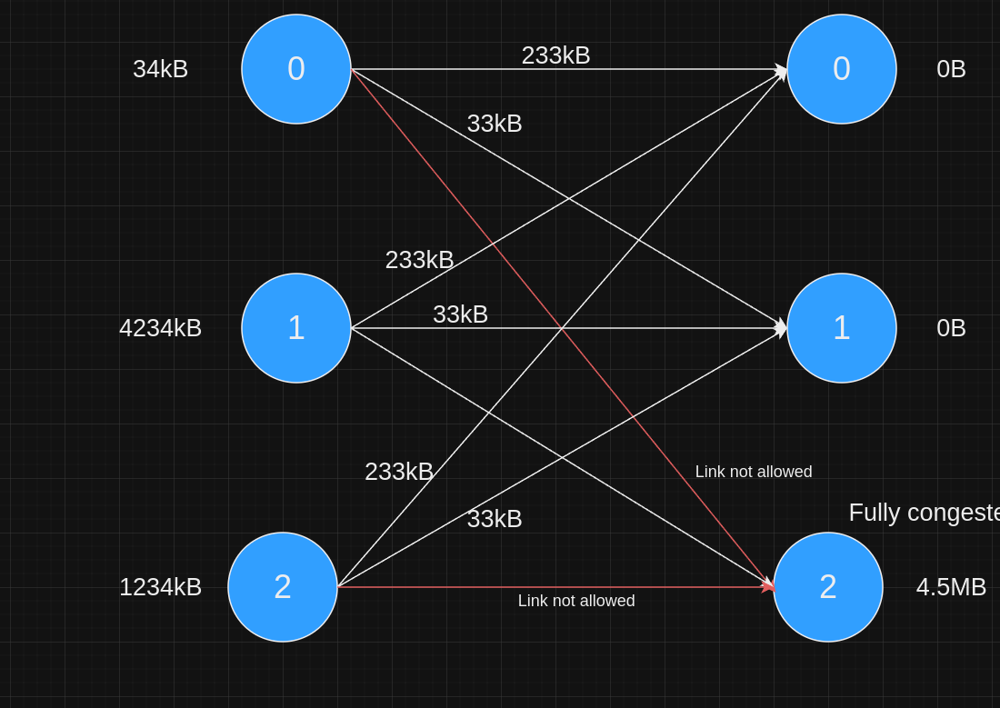

Link (1 -> 2): Sender proposes 4234kB/1 = 4234kB. Receiver proposes 4.5MB. Grant 4234kB

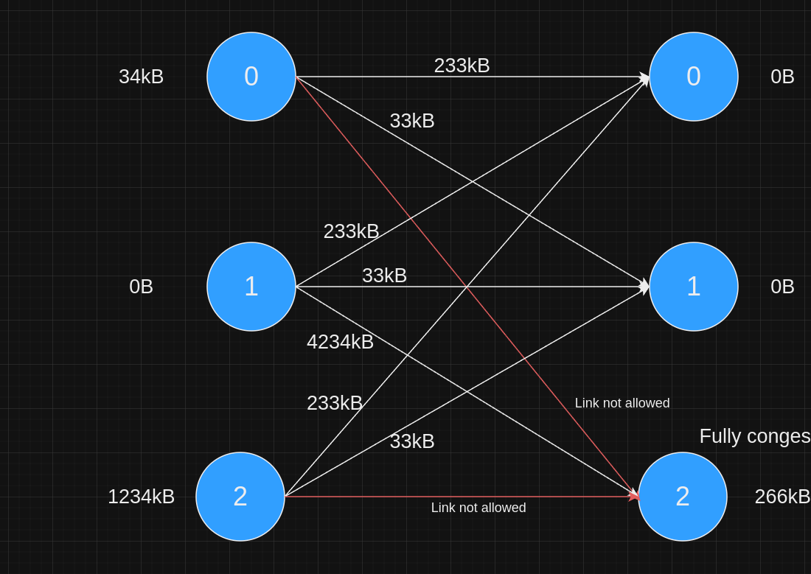

And all of the bandwidth has been distributed fairly and efficiently.

---

</details>

When all links are allowed the algorithm achieves very high bandwidth utilization (99% of the
theoretical maximum). When some links are not allowed the problem becomes much harder, it starts
being similar to the maximum flow problem. The algorithm still achieves okay utilization (75% of the
theoretical maximum), and I think this is good enough. In this case we want a fast heuristic, not a
slow algorithm that will solve the max flow problem perfectly.

The algorithm is safe because it never grants more than `min(sender.bandwidth_left,
receiver.bandwidth_right)`, so it'll never go over the limits. The utilization and fairness is good,
but I don't have a good proof for that, just an intuitive understanding. The algorithm is fast,
behaves well in practice and is provably safe, and I think that is good enough.

For the exact implementation see: https://github.com/near/nearcore/pull/12682

### One block delay

There's a one block delay between requesting bandwidth and receiving a grant. This is not ideal,
most large receipts will have to be buffered and sent out at the next height, it'd be nicer if we
could quickly negotiate bandwidth and send them immediately.

It is a hard problem to solve - a shard doesn't know what other shards want to send, so it needs to
contact them and negotiate. Maybe it'd be possible to negotiate it off-chain in between blocks, but
that would be much more complex - we would have to make sure that the negotiation happens quickly
even when latency between nodes is high and ensure that everything is fair and secure. The idea is
explored further in `Option D` section, but for now I think we can go with a solution that is
simpler and should be good enough, even though it has a one block delay.

At first glance it might seem that the delay prevents us from using 100% of the bandwidth - a big
receipt takes 2 blocks to reach the other shard, doesn't that mean that we get only 50% of the
theoretical throughput? Not really, the delay increases latency, but it doesn't affect throughput.
An application that wants to utilize 100% of bandwidth can submit the receipts and they'll be queued
and sent over utilizing 100% of the bandwidth, just with a one block delay. There's no 50% problem.
As an example one can imagine a contract that wants to send 4MB of data to another shard at every
height. The contract will produce a 4MB receipt at every height, the shard will generate a 4MB
`BandwidthRequest` at every height, and the bandwidth scheduler will grant the shard 4MB of
bandwidth at every height (assuming no requests from other shards). At the first height the 4MB will
be buffered, but for all the following heights the shard will have the 4MB grant and it'll be able
to send 4MB of data to the other shard. We can utilize 100% of the bandwidth despite the delay, we
just have to make sure that we can buffer ~10MB of receipts in the outgoing queue.

### Performance

Complexity of the bandwidth scheduler algorithm is `O(num_shards^2 + num_requests *
log(num_requests))`, which in the worst case is equal to `O(num_shards^2 * log(num_shards))`. It's
hard (impossible?) to avoid the `num_shards^2` because the scheduler has to consider every pair of
shards. The `log(num_requests)` comes from sorting by allowance.

Scheduler works quickly for lower number of shards, but the time needed to run it grows quickly as
the number of shards increases. Here's a benchmark of the worst-case scenario performance, measured
on a typical `n2d-standard-8` GCP VM with an AMD EPYC 7B13 CPU:

| Number of shards | time      |
| ---------------- | ----------|
| 6                | 0.13 ms   |
| 10               | 0.19 ms   |
| 32               | 1.85 ms   |
| 64               | 5.80 ms   |
| 128              | 23.98 ms  |
| 256              | 97.44 ms  |
| 512              | 385.97 ms |

It's important to note that this is worst-case performance, with all shards wanting to send a ton of
small receipts to other shards. Usually the number of bandwidth requests will be lower and the
scheduler will work quicker than that.

The current version of the scheduler should work fine up to 50-100 shards, after that we'll probably
need some modifications. A quick solution would be to randomly choose half of the shards at every
height and only grant bandwidth between them, this would cut `num_shards` in half. There's also some
potential for parallelization, the bandwidth grants could be calculated in parallel with application
of the action receipts. I think we can worry about it when we reach 100 shards, with this many
shards the environment and typical patterns will probably change a lot, we can analyze them and
modify the scheduler accordingly.

### Testing

Bandwidth scheduler is pretty complex, and it's a bit hard to reason about how things really flow,
so it's important to test it well. There is a bunch of tests which run some kind of workload and
check if the parameters look alright. The two main parameters are:

- Utilization - are receipts sent as fast as theoretically possible? Utilization should be close to
  100% for small receipts. With big receipts it should be at least 50%. (If all receipts have size
  `max_shard_bandwidth / 2 + 1` we can only send one such receipt per height, and we get ~50%
  utilization)
- Fairness - is every link sending the same amount of bytes on average? As long as all outgoing
  buffers are full, all links should send about the same amount of data on average, there should be
  no favorites.

The scheduler algorithm was tested in two ways:

- On a blockchain simulator, which simulates a few shards sending receipts between each other, along
  with missing chunks and blocks. It doesn't take into account other mechanisms like congestion
  control. It was used to test utilization and fairness in various scenarios, without interference
  from other congestion mechanisms. A simulator allows to quickly run a test over thousands of
  blocks, which would take minutes in actual `nearcore`.
- In testloop, which runs the actual blockchain code in a deterministic way. The tests are slower,
  but test the actual code that will run in the real world. They also allow to test interaction with
  other mechanisms like congestion control.

The simulator tests went well. Utilization and fairness were good, the only issue that these tests
found is that a chunk might sometimes receive more than `max_shard_bandwidth` because of missing
chunks, which is a known issue with the design.

The testloop tests were a bit below expectations. It seems like there are other mechanisms that
prevent us from reaching full cross-shard bandwidth utilization. It was hard to reach a state where
all of the outgoing buffers were full and the scheduler could go at full speed. I plan to add more
observability which should shed more light on what exactly is going on there. Still the test results
were okay, the scheduler works reasonably well. Testing in testloop also allowed to find some bugs
with the congestion control integration.

## Reference Implementation

[This technical section is required for Protocol proposals but optional for other categories. A
draft implementation should demonstrate a minimal implementation that assists in understanding or
implementing this proposal. Explain the design in sufficient detail that:

- Its interaction with other features is clear.
- Where possible, include a Minimum Viable Interface subsection expressing the required behavior and
  types in a target programming language. (ie. traits and structs for rust, interfaces and classes
  for javascript, function signatures and structs for c, etc.)
- It is reasonably clear how the feature would be implemented.
- Corner cases are dissected by example.
- For protocol changes: A link to a draft PR on nearcore that shows how it can be integrated in the
  current code. It should at least solve the key technical challenges.

The section should return to the examples given in the previous section, and explain more fully how
the detailed proposal makes those examples work.]

Here are the PRs which implement this NEP in `nearcore`:

- https://github.com/near/nearcore/pull/12234: wiring for bandwidth scheduler
- https://github.com/near/nearcore/pull/12307: Do bandwidth scheduler header upgrade the same way as for congestion control
- https://github.com/near/nearcore/pull/12333: implement the BandwidthRequest struct
- https://github.com/near/nearcore/pull/12464: generate bandwidth requests based on receipts in outgoing buffers
- https://github.com/near/nearcore/pull/12511: use u16 for shard id in bandwidth requests
- https://github.com/near/nearcore/pull/12533: bandwidth scheduler
- https://github.com/near/nearcore/pull/12682: distribute remaining bandwidth
- https://github.com/near/nearcore/pull/12694: make BandwidthSchedulerState versioned
- https://github.com/near/nearcore/pull/12719: slightly increase base_bandwidth
- https://github.com/near/nearcore/pull/12728: include parent's receipts in bandwidth requests
- https://github.com/near/nearcore/pull/12747: Remove BandwidthRequestValues which can never be granted

## Security Implications

- Risk of too many receipts incoming receipts to a chunk. There are certain corner cases in which a
  chunk could end up with more than `max_shard_bandwidth` of incoming receipts, up to `num_shards *
  max_shard_bandwidth` in the worst-worst case. This has already been a problem before bandwidth
  scheduler, the scheduler slightly increases protection against such situations, but they could
  still happen. The consequence of too many receipts would be increased witness size, which could
  cause missing chunks, and in extreme cases even chain stalls. The corner case is pretty hard to
  trigger for an attacker, they would have to find a way to precisely cause multiple missing chunks,
  which would be a vulnerability by itself.
- The code is a bit complex, there's a risk of a bug somewhere in the code. We trade complexity for
  higher performance. The most likely bug to happen would be some kind of liveness issue, e.g.
  receipts getting stuck in the buffer without ever being sent. Worst-case scenario would probably
  be a panic somewhere in the code which could cause a shard to stall.
- Better protection against DoS attacks. Cross shard throughput in the previous solution was pretty
  low, which made it easier to run DoS attacks by generating a ton of cross-shard receipts.
  Bandwidth scheduler significantly increases cross-shard throughput, which makes such attacks less
  viable.

## Alternatives

There were a few alternative designs that we considered:

### Partial receipts

A lot of problems come from the fact that receipts can be big (up to 4MB in the current protocol
version). It means that we have to choose which receipts can be sent and which ones must wait for
their turn. It would be much easier if all of the receipts were small (say under 1kB), we would be
able to divide bandwidth in a more continuous way, e.g. just grant `max_shard_bandwidth /
num_shards` on every link. What if we split big receipts into parts, a 4MB receipt would be split
into 4000 partial receipts, 1kB each. Partial receipts would be sent to the receiver shard over
multiple block heights and saved to the receiver's state. Once all of the partial receipts are
available, the whole receipt would be rebuilt from the parts stored in the state.

This would work fine with stateful validation, but it isn't really viable for stateless. In
stateless validation everything that is read from the state must be included in the
`ChunkStateWitness`. Reconstructing a receipt from its parts would require adding all of the parts
to the witness. This means that every receipt will be included in the witness twice - first as the
incoming partial receipts, and then as the parts used to rebuild the whole receipt. This effectively
halves the witness bandwidth available for incoming receipts. And eventually we would include the
whole receipt in the witness anyway, so we might as well send the whole receipt immediately. There
could also be problems with fairness when choosing which receipts to rebuild - we might not be able
to rebuild all of them, as that could cause witness size to explode, so we'd need to have some sort
of fair scheduler to choose which ones to include in the witness. At this point the problem becomes
eerily similar to bandwidth scheduler, just with more complications.

### Chunk producers choosing incoming receipts (also called `Option D` in some docs)

Bandwidth scheduler limits things from the sender side, but really it would be better to do that on
the receiver side, the sender usually has limited information about the receiver's exact state.
Let's allow the chunk producer to choose the incoming receipts that it includes in a chunk. All
shards would produce outgoing receipts and publish some small metadata about them (e.g this many
receipts, with this size, and this much gas). Chunk producers would read the metadata and fetch the
receipts as fast as they can. When it's time to produce a chunk, the chunk producer would include
only the incoming receipts that it was able to fetch so far, they wouldn't be forced to include all
of the receipts that were sent. We would need some additional mechanism to limit how many receipts
were sent, but not included, but that's doable. It would make the bandwidth limits correspond
exactly to the actual networking situation in the chain. It's a similar approach as the TCP flow
control uses - sender sends something, receiver receives as fast as it can and sends acks for the
things it received. If sender notices that it's sending data too fast, it slows down. This solution
also has potential to eliminate the one-block delay that is present in bandwidth scheduler. I feel
like this is the "proper" way that things should be done, but this approach was not chosen for two
reasons:

- It's much harder to implement than bandwidth scheduler. Bandwidth scheduler can be added
  relatively painlessly in the runtime, this approach would require a lot of delicate changes to
  various subsystems. Bandwidth scheduler solves 80% of the problem for 50% of the effort.
- There are various security considerations around giving chunk producer more choice. A malicious
  chunk producer could choose the receipts that it prefers, giving it extra power over what happens
  on the blockchain, that could lead to potential security vulnerabilities.

## Future possibilities

### Better handling of missing chunks

The current way of handling missing chunks isn't as good as it could be. In some cases it's possible
for a shard to receive more than `max_shard_bandwidth` of receipts. It'd be good to improve the
scheduler to guard against such situations. However it's also possible that the concept of missing
chunks will disappear if we move to SPICE or some other consensus mechanism.

### Merging bandwidth scheduler with congestion control

Size of outgoing receipts is limited by the bandwidth scheduler, but their gas is limited by
congestion control. This is awkward, there could potentially be situations where the scheduler
grants a lot fo bandwidth, but receipts can't be sent because of gas limits imposed by congestion
control.

I think ideally they should be merged into one `CongestionScheduler` which would look how much size
and gas there is in every outgoing buffer and grant bandwidth/gas based on that. It could even
detect cycles and allow the receipts to progress in a smart way, which the current congestion
control can't do.

But that would be a big effort, for now we have two separate mechanisms for gas and size, it solves
most of the problems, even if it isn't ideal.

### Don't put bandwidth requests in the chunk header

The chunk header should be as small as possible, and putting bandwidth requests there could add tens
of bytes to each header. We could distribute the requests separately and include only their merkle
root in the chunk header.

### Optimize witness size when a chunk receives too many receipts

To deal with situations where there are too many incoming receipts to a chunk, we could add a new
rule for chunk application - only the first 4MB of incoming receipts are processed, the rest of
incoming receipts will always be delayed. Thanks to this rule we would be able to do a trick - for
the first 4MB of incoming receipts include the actual receipts in the witness, for the rest include
only lightweight metadata that will be put in the delayed queue. Later when the metadata is read
from the delayed queue we will include the actual receipts in the witness and they'll be executed.

So if there's 8MB of incoming receipts the chunk producer would include only the first 4MB in the
witness, for the rest there would metadata that will be put in the delayed queue. At the next height
the metadata would be read from the delayed queue, the next chunk producer would include these
receipts in the witness and they'd be processed.

This would allow to keep witness size small, even when there are too many incoming receipts.

## Consequences

### Positive

- Higher cross-shard throughput
- Lower latency for big cross-shard receipts
- Better scalability
- Slightly better protection against large incoming receipts than the previous solution

### Neutral

- ?

### Negative

- More complexity in the runtime, higher potential for bugs
- Additional compute when applying a chunk

### Backwards Compatibility

The change is backwards-compatible. Everything that worked before the change will still work after
it.

## Unresolved Issues (Optional)

[Explain any issues that warrant further discussion. Considerations

- What parts of the design do you expect to resolve through the NEP process before this gets merged?
- What parts of the design do you expect to resolve through the implementation of this feature
  before stabilization?
- What related issues do you consider out of scope for this NEP that could be addressed in the
  future independently of the solution that comes out of this NEP?]

Most of the issues are resolved, the change should be ready for stabilization.

## Changelog

[The changelog section provides historical context for how the NEP developed over time. Initial NEP
submission should start with version 1.0.0, and all subsequent NEP extensions must follow [Semantic
Versioning](https://semver.org/). Every version should have the benefits and concerns raised during
the review. The author does not need to fill out this section for the initial draft. Instead, the
assigned reviewers (Subject Matter Experts) should create the first version during the first
technical review. After the final public call, the author should then finalize the last version of
the decision context.]

### 1.0.0 - Initial Version

> Placeholder for the context about when and who approved this NEP version.

#### Benefits

> List of benefits filled by the Subject Matter Experts while reviewing this version:

- Benefit 1
- Benefit 2

#### Concerns

> Template for Subject Matter Experts review for this version: Status: New | Ongoing | Resolved

|   # | Concern | Resolution | Status |
| --: | :------ | :--------- | -----: |
|   1 |         |            |        |
|   2 |         |            |        |

## Copyright

Copyright and related rights waived via [CC0](https://creativecommons.org/publicdomain/zero/1.0/).
