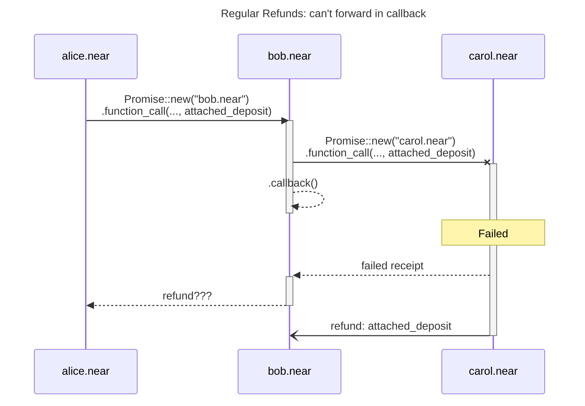
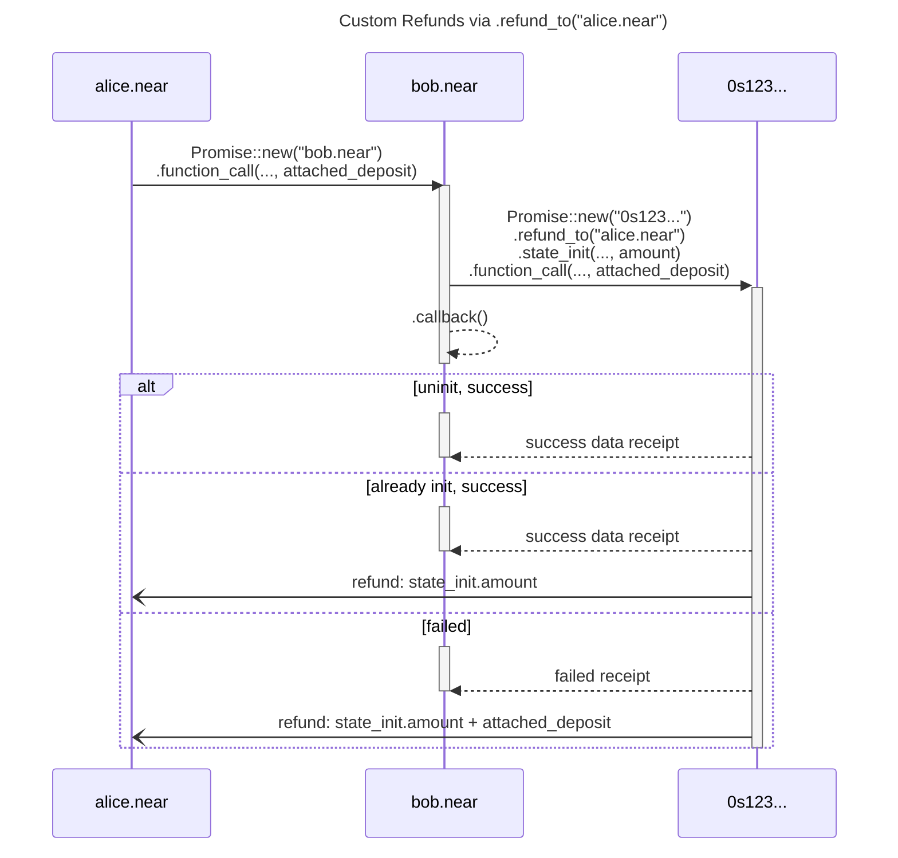

## Summary

With [global contracts](https://github.com/near/NEPs/blob/master/neps/nep-0591.md)
making code reuse cheaper, it's now more feasible to deploy multiple instances
of the same contract code across different accounts. However, this creates
challenges around permissions, storage costs, refunds, and code verification.

This NEP addresses these concerns by introducing a new
[backwards-compatible](#backwards-compatibility) `AccountIds` which are [deterministically derived](#deterministic-accountids) from contract
initialization code and state, enabling for truly sharded contract designs.

## Motivation

With global contracts introduced in [NEP-591](https://github.com/near/NEPs/blob/master/neps/nep-0591.md),
it's now much cheaper to reuse the same code across different contracts in
terms of storage costs. This opens up a door for sharded contract designs where
each instance needs to be deployed on a separate account.

However, when designing sharded contracts, following concerns naturally come up:

* Who is allowed to perform different actions (deploy, call, delete, etc.) on
  different sharded contract instances?
* Who pays for storage costs of deploying new sharded contract instances?
* How does it get refunded if the contract turned out to be already deployed?
* How can a contract verify that the caller was executing the same code?

This NEP proposes enabling sharded contracs design by introducing
fully backwards-compatible [deterministic AccountIds](#deterministic-accountids)
and new protocol-level primitives required to deploy such contracts, addressing
concerns above.

## Specification

### Deterministic AccountIds

The core idea is to have contract account ids **deterministically** derived
from its initialization code and state.  
Let's first define [`StateInit`](https://github.com/mitinarseny/near-sdk-rs/blob/50eb6e68544b75288145f7f0d07068a482b9e3fc/near-sdk/src/state_init.rs#L15-L24)
struct:

```rust
/// Initialization state for non-existing contract with
/// deterministic account id, according to NEP-616.
#[derive(BorshSerialize, BorshDeserialize)]
pub struct StateInit {
    /// Code to deploy
    pub code: ContractCode,
    /// Optional key/value pairs to populate to storage on first initialization
    pub data: BTreeMap<Vec<u8>, Vec<u8>>,
}

/// Code to deploy for non-existing contract.
#[derive(BorshSerialize, BorshDeserialize)]
pub enum ContractCode {
    /// Reference global contract's code by its hash
    GlobalCodeHash(CryptoHash),
    /// Reference global contract's code by its [`AccountId`]
    GlobalAccountId(AccountId),
}
```

Now, let's [derive](https://github.com/mitinarseny/near-sdk-rs/blob/50eb6e68544b75288145f7f0d07068a482b9e3fc/near-sdk/src/state_init.rs#L189-L203)
`AccountId` deterministically as `"0s" .. hex(keccak256(state_init)[12..32])`:

```rust
impl StateInit {
    /// Derives [`AccountId`] deterministically, according to NEP-616.
    pub fn derive_account_id(&self) -> AccountId {
        let serialized = borsh::to_vec(self).unwrap_or_else(|| unreachable!());
        format!("0s{}", hex::encode(&env::keccak256_array(&serialized))[12..32]))
            .parse()
            .unwrap_or_else(|_| unreachable!())
    }
}
```

Such schema is fully backwards-compatible with existing `AccountId` types. It
looks similar to existing implicit Eth addresses but we intentionally use a
different prefix, so it's possible to distinguish between different kinds of
accounts in runtime and apply [different rules](https://github.com/near/nearcore/blob/c5225bacaad88de3574656333bd312464a90fb6a/core/parameters/src/cost.rs#L651-L681)
for estimating gas and storage costs.

### Address Verification

If a contract needs to authenticate predecessor and verify that it was executing
the [same code](#other-host-functions), then it can simply
[verify](https://github.com/mitinarseny/near-sdk-rs/blob/50eb6e68544b75288145f7f0d07068a482b9e3fc/examples/sharded-fungible-token/wallet/src/lib.rs#L162-L167)
that it matches `AccountId` [deterministically derived](#deterministic-accountids)
from its expected initialization state:

```rust
// construct expected initialization state
let state_init = StateInit {
    code: env::current_contract_code(),
    data: Self::init_state_for(params...),
};

// verify
require!(env::predecessor_account_id() == state_init.derive_account_id(), "not allowed");
```

Moreover, contracts might store references to other global contracts, so that
such verification logic [can](https://github.com/mitinarseny/near-sdk-rs/blob/d9950de34084a352bd58bbb0872e686fc7d40d04/examples/sharded-fungible-token/ft2sft/src/lib.rs#L131-L135)
be applied to all deterministic accounts, not just the predecessor, enabling for
infinite composability between different deterministic and non-deterministic contracts.

### `StateInit` action

The main issue with sharded design is that there is no synchronous way for a
contract to check for existence of another contract before calling its methods.
So, the only way to ensure its existence is to optionally deploy and initialize
it before proceeding to actual function calls.

However, since we don't know in advance whether the contract exists or needs to
be deployed first, we need to reserve some amount to cover storage costs of
potential deployment.

Let's define a new [`StateInit` action](https://github.com/mitinarseny/near-sdk-rs/blob/50eb6e68544b75288145f7f0d07068a482b9e3fc/near-sdk/src/environment/env.rs#L1237-L1276)
and a host function for it:

```rust
/// Optionally, deploy the contract with deterministic account id and
/// initialize its storage with [`StateInit`](crate::StateInit) according to
/// [NEP-616](https://github.com/near/NEPs/pull/616).
///
/// Note that the `receiver_id` of the [`Promise`](crate::Promise) MUST be
/// equal to [`state_init.derive_account_id()`](StateInit::derive_account_id).
/// Otherwise, this promise will fail.
///
/// If non-zero, `amount` will be immediately subtracted from current
/// account's balance as a "reserve" for storage costs.
///
/// If the receiving contract is in `noexist` or `uninit` state by the time
/// this action gets executed:
/// * The contract is deployed and initialized with [`state_init`](crate::StateInit)
/// * [`state_init.storage_cost`](crate::StateInit::storage_cost) is
///   subtracted from attached `amount`. If the contract was in `uninit`
///   state and had non-zero balance, then its balance is used first and only
///   the missing part required for covering storage costs will subtracted
///   from the attached `amount`.
/// * The contract state is marked as `active`.
/// * The remaining amount is transferred back to predecessor or
///   [refund_to](promise_set_refund_to) if set.
///
/// If the contract was already in `active` state, then full `amount` is
/// refunded. See [`promise_set_refund_to`].
pub fn promise_batch_action_state_init(
    promise_index: PromiseIndex,
    state_init: &LazyStateInit, // may be already serialized
    amount: NearToken,
);
```

### Permissions

Since the contract address is derived deterministically from its initialization
code and state, then **anyone** can deploy such contract via
[`StateInit` action](#stateinit-action) and pay for it.

All existing rules for current account model apply to deterministic
accounts, too. In particular, only the contract itself is allowed to perform
these actions on himself:

* `CreateAccount`: for sub-accounts like `sub.0s123...`
* `DeleteAccount`
* `DeployGlobalContract`
* `UseGlobalContract`
* `DeployContract`, `AddKey`, `DeleteKey`: doesn't make sense and should be
  discouraged by implementations, but still allowed
* `Stake`

### Account State

There is nothing preventing accounts with deterministic ids from accepting
incoming native transfers before they were deployed and initialized via
[`StateInit` action](#stateinit-action). This can be used to build some
mechanics where one wants to sponsor the deployment but doesn't bother to
actually initialize it.

To support this case, we say that each deterministic account can be in one of
following states:

* `nonexist`: there were no accepted receipts on this account, so it doesn't
  have any data (or the contract was deleted). Initially all deterministic
  accounts are in this state.
* `uninit`: account has some data, which contains balance and meta info. An
  account enters this state, for example, when it was in a `nonexist` state,
  and another account sent native transfer to it.
* `active`: account has contract code deployed, persistent data and balance. An
  account enters this state when it was in `nonexist` or `uninit` state and
  there was an incoming [`StateInit` action](#stateinit-action). Note, that
  to be able to deploy this account,
  [`state_init.derive_account_id()`](#deterministic-accountids) must be equal
  to its `AccountId`


### Refunds

Currently, refund of total attached deposit to a failed receipt is sent via
plain transfer to its predecessor. In a sharded design, the contract creating a
promise is not necessarily the one who would like to receive a refund in case of
failure or unused amount (e.g. [`StateInit` action](#stateinit-action)). So, we
need a way to route these refunds to intended beneficiaries, which can be
implementation-specific and depend on inner logic of a smart-contract.

Unfortunately, Near protocol doesn't provide a way for contracts to execute
some code upon receiving a native transfer if it wasn't attached deposit to a
function call. Moreover, when scheduling callbacks, the runtime doesn't
guarantee that the refund for a failed receipt will come before callback
execution, since the refund is processed as a new independent receipt:



To remove this limitation let's add an optional `refund_to` field to [`Receipt`](https://github.com/near/nearcore/blob/685f92e3b9efafc966c9dafcb7815f172d4bb557/core/primitives/src/receipt.rs#L81-L93)
and a host function for setting it:

```rust
/// Set a different [`AccountId`] instead of current one to which refunds
/// should go for all failed (e.g. [function_call](promise_batch_action_function_call_weight))
/// or unused (e.g. [state_init](promise_batch_action_state_init)) deposits in
/// the created receipt.
pub fn promise_set_refund_to(
    promise_idx: PromiseIndex,
    account_id: &AccountId,
);
```

So, when `refund_to` is used together with [`StateInit` action](#stateinit-action) the flow can
look like:



Note that setting `refund_to` to a non-existing named account id will result
into burning refunded NEAR tokens.
> In fact, regular refunds to predecessor also suffer from the same problem:
> predecessor is not always guaranteed to exist as it could have been deleted.
> You can [burn](https://github.com/near/nearcore/blob/685f92e3b9efafc966c9dafcb7815f172d4bb557/runtime/runtime/src/lib.rs#L901-L908)
> NEAR today by using `DeleteAccount` action with non-existing `beneficiary_id`.

### Other host functions

We would also need to implement a couple of other trivial host functions, which
are required for contracts to function properly:

```rust
/// Returns code deployed on current contract being executed.
/// For now, only references to globally deployed contracts are supported.
///
/// Note: gas cost of this for globally deployed contracts should be
/// relatively small, since it would only return `ContractCode::GlobalCodeHash(code_hash)`
/// or `ContractCode::GlobalAccountId(account_id)`.
pub fn current_contract_code() -> ContractCode;

/// If the current function is invoked by a callback, we can access the
/// length of execution results of the promises that caused the callback.
/// It can be used to prevent out-of-gas failures when reading too long
/// execution result via [`promise_result()`].
pub fn promise_result_length(result_idx: u64) -> Result<u64, PromiseError>;

// Currently constants, but better to be exposed as host functions,
// so that changing the protocol config doesn't brick existing contracts.
pub fn storage_byte_cost() -> NearToken;
pub fn storage_num_bytes_account() -> StorageUsage;
pub fn storage_num_extra_bytes_record() -> StorageUsage;
```

## Reference Implementation

Here is a [reference implementation](https://github.com/near/near-sdk-rs/pull/1376)
of Sharded Fungible Token contracts with deterministic account ids, including 
FT<->sFT adaptors and optional governance functionality (useful for stablecoins),
along with definition of [`StateInit`](#deterministic-accountids) structs and
required [host functions](#stateinit-action).  
All changes are [backwards-compatible](#backwards-compatibility) with existing
contracts and account ids.

## Security Implications

### 3-stage Upgrades

> This concern is valid for all global contracts introduced in [NEP-591](https://github.com/near/NEPs/blob/master/neps/nep-0591.md).
> However, it's worth to highlight it here for better clarity.

If the upgrade of a globally deployed contract, which is used for some sharded
interactions, introduces a breaking change in its internal ABI (i.e. used for
XCCs only between referencing contracts), then it can be done safely only via
3-stage upgrade process:

1. Deploy a "pre-upgrade" version that still uses the old ABI but **can**
  understand the new one.  
  Wait for it to be fully distributee across shards.
2. Deploy a "do-upgrade" version that starts to use new ABI, but still **can**
  understand the old one.  
  Wait for it to be fully distributee across shards.
3. Deploy a "post-upgrade" version that cleans up the legacy code and now
  **only** uses and understands the new ABI.

Even if the implementation always passes the contract version `v` as an argument
for all interactions between different instances of this global contract, then
it would still not help the contract to understand how to handle the new
version, because the new code just hasn't reach his shard yet. The most what
the contract can do upon receiving "unknown version" is to panic, which can
break others' assumptions about its standard behavior.

## Alternatives

### Sharded Contexts

There is an existing proposal described in
[NEP-605](https://github.com/near/NEPs/pull/605) that follows a more OS-like
approach by introducing a concept of non-root accounts and "sharded contexts".

The main advantage of current proposal over "sharded contexts" is that there is
no isolation between sharded and non-sharded contracts: any deterministic
account is allowed to freely interact with any non-deterministic one and vice
versa. As a result, deterministic accounts enable for truly sharded contract
designs with infinite composability, while "sharded contexts" approach suffers
from high complexity, less composability and inevitable bottlenecks for routing
calls between root/non-root accounts.

However, non-root accounts are designed to live on the same shard as their
root accounts, which is a step towards [synchronous execution](https://github.com/near/NEPs/issues/497)
but only within the boundaries of a single root account. At the same time, this
can be seen as limitation for future scaling and dynamic resharding. With
deterministic accounts approach, this might be achievable by having
[`closeTo`](#co-location) analog.

### Prior Art

This proposal is highly inspired by [deterministic addresses](https://docs.ton.org/v3/documentation/smart-contracts/addresses#account-id)
in TON blockchain. However, we still needed to adapt their definitions to Near
specifications:

* Unlike TVM, Near doesn't support [message bouncing](https://docs.ton.org/v3/documentation/smart-contracts/transaction-fees/forward-fees#message-bouncing),
  but instead allows to schedule callbacks, which gives more control over
  handling of chained cross-contract calls.
* Near doesn't provide a way for contracts to execute some code upon receiving
  a native transfer if it wasn't attached deposit to a function call. See [refunds](#refunds).
* TVM doesn't differentiate between gas and attached deposit, while in Near
  they are not coupled, which removes some complexities.

## Future possibilities

### Sharded DeFi protocols

Here is how deterministic accounts can be used to build [DEX](https://docs.dedust.io/docs/swaps)
or [Lending Protocol](https://github.com/evaafi/contracts/blob/40a0e8bb32f88df8e09def536371192a824d1c3d/diagrams/liquidate-for-jetton.svg)
with sharded design in mind.

### Wallet Extentions

If we allow deterministic accounts to handle external messages by verifying
signatures and tracking nonces by themselves instead of relying on
[access keys](https://nomicon.io/DataStructures/AccessKey), then it would open
up doors for upgradable [wallet implementations](https://docs.ton.org/v3/documentation/smart-contracts/contracts-specs/wallet-contracts)
with [arbitrary plugins](https://docs.ton.org/v3/documentation/smart-contracts/contracts-specs/wallet-contracts/#wallet-v5)
such as 2FA, social recovery, gasless transactions and [more](https://github.com/ton-blockchain/wallet-contract-v5/blob/main/README.md#suggested-extensions).  
This can be seen as an alternative to [contract namespaces](https://gov.near.org/t/proposal-account-extensions-contract-namespaces/34227).

### Co-location

It might be possible to implement some analog of [`closeTo`](https://docs.ton.org/v3/documentation/smart-contracts/tolk/tolk-vs-func/create-message#sharding-deploying-close-to-another-contract)
for deploying "close to" another contract based on shard depth (i.e. fixed
prefix length).

### Storage Rent vs Fixed Storage Staking

We can move from fixed storage staking fees to a more sustainable storage rent
approach by adding new [account state](#account-state):

> * `frozen`: account cannot perform any operations, this state contains only
> two hashes of the previous state (code and state respectively). When an
> account's storage charge exceeds its balance, it goes into this state. To
> unfreeze it, you can send an internal message with state_init and code which
> store the hashes described earlier and some NEAR. It can be difficult to
> recover it, so you should not allow this situation. There is a project to
> unfreeze the account, which you can find [here](https://unfreezer.ton.org).

## Consequences

### Positive

* Deterministic AccountIds enable for truly **sharded** contract designs
  with minimalistic implementations without sacrificing composability.

* Proposed [deterministic accounts](#deterministic-accountids) are fully
  [backwards-compatible](#backwards-compatibility) with existing ones.

* Knowledge of `AccountId` (e.g. predecessor) combined with its expected
  initialization state is enough to [verify](#address-verification) it was
  executing the exact code.

### Neutral

* Deterministic accounts are allowed to freely interact directly with
  non-deterministic ones and vice versa.

* Existing contracts can be upgraded to start using
  [`StateInit` action](#stateinit-action) and, thus, gain the power to
  automatically deploy non-existing deterministic accounts.

* No step towards [synchronous execution](https://github.com/near/NEPs/issues/497).
  Though, latency might be improved if we add support for [`closeTo`](#co-location) analog.

* Indexers for sharded contracts might need to be [stateful](#stateful-indexers) in order
  to keep track of newly created contracts.


### Negative

\-

### Backwards Compatibility

Proposed [deterministic AccountIds](#deterministic-accountids) are fully
**backwards-compatible** with existing ones.

Deterministic accounts are allowed to freely interact directly with
non-deterministic ones and vice versa.

Existing contracts can be upgraded to start using
[`StateInit` action](#stateinit-action) and, thus, gain the power to
automatically deploy non-existing deterministic accounts.

### Stateful Indexers

> This concern is valid for any sharded contracts design.
> However, it's worth to highlight it here for better clarity.

For some sharded contracts with deterministic account ids it doesn't make sense
to emit events (e.g. `sft_transfer`) as it simply wouldn't bring any value for
indexers. Even if they do emit these events, indexers still **need to track**
outgoing [`StateInit` actions](#stateinit-action) to not-yet-existing sharded
contracts, which will emit these events in the future.  

However, to properly track these cross-contract calls they would need parse
function names (e.g. [`sft_transfer()`](https://github.com/mitinarseny/near-sdk-rs/blob/50eb6e68544b75288145f7f0d07068a482b9e3fc/near-contract-standards/src/sharded_fungible_token/wallet.rs#L26-L55))
and their args, while this information combined with receipt status already
contains all necessary info for indexing.

## Unresolved Issues

1. Can we leverage [zero-balance accounts](https://github.com/near/NEPs/blob/master/neps/nep-0448.md)
  and pay for deploying small deterministic contracts by gas?
2. Should we support for [non-refundable storage staking](https://github.com/near/NEPs/blob/master/neps/nep-0491.md) in [`StateInit` action](#stateinit-action)?
3. Should we allow for forwarding `amount` from
  [`StateInit` action](#stateinit-action) as attached deposit into later
  `FunctionCall` actions instead of [refunding](#refunds) immediately?  
  This is how TON contracts [handle](https://github.com/ton-blockchain/jetton-contract/blob/3d24b419f2ce49c09abf6b8703998187fe358ec9/contracts/jetton-wallet.fc#L122-L136)
  refunds.
4. Is [refunding](#refunds) via plain native transfers enough or do we need to
  support refunding via attached deposits to function calls as well?  
  Can be tricky because of not having gas guarantees.

## Changelog

### 1.0.0 - Initial Version

> Placeholder for the context about when and who approved this NEP version.

#### Benefits

> List of benefits filled by the Subject Matter Experts while reviewing this version:

* Benefit 1
* Benefit 2

#### Concerns

> Template for Subject Matter Experts review for this version:  
> Status: New | Ongoing | Resolved

|   # | Concern | Resolution | Status |
| --: | :------ | :--------- | -----: |
|   1 |         |            |        |
|   2 |         |            |        |

## Copyright

Copyright and related rights waived via [CC0](https://creativecommons.org/publicdomain/zero/1.0/).
