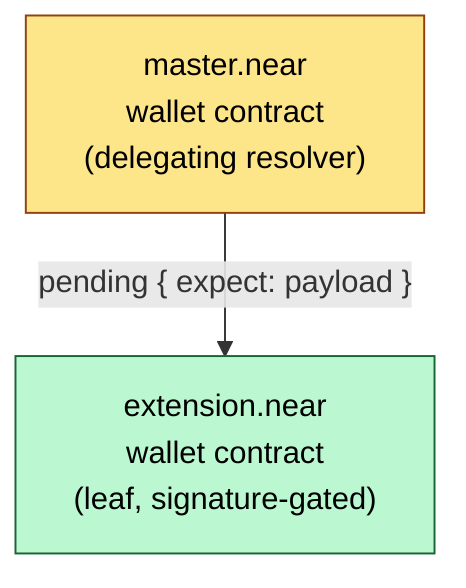
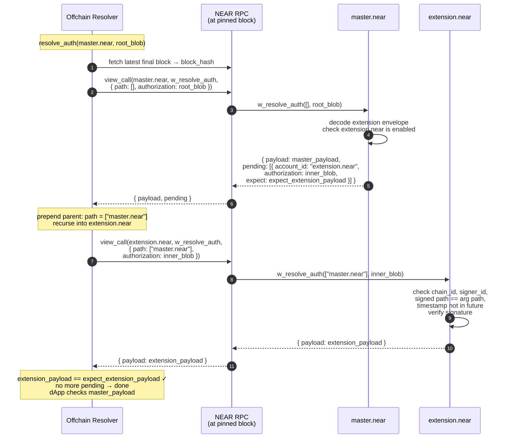

## Summary

A view-function convention, `w_resolve_auth`, that lets any NEAR contract attest to offchain authorizations — dApp logins, offchain action approvals — without requiring a NEAR access key on the account. It defines:

- the resolution interface: `w_resolve_auth(path, authorization) -> { payload, pending }`; invalid authorizations **panic**;
- recursive, caller-side resolution through `pending` sub-authorizations, so multisigs, extensions, and delegated wallets compose with any wallet type;
- a standardized signable envelope, `OffchainMessage`, binding `chain_id`, `signer_id`, resolution `path`, signing `timestamp`, and the authorized `payload`;
- a standardized full-access-key authorization (built on NEP-413), so regular NEAR accounts resolve through the same procedure.

## Motivation

NEP-413 verifies signatures against an account's access keys. That excludes accounts whose authority lives in contract code:

- **Wallet contracts** gated by external credentials — an Ethereum key, a WebAuthn passkey — possibly with no access keys at all;
- **Wallets with extensions** — accounts delegating authority to other accounts (session wallets, recovery wallets, sub-wallets);
- **Multisigs** requiring M-of-N approval from members that may themselves be wallet contracts of different types;
- **Future schemes** — ZK-gated or attestation-gated accounts.

Without a standard, each dApp must duplicate every contract's authorization rules offchain. That is fragile (contract upgrades break dApps), insecure (duplication invites divergence), and non-composable (no single library can verify a mixed delegation chain).

This NEP makes the contract the single source of truth for its account's offchain authorizations, behind one uniform view function. Resolution is recursive, so heterogeneous compositions resolve through generic caller-side logic.

### Target use cases

1. **dApp sign-in**: the dApp issues a fresh payload; the wallet contract attests it; the backend grants a session. No transaction, no access key.
2. **Offchain action approval**: authorizing an MPC signing request, a confidential swap intent, or any other offchain action.

Both reduce to one question — "does this account authorize this exact payload?" — which is what `w_resolve_auth` answers. What the payload *means* is the dApp's business, encoded in the payload itself (see [`JsonPayload`](#domain-separated-json-payload-recommended)).

## Design Decisions

<details>
<summary><strong>Verification as a view function</strong></summary>

The governing contract is the natural authority on what authorizes its account. A view function makes that rule authoritative (no offchain library to keep in sync), composable (one call verifies any wallet type), and free (no transaction, no gas). Cost: one RPC round-trip per node of the authorization tree — one call for the common single-account case. A verifier can even skip RPC entirely by executing the contract WASM locally against fetched state (see [`fast-near`](https://github.com/vgrichina/fast-near)).

</details>

<details>
<summary><strong>Panics instead of an error enum</strong></summary>

Alternative: return a tagged result with an `INVALID` variant and structured error codes. Rejected — contract panics are NEAR's native view-call failure channel, propagated verbatim through RPC. The success type stays a simple struct, error messages stay free-form, and resolvers treat every failure mode (panic, missing method, no contract) uniformly as "branch did not resolve".

</details>

<details>
<summary><strong>Opaque authorization blob</strong></summary>

Each contract owns its blob format *and semantics*: the blob is arbitrary data in an arbitrary encoding, and resolution need not involve signatures at all. A wallet verifies a signature envelope; a multisig unpacks a member bundle; a vault contract may authorize any payload purely on programmable state conditions — a block height reached, a deposit threshold met — with the blob carrying only parameters, or nothing. A universal blob schema would constrain the former and never fit the latter.

This NEP standardizes only what must be interoperable: the signed [`OffchainMessage`](#offchainmessage) envelope for signature-based resolution, and the [`AccessKeyAuthorization`](#access-key-authorization) blob for keyed accounts (which have no contract to define one), but it does NOT limit other kinds of authorization blobs.

Since resolvers try [both interpretations](#resolution-of-a-single-authorization) of every blob, formats SHOULD avoid structural collisions — `AccessKeyAuthorization` rejects unknown fields and uses distinctive names for exactly this reason.

</details>

<details>
<summary><strong>Standardized signable envelope</strong></summary>

While the authorization blob is opaque, in case of Wallet contracts and Multisigs, where user signature is used to prove account ownership, adequate security measures MUST be taken to prevent replay attacks. Thus, this NEP requires the signer to include and sign the same five fields (`chain_id`, `signer_id`, `path`, `timestamp`, `payload`).

Non-signature resolvers have nothing to sign and are exempt: their authority derives from chain state alone.

</details>

<details>
<summary><strong>Caller-side recursion and the <code>path</code></strong></summary>

A contract that cannot attest alone (e.g. multisig, extension wallet) returns its `payload` plus `pending` sub-authorizations, each with the sub-blob already **extracted** from its bundle (or state) — so the caller walks the graph without understanding any bundle format.

The `path` argument tells each sub-resolver where in the graph it is: empty at the top level, parent ID prepended before each descent. Signers commit to the path, so a member signature collected for multisig A cannot be replayed top-level or under multisig B.

Both the argument and the signed path are oriented **bottom-up** (direct parent first, top-level last). Alternative — top-down argument with a reversed signed path — rejected: one shared orientation means contracts check plain equality, with no reversal logic to get wrong. Bottom-up is also the signer's natural view: direct delegator first, ultimate authority last. (Resolvers may keep the path top-down internally for cheap appends and reverse on serialization.)

</details>

<details>
<summary><strong>Per-edge payload equality via <code>expect</code></strong></summary>

Each pending entry names the exact payload the sub-resolver must authorize. The caller checks `sub.payload == expect` on every edge and fails the whole resolution on mismatch — a sub-contract cannot substitute a message its signers never approved. Declaring the expectation explicitly (vs. an implicit "same payload everywhere") checks the invariant where it matters and permits delegation schemes where a parent expects a transformed sub-payload; typical wallets set `expect` to their own payload. The dApp does the final check at the root: resolved payload == issued payload.

</details>

<details>
<summary><strong>Full-access keys take precedence</strong></summary>

Resolvers try **both** interpretations of every authorization — full-access key and contract — and a successful key resolution wins, because a full-access key:

- has the same full control over the account (it can redeploy the contract at will);
- always terminates the branch (no pending sub-authorizations);
- is a last resort for a broken resolver contract.

Alternative — a "no downgrade" rule forbidding key verification when the account implements `w_resolve_auth`, so a lone signature cannot bypass an M-of-N policy. Rejected: on NEAR the key already bypasses the contract on-chain, so refusing it offchain protects nothing. Contract-only authorization is achieved the only way it can be — by removing full-access keys, which such deployments must do for on-chain security anyway.

</details>

<details>
<summary><strong>Freshness via signing timestamp</strong></summary>

Contracts reject messages whose `timestamp` is later than the current block timestamp. A freshly-signed authorization therefore cannot be resolved against chain state from *before* signing — where a revoked key, disabled extension, or removed member was still active — whether by a malicious caller pinning an old block or by a lagging RPC. Contracts MAY add a TTL. Clients set the timestamp ~60s early to absorb clock skew and block-time lag.

</details>

<details>
<summary><strong>Block-pinned resolution</strong></summary>

Account state (extensions, membership) can change mid-resolution. The caller resolves the **entire** graph against one block hash — fetched once, passed to every view call and key lookup, and checked in every response — making the walk atomic against a single, recent chain state.

</details>

<details>
<summary><strong>Cycles and limits</strong></summary>

Delegation cycles are allowed while **finite** — each hop consumes a path entry. But graph size is untrusted contract output, so resolvers SHOULD cap total sub-authorizations and depth. The reference resolver defaults both caps to **zero** (top-level only); recursion is explicit opt-in. The spec itself sets no limits: recursion is offchain, blobs are bounded by view-call payload limits, gas budget is per-RPC.

</details>

<details>
<summary><strong>MPC-owned keys</strong></summary>

An account keyed by NEAR's MPC network (e.g. `v1.signer`) fits either way: the wallet contract validates the MPC-produced signature itself (MPC is just another signature scheme), or the MPC contract implements `w_resolve_auth` and is reached through normal recursion. No special handling.

</details>

## Specification

The key words "MUST", "MUST NOT", "SHOULD", "MAY" are per RFC 2119.

### Method

Implementing contracts MUST expose:

```rust
pub fn w_resolve_auth(
    path: Vec<AccountId>,
    authorization: String,
) -> AuthorizationResolution;
```

- `path` — traversal path from this contract's direct parent up to the top-level resolver; empty at top level. See [Path](#path).
- `authorization` — opaque, resolver-defined blob. See [Authorization blob](#authorization-blob).

Requirements:

- MUST be a view function: no state mutation, callable via view-call RPC.
- MUST be deterministic over its arguments and chain state.
- MUST panic on invalid authorization; the panic SHOULD explain why.

There is no error variant. Resolvers treat any view-call failure as a failed resolution of that branch.

### Types

```rust
pub struct AuthorizationResolution {
    /// Payload authorized by the given blob at current contract state.
    pub payload: String,

    /// Sub-authorizations that MUST all resolve before accepting `payload`.
    /// Empty for a leaf.
    #[serde(default, skip_serializing_if = "Vec::is_empty")]
    pub pending: Vec<PendingAuthorization>,
}

pub struct PendingAuthorization {
    /// Account to resolve on.
    pub account_id: AccountId,

    /// Blob to pass to its `w_resolve_auth()`.
    pub authorization: String,

    /// Payload it must resolve to. Any failure or mismatch invalidates
    /// the whole top-level authorization.
    pub expect: String,
}
```

Wire format:

```json
{
  "payload": "<authorized payload>",
  "pending": [
    { "account_id": "sub.near", "authorization": "<blob>", "expect": "<payload>" }
  ]
}
```

`pending` is omitted for leaves.

### Path

Resolution starts at the top-level authorization with empty `path`. Before descending into a `pending` list, the current resolver's ID is *prepended* to `path`:

| Depth | Resolver ID             | Args                                                                          | Return                                                                                                                          |
| ----: | ----------------------- | ----------------------------------------------------------------------------- | ------------------------------------------------------------------------------------------------------------------------------- |
|     0 | `resolver.near`         | `{"path": [], "authorization": "auth0"}`                                      | `{"payload": "payload0", "pending": [{"account_id": "sub.resolver.near", "authorization": "auth1", "expect": "payload1"}]}`     |
|     1 | `sub.resolver.near`     | `{"path": ["resolver.near"], "authorization": "auth1"}`                       | `{"payload": "payload1", "pending": [{"account_id": "sub.sub.resolver.near", "authorization": "auth2", "expect": "payload2"}]}` |
|     2 | `sub.sub.resolver.near` | `{"path": ["sub.resolver.near", "resolver.near"], "authorization": "auth2"}`  | `{"payload": "payload2"}`                                                                                                        |

The argument and the signed [`OffchainMessage.path`](#offchainmessage) share the same bottom-up orientation (direct parent first, top-level last). Signature-verifying contracts MUST check they are **equal**.

### Authorization blob

The blob is arbitrary data in a resolver-defined format. Resolution MAY hinge on any programmable condition, not only signatures: a vault contract may authorize a payload once a target block height is reached or a deposited amount is met — the blob then carries only parameters, or nothing at all. Such resolvers derive their authority from chain state alone.

Whenever resolution is **signature-based** — wallet contracts, multisig members — the signed material MUST be the [`OffchainMessage`](#offchainmessage) envelope. Signing the bare payload instead would drop the `chain_id`/`signer_id`/`path`/`timestamp` bindings and re-open cross-network, cross-account, and cross-context replay.

### `OffchainMessage`

The standardized signable envelope. Signature-based resolvers MUST verify a signature over the **entire** message:

```rust
pub struct OffchainMessage {
    /// Chain ID, e.g. `mainnet`.
    pub chain_id: String,

    /// Account this message authorizes for.
    pub signer_id: AccountId,

    /// Bottom-up path to the top-level resolver. Empty = top-level.
    #[serde(default, skip_serializing_if = "Vec::is_empty")]
    pub path: Vec<AccountId>,

    /// UNIX timestamp at signing
    /// (RFC-3339 string in JSON, `u64` nanoseconds in Borsh).
    pub timestamp: Timestamp,

    /// The authorized payload.
    pub payload: String,
}
```

The verifying contract MUST panic if:

- `chain_id` doesn't match its chain;
- `signer_id` doesn't match `env::current_account_id()`;
- `path` doesn't equal the `path` argument;
- `timestamp` is later than the current block timestamp (contracts MAY also enforce a TTL);
- the signature is invalid.

Clients SHOULD set `timestamp` ~60 seconds before signing time to absorb clock skew and block-time lag.

Canonical hash:

```text
SHA3-256(b"NEAR_NEP641_OFFCHAIN_MESSAGE/V1" || borsh(msg))
```

Signature schemes SHOULD sign (a scheme-appropriate wrapping of) this hash, binding all fields under every scheme.

### Domain-separated JSON payload (recommended)

The `payload` is opaque to the protocol. dApps SHOULD use this human-readable structure for cross-wallet rendering:

```rust
#[serde(deny_unknown_fields)]
pub struct JsonPayload {
    /// dApp or protocol domain, e.g. `near.com` or `Near MPC`.
    pub domain: String,

    /// Action taken on the dApp/protocol, e.g. `Login` or `Sign`.
    pub action: String,

    /// dApp-specific message: plain text or JSON; may carry nonces,
    /// deadlines, TTLs, etc.
    pub msg: String,
}
```

Since the dApp accepts only payloads it issued, byte-for-byte, `domain` and `action` inside the payload rule out cross-dApp and cross-action replay. Policy-driven resolvers (e.g. multisigs with per-action thresholds) MAY parse this structure to route policies.

### Access-key authorization

For accounts verified against **full-access keys** — regular accounts, or any account retaining such keys — the blob is standardized (there is no contract to define one) and verified entirely offchain:

```rust
#[serde(deny_unknown_fields)] // reduce collisions with other blob formats
pub struct AccessKeyAuthorization {
    /// Signed offchain message.
    pub msg: OffchainMessage,

    /// Signature schema and signing metadata.
    pub via: AccessKeySchema,

    /// Access key with `FullAccess` permission.
    pub access_key: PublicKey, // "ed25519:..." | "secp256k1:..."

    /// Signature.
    pub signature: Signature,  // "ed25519:..." | "secp256k1:..."
}

#[serde(tag = "schema", content = "extra", rename_all = "snake_case")]
pub enum AccessKeySchema {
    /// NEP-413 signing schema.
    Nep413 {
        /// Optional callback URL (browser wallets).
        #[serde(default, skip_serializing_if = "Option::is_none")]
        callback_url: Option<String>,
    },
}
```

`via` on the wire:

```json
{ "schema": "nep413", "extra": { "callback_url": "https://wallet.example/cb" } }
```

#### NEP-413 mapping

Under `"schema": "nep413"`, the signature is a standard NEP-413 signature (prefix tag `2^31 + 413`, SHA-256 over Borsh) over:

| NEP-413 field  | Value                                                                                                                  |
| -------------- | ----------------------------------------------------------------------------------------------------------------------- |
| `message`      | `msg.payload`                                                                                                          |
| `nonce`        | the [canonical hash](#offchainmessage) of `msg` — binds **all** envelope fields                                        |
| `recipient`    | `"<chain_id>: <signer_id>[ -> <id>]... @ <timestamp>"` — path bottom-up, timestamp truncated to whole seconds          |
| `callback_url` | `via.extra.callback_url`                                                                                               |

Example — `chain_id = "mainnet"`, `signer_id = "extension.near"`, `path = ["wallet.near", "v1.signer"]`, `timestamp = 2026-08-05T07:28:00.123456789Z`:

```text
recipient = "mainnet: extension.near -> wallet.near -> v1.signer @ 2026-08-05T07:28:00Z"
```

NEP-413 wallets render only `message` and `recipient` (`nonce` is an opaque hash), so this `recipient` puts the network, account, delegation path, and signing time in front of the user. Truncation to seconds is cosmetic; full precision stays bound through the `nonce`.

All native NEAR Protocol key types SHOULD be supported; `access_key` and `signature` curves MUST match. Existing NEP-413 wallets need no modification.

#### Verification procedure

The resolver MUST verify an `AccessKeyAuthorization` for `account_id` at the pinned block:

1. `msg.chain_id` equals the resolver's chain ID.
2. `msg.signer_id` equals `account_id`.
3. `msg.path` equals the current resolution [path](#path).
4. The signature verifies per `via` against `access_key`.
5. `msg.timestamp` is not later than the block's timestamp.
6. `access_key` on `account_id` at the block:
   - **key exists** → accept only with `FullAccess` permission (incl. gas-key full-access); reject function-call keys;
   - **account exists, key absent** → reject — even for an implicit-derived ID, the owner may have removed the key deliberately;
   - **account doesn't exist or not initialized yet** → accept only if `account_id` is the implicit account derived from `access_key` (hex ed25519, or `0x` + Keccak for secp256k1) — it can be claimed under this key at any time.
7. The result is a leaf: `{ payload: msg.payload }`.

#### Resolution of a single authorization

For every node, the resolver attempts **both** — the access-key verification above and the `w_resolve_auth` view call — optionally concurrently. A successful access-key resolution **takes precedence**. If both fail, report the access-key error when the blob parsed as `AccessKeyAuthorization` but failed key verification; otherwise the contract error.

### Pending sub-authorizations

- Empty `pending` = leaf: the contract alone authorizes `payload`.
- Non-empty `pending`: `payload` is authorized **iff** every entry, resolved recursively with the [extended path](#path), returns exactly its `expect`. Any failure or mismatch MUST fail the whole verification immediately.
- The contract MUST extract each sub-blob from its own `authorization`; the caller passes blobs on opaquely.

### Block consistency

The resolver MUST resolve the authorization tree against one block hash, SHOULD default to a recent *final* block, and SHOULD check each RPC response refers to the requested block. Historical resolution is possible (e.g. audits), but the timestamp rule keeps freshly-signed authorizations unresolvable against blocks preceding them.

### Resource limits

Resolvers SHOULD cap total sub-authorization count and recursion depth. Cycles are permitted while finite; the caps bound work driven by untrusted contract output.

### Offchain only

> [!WARNING]
> **DO NOT** call `w_resolve_auth` in on-chain transactions.

Resolutions mutate no state and cannot prevent replay. Replay protection for the payload is the dApp's job (unique nonces/expiry inside the payload). For on-chain actions, use on-chain messages — transactions, delegate action — designed with replay protection.

### Caller-side resolution algorithm

Informative; implementations may differ while preserving the semantics above.

```text
resolve_auth(top_account, authorization):
    block  = fetch latest final block           # pin the whole graph
    queue  = [(top_account, path=[], authorization, expect=None)]
    result = None
    total  = 0

    while queue is not empty:
        (account, path, auth, expect) = queue.pop()

        res = resolve_single(account, path, auth, block)

        if expect is not None and res.payload != expect:
            fail("payload mismatch")
        if result is None:
            result = res.payload                # top-level payload

        if res.pending is not empty:
            if len(path) >= MAX_DEPTH:          fail("max depth exceeded")
            total += len(res.pending)
            if total > MAX_SUB_AUTHORIZATIONS:  fail("too many sub-authorizations")

        sub_path = [account] + path             # prepend parent ID (bottom-up)
        for sub in res.pending:
            queue.push((sub.account_id, sub_path, sub.authorization, sub.expect))

    return result


resolve_single(account, path, auth, block):
    # both interpretations, optionally concurrent
    a = try_access_key(account, path, auth, block)
    c = try view_call(account, "w_resolve_auth",
                      { "path": path, "authorization": auth },
                      at_block = block)

    if a succeeded: return a        # full-access key takes precedence
    if c succeeded: return c
    fail(a.error if a failed access-key verification else c.error)
```

Sibling pending entries MAY resolve concurrently. Finally, the dApp MUST check the returned payload by either checking that it equals the one it issued or validating the payload (domain to match the dApp, action against user permissions, and nonce material preventing replays).

## Reference Flows

### Flow 1 — dApp login with a single-signer wallet contract

Alice's account `0s1234...` is a deterministic account (NEP-616) with a wallet contract gated by her credential (ed25519 here; a passkey or Ethereum key works identically). No access keys. She logs into `example.app`.

```mermaid
sequenceDiagram
    autonumber
    actor User as Alice
    participant FE as example.app <br/> Frontend
    participant BE as example.app <br/>Backend
    participant W as Wallet <br/>(signer for 0s1234...)
    participant RPC as NEAR RPC
    participant WC as 0s1234... <br/>Wallet Contract

    rect rgba(127, 127, 127, 0.15)
    Note over FE,BE: Phase 1 — Payload issuance
    FE->>BE: GET /auth/challenge
    BE->>BE: payload = JsonPayload { <br/>domain: "example.app", <br>action: "Login", <br/>msg: "&lt;nonce, expiry&gt;" } <br/>store(payload, ttl=5min)
    BE-->>FE: { payload }
    end

    rect rgba(127, 127, 127, 0.15)
    Note over FE,W: Phase 2 — Authorization assembly
    FE->>W: authorize(account: "0s1234...", payload)
    W->>W: msg = OffchainMessage { <br/>chain_id: "mainnet", <br/>signer_id: "0s1234...", <br/>path: [], <br/>timestamp: now - 60s, <br/>payload }
    W->>User: render payload & confirm
    User-->>W: approve
    W->>W: proof = sign(hash(msg))
    W-->>FE: authorization = <br/>contract-defined blob(msg, proof)
    end

    rect rgba(127, 127, 127, 0.15)
    Note over FE,WC: Phase 3 — Verification
    FE->>BE: POST /auth/verify <br/>{ account_id, authorization }
    BE->>RPC: fetch latest final block
    RPC-->>BE: block_hash
    BE->>RPC: view_call("0s1234...", "w_resolve_auth", <br/>{ path: [], authorization }, <br>at_block = block_hash)
    RPC->>WC: w_resolve_auth([], authorization)
    WC->>WC: decode blob <br/>check chain_id, signer_id, <br/>path (= []), timestamp <br>verify signature over msg
    WC-->>RPC: { "payload": "&lt;JsonPayload&gt;" }
    RPC-->>BE: { payload }
    BE->>BE: assert payload == stored payload <br/>consume payload
    BE-->>FE: { session_token }
    end
```

The authorized payload (pretty-printed `JsonPayload`, rendered to Alice):

```json
{
  "domain": "example.app",
  "action": "Login",
  "msg": "{\"nonce\":\"d9f3...\",\"expires_at\":\"2026-08-06T15:30:00Z\"}"
}
```

The authorization blob (format owned by the wallet contract; the reference wallet's shown):

```json
{
  "signature": {
    "msg": {
      "chain_id": "mainnet",
      "signer_id": "0s1234...",
      "timestamp": "2026-08-06T14:29:00Z",
      "payload": "{\"domain\":\"example.app\",\"action\":\"Login\",\"msg\":\"...\"}"
    },
    "proof": "ed25519:4vJ9..."
  }
}
```

View-call args and response:

```json
{ "path": [], "authorization": "<blob above, as a string>" }
```

```json
{ "payload": "{\"domain\":\"example.app\",\"action\":\"Login\",\"msg\":\"...\"}" }
```

Any failure — bad signature, wrong network, wrong signer, non-empty signed path, future timestamp — panics the view call with a descriptive message; the backend rejects the login.

### Flow 2 — delegated authorization through a wallet extension

`master.near` is a wallet contract with an enabled **extension** `extension.near` — another account allowed to act on its behalf (itself a wallet contract here, e.g. a session or recovery wallet). The user signs with the extension's credential; the dApp needs `master.near`'s authorization. The same shape covers M-of-N multisigs: one `pending` entry per required member.



The client signs an `OffchainMessage` with the extension's credential, delegation path baked in (bottom-up):

```json
{
  "chain_id": "mainnet",
  "signer_id": "extension.near",
  "path": ["master.near"],
  "timestamp": "2026-08-06T14:29:00Z",
  "payload": "{\"domain\":\"Near MPC\",\"action\":\"sign\",\"msg\":\"Hello, Near!\"}"
}
```

then wraps the signed leaf into the parent's extension envelope (again contract-defined; reference wallet's shown):

```json
{
  "extension": {
    "account_id": "extension.near",
    "authorization": "{\"signature\":{\"msg\":{...signed message above...},\"proof\":\"ed25519:...\"}}",
    "payload": "<same payload string>"
  }
}
```

Verification:



Key points:

- `master.near` verifies no signature — it attests the delegation (extension enabled), extracts the inner blob, and pins the expected payload via `expect`.
- `extension.near` verifies the signature and the path: signed `["master.near"]` equals the argument. Presented top-level (argument `[]`), the same signature fails the path check — a delegate signature cannot escape its context.
- A plain keyed member would resolve as an [`AccessKeyAuthorization`](#access-key-authorization) instead — same envelope, same path rules, no contract.

## Reference Implementation

[near/intents#335](https://github.com/near/intents/pull/335):

- [`crates/signatures/nep641`](https://github.com/near/intents/tree/main/crates/signatures/nep641) — types, `OffchainMessage` with canonical hashing, `AccessKeyAuthorization`, and `RpcResolver`: the full recursive procedure (block pinning, concurrent key/contract resolution, `expect` checks, limits).
- [`contracts/wallet`](https://github.com/near/intents/tree/main/contracts/wallet) — reference wallet contract (signature and extension authorizations) with ed25519 and WebAuthn (P-256, ed25519) variants.
- [`crates/wallet/sdk`](https://github.com/near/intents/tree/main/crates/wallet/sdk) — client SDK: signs offchain payloads, wraps extension chains; end-to-end resolution test.

TypeScript resolver (wallet-selector / NEAR Connect integration): TBD.

## Security Considerations

### Cross-network replay

`chain_id` binding: a testnet-signed authorization fails on mainnet.

### Cross-account replay

`signer_id` binding: an envelope for one account fails on another account controlled by the same credential (same Ethereum key or passkey on two wallet contracts).

### Cross-context replay

`path` binding: a member/delegate signature commits to its exact chain of parents — unusable top-level or under a different parent.

### Cross-dApp and cross-action replay

Payload-level: the dApp accepts only byte-identical payloads it issued, and [`JsonPayload`](#domain-separated-json-payload-recommended) puts `domain` and `action` into those bytes.

### Replay within a dApp

The dApp's job: unique payloads (nonce and/or expiry in `msg`), bound server-side — either stored with a TTL and consumed once, or server-signed (JWT-style) with an embedded expiry. And `w_resolve_auth` MUST never gate on-chain state changes ([offchain only](#offchain-only)).

### Payload substitution

The per-edge `expect` check, enforced at every recursion step, catches a sub-contract authorizing anything other than what the parent declared. This is the protocol's principal invariant.

### Stale-state resolution

Block pinning makes the graph walk atomic against one chain state; the timestamp rule blocks validating fresh signatures against pre-signing state, where revoked keys or removed members were still active.

### Full-access keys

Key precedence over the contract is not a downgrade: the key holder can already redeploy the contract and act as the account on-chain, so no contract policy exceeds the key's authority. Accounts governed solely by contract rules MUST NOT hold full-access keys — the same requirement their on-chain security already imposes. Only `FullAccess` (incl. gas-key full-access) qualifies; function-call keys are rejected. Missing keys on existing accounts are rejected even for implicit-derived IDs (possibly deliberately removed); non-existent accounts accept only their implicit-deriving key (claimable at any time).

### Blob ambiguity

Both interpretations run on every blob, so accidental double-parses must not happen: `AccessKeyAuthorization` rejects unknown fields and uses distinctive names; contract formats SHOULD avoid structural overlap with it.

### Denial of service

Graph size is untrusted contract output. Cap sub-authorization count and depth, set per-view-call gas limits, treat gas exhaustion as failure.

## Drawbacks

- **Recursion complexity**: callers orchestrate recursive view calls instead of one check — encapsulated in a library, but heavier than NEP-413.
- **Per-contract blob formats**: signing clients need format-specific encoders per wallet type. Unavoidable given wallet heterogeneity.
- **Latency**: nested delegation costs one RPC round-trip per level (siblings parallelize; parent/child cannot). Depth rarely exceeds 2.
- **Borsh + SHA3 in clients**: the canonical hash requires both in every signing client, including non-NEAR-native ones.
- **Uninitialized deterministic accounts**: a NEP-616 account existing only as a `StateInit` derivation cannot answer view calls, so its contract authorizations cannot resolve yet (access-key authorizations for implicit accounts are exempt). Needs RPC support for view calls against pre-initialized state.

## Future Possibilities

- **Pre-init view calls**: RPC execution against a supplied `StateInit` (NEP-616), enabling resolution for not-yet-deployed deterministic accounts.
- **More `AccessKeySchema` variants**, including post-quantum (e.g. ML-DSA).
- **Local WASM execution** of `w_resolve_auth` in verifier SDKs (e.g. [`fast-near`](https://github.com/vgrichina/fast-near)) — no per-node RPC. Note that WASM bytecode currently deployed to the account is actually a part of its on-chain state and cannot be cached unconditionally, yet the widely used global contracts can be cached and the deployed/used contract hash must be checked for each resolving account.

## Copyright

CC0 1.0 Universal.
