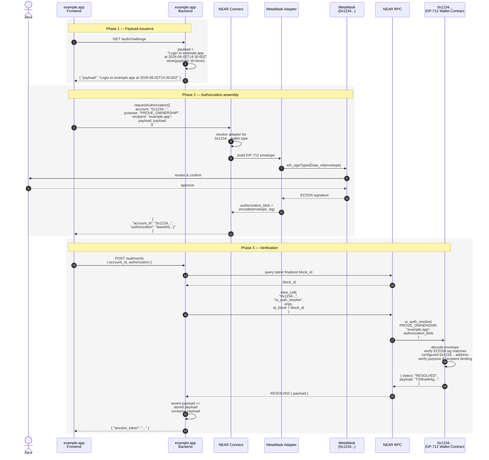
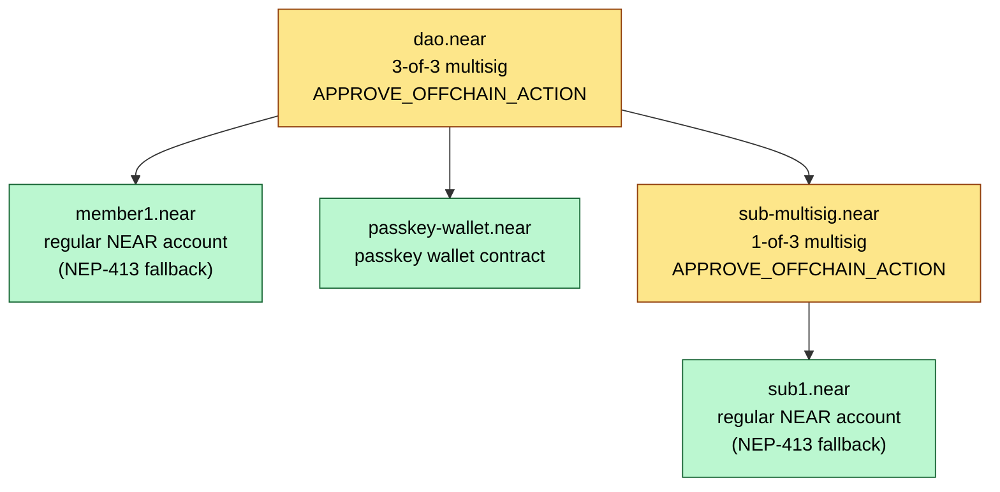
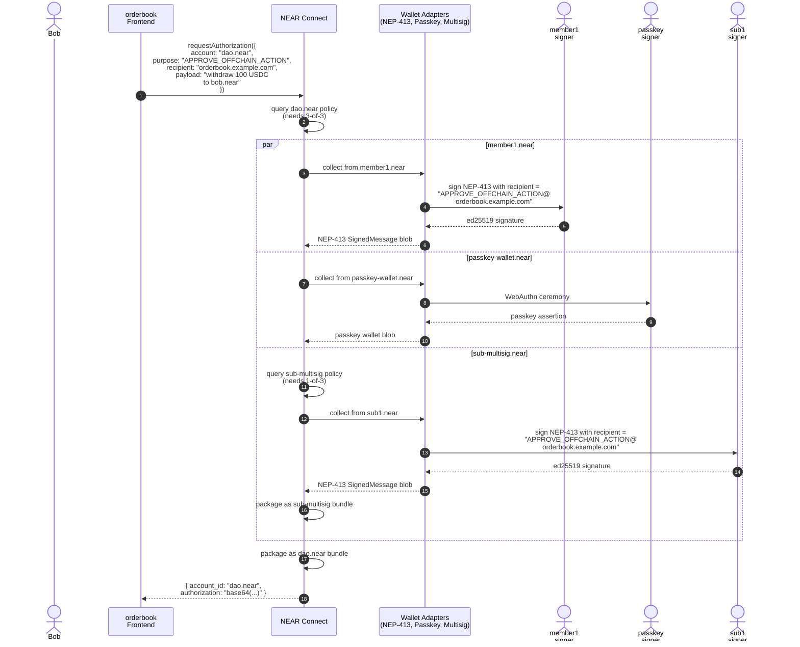
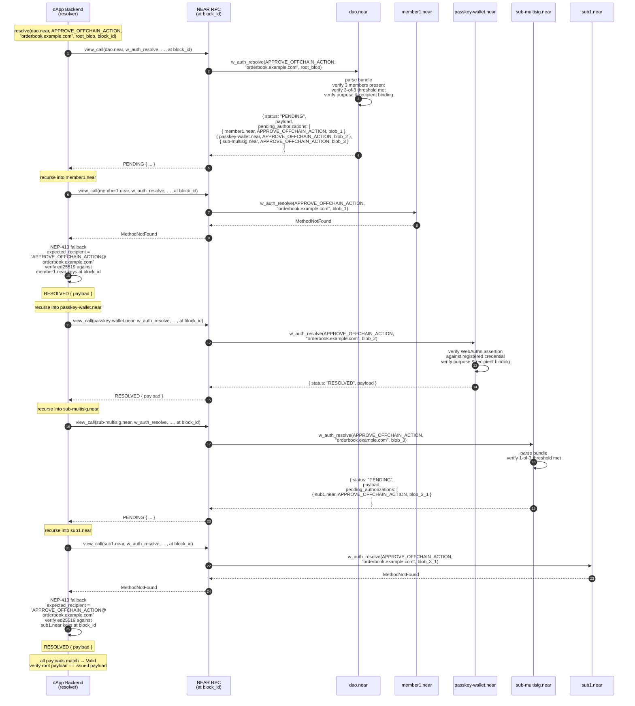

## Summary

This NEP standardizes a view-function convention, `w_auth_resolve`, that lets any NEAR account contract attest to off-chain authorizations — whether for authentication ("prove ownership") or for approving a specific off-chain action — without requiring a NEAR access key on the account. It supports recursive resolution so that multisig and delegated-wallet contracts compose naturally with single-signer wallet contracts and with regular NEAR accounts (via NEP-413 as a fallback).

## Motivation

NEP-413 (`signMessage`) enables off-chain message signing for NEAR accounts, but it is fundamentally bound to the access-key model: the signature must be produced by a key registered on the account, and verification is performed entirely off-chain by checking ed25519 against the account's access-key list.

This excludes an increasingly important class of NEAR accounts:

- **Wallet contracts controlled by external authentication schemes** — for example, an account whose authorization is governed by an Ethereum address (via EIP-712 signatures) or by a passkey (via WebAuthn assertions). These accounts may have no access keys at all; the contract is the sole authority.
- **Multisig contracts** that require M-of-N approval from member accounts, each of which may itself be a wallet contract of a different type.
- **Future schemes** — ZK-proof-gated accounts, attestation-gated accounts, session-key delegated accounts — implemented entirely in contract code.

Today, dApps integrating with such accounts must hand-roll per-contract verification logic off-chain, duplicating the contract's authorization rules. This is fragile (contract upgrades break dApps), insecure (off-chain duplication invites divergence), and does not compose (a multisig of mixed wallet types cannot be verified by any single library).

This NEP makes the **on-chain contract the single source of truth** for whether an off-chain authorization is valid for its account, accessible via a uniform view-function interface. Resolution is recursive, so heterogeneous compositions resolve correctly through generic caller-side logic.

## Design Considerations

The following considerations shaped the design. Each is documented so future revisions and implementers can see the trade-offs.

<details>
<summary><strong>Verification as a view function on the contract</strong></summary>

The contract that governs an account is the natural authority for what counts as a valid authorization on that account. Encoding this rule on-chain via a view function gives three properties:

- **Authoritative**: there is no off-chain library to keep in sync with the contract.
- **Composable**: any caller can verify any account uniformly, regardless of wallet type.
- **Cheap**: view calls do not require transactions, gas payment, or chain-state changes.

The trade-off is that resolution requires an RPC round-trip per node in the authorization graph. For typical authentication flows (single account, single call) this is one RPC. For deeply nested multisigs it scales linearly with graph size, which is acceptable for off-chain flows.

</details>

<details>
<summary><strong>Opaque authorization blob</strong></summary>

Each wallet contract defines its own internal format for the authorization blob: an EIP-712 envelope for an Ethereum-signing wallet, a WebAuthn assertion for a passkey wallet, a Borsh-encoded bundle of member authorizations for a multisig, and so on. This NEP intentionally does not standardize the blob format.

Standardizing across all wallet types would require either lowest-common-denominator constraints (limiting innovation) or a fat schema (unmanageable). Companion NEPs may standardize specific blob formats for common schemes (EIP-712, WebAuthn, etc.) without modifying this NEP.

</details>

<details>
<summary><strong>Two purposes: <code>PROVE_OWNERSHIP</code> and <code>APPROVE_OFFCHAIN_ACTION</code></strong></summary>

A single boolean "is this signature valid?" is not enough to express what most real wallets need. There are two operationally distinct intents:

- **`PROVE_OWNERSHIP`**: the dApp wants to know "is this NEAR account willing to authenticate this session?" This is the Sign-In-With-Ethereum (SIWE) equivalent. The threat model is low: the dApp is just authenticating a session, and the worst-case outcome of a compromised authentication is impersonation in one dApp session.
- **`APPROVE_OFFCHAIN_ACTION`**: the dApp wants to know "does this NEAR account approve this specific off-chain action?" This is for signing off-chain orders, granting off-chain capabilities, or any case where the signature represents a binding commitment. The threat model is high: an attacker who steals such a signature can replay a real-world action.

For **single-user wallet contracts** (passkey, EIP-712, NEP-413-only accounts), the distinction is mostly semantic — both purposes typically require the same single signature from the controlling key. The contract just enforces that `purpose` is bound into what gets signed, so the two cannot be cross-replayed.

For **multisig contracts**, the distinction is operationally critical and **MUST** be enforced by the contract. A typical policy:

- `PROVE_OWNERSHIP`: 1-of-N (any member can authenticate the multisig for dApp login).
- `APPROVE_OFFCHAIN_ACTION`: M-of-N or full-threshold (a real action requires the multisig's full policy).

This split avoids the absurdity of requiring all N multisig members to sign just to log into a website, while preserving full policy enforcement for actions that matter.

</details>

<details>
<summary><strong>Closed purpose enum</strong></summary>

The `purpose` enum is closed. Adding new purposes requires a new NEP revision. Open enums (string-typed with a registry) were considered but rejected: NEAR contracts deserialize against a fixed schema, an unrecognized purpose string is just a footgun, and the design space of fundamentally distinct authorization intents is small enough to evolve via versioning.

</details>

<details>
<summary><strong><code>recipient</code> is an explicit input</strong></summary>

The `recipient` parameter — typically the dApp's domain — is bound into the signed material by each contract. This matches NEP-413's semantics and prevents cross-dApp replay: an authorization signed for `dapp-a.com` is rejected by the contract when presented with `recipient = "dapp-b.com"`.

`recipient` is supplied as a top-level argument rather than embedded in the opaque blob so that the dApp backend explicitly states what it expects, and the contract validates that the blob commits to that recipient. This makes the binding visible at the call boundary instead of hidden inside opaque bytes.

</details>

<details>
<summary><strong><code>purpose</code> is bound into signed material</strong></summary>

Beyond `recipient`, each contract **MUST** bind the `purpose` into its envelope before signing. Without this, an attacker who obtains a `PROVE_OWNERSHIP` authorization (which a multisig member might sign casually for a dApp login) could replay it as `APPROVE_OFFCHAIN_ACTION` (where it represents a binding commitment). Purpose binding is a non-negotiable security property.

</details>

<details>
<summary><strong>Caller-side recursive resolution</strong></summary>

When a contract cannot resolve an authorization alone — typically because it is a multisig delegating to member accounts — it returns `PENDING` with the list of `account_id` / `purpose` / `authorization` triples that the caller must recursively resolve. The caller (dApp backend, NEAR Connect, etc.) walks the graph generically.

The parent contract is responsible for **extracting** each sub-account's authorization from its own bundle format and returning it inline in the `PENDING` response. This means:

- The caller never needs to understand any contract's bundle format.
- The caller just follows the graph: for each `PendingAuthorization`, call `w_auth_resolve` on the named account with the supplied blob.
- Each wallet contract owns its own format; the protocol stays universal.

</details>

<details>
<summary><strong>Payload equality across the graph</strong></summary>

The unwrapped `payload` returned from every node in the resolution graph **MUST** be identical. This is the load-bearing invariant: it means a sub-contract cannot mutate the message that its members effectively signed. The caller verifies equality at every recursion step and rejects mismatches.

The dApp backend therefore performs one final check: the payload returned at the root equals the payload it issued. This is sufficient against replay because the dApp generates a fresh, unique payload (nonce) per session and only accepts authorizations bound to a payload it has issued.

</details>

<details>
<summary><strong>NEP-413 fallback for regular accounts</strong></summary>

Most NEAR accounts today are regular accounts with access keys, not wallet contracts. For these, `w_auth_resolve` does not exist and the view call returns a `MethodNotFound` error. The caller **MUST** then fall back to NEP-413 verification, treating the `authorization` blob as a NEP-413 `SignedMessage` and verifying against the account's access keys.

This means a single client-side library can resolve authorizations for any NEAR account — wallet contract or regular — using one uniform call. Multisig contracts whose members are a mix of regular accounts and wallet contracts work without any special handling at the caller layer.

To preserve `purpose` binding under NEP-413 (which has no native `purpose` field), this NEP encodes the purpose into the NEP-413 `recipient` field using the syntax `<PURPOSE>@<recipient>`. For example, an authentication request for `example.app` becomes a NEP-413 signature with `recipient = "PROVE_OWNERSHIP@example.app"`. This is a small, additive convention that does not require any change to NEP-413 itself and cleanly prevents cross-purpose replay.

</details>

<details>
<summary><strong>Contract method is authoritative; no downgrade</strong></summary>

If a contract implements `w_auth_resolve`, that method is the **only** authoritative path. The caller **MUST NOT** fall back to NEP-413 verification for an account whose contract returns `INVALID` from `w_auth_resolve`. Otherwise an attacker who learns of a vestigial access key on a wallet contract account could downgrade authorization from the contract policy (e.g., M-of-N threshold) to a single ed25519 signature.

Wallet contract deployments **SHOULD** therefore remove all access keys after deployment, but this NEP does not depend on that hygiene — the no-downgrade rule defends against accidentally retained keys.

</details>

<details>
<summary><strong>No artificial size or depth limits in the spec</strong></summary>

Earlier drafts considered specifying maximum recursion depth, maximum authorization blob size, and gas-limit guidance per view call. These were dropped:

- Recursion is off-chain; the caller controls its own budget and aborts however it likes.
- Authorization blobs are bounded naturally by the NEAR view-call payload size limit.
- The view-call gas budget is set by the caller per RPC; the contract has no incentive or ability to over-consume.

The spec stays minimal. Implementers may enforce limits as they see fit.

</details>

<details>
<summary><strong>Block-pinned resolution</strong></summary>

An account's policy (e.g., multisig membership) can change between the resolution of one sub-account and the next. Without pinning, the caller may observe a partially updated authorization graph in which a member who signed at time T₀ is no longer a member at time T₁. To eliminate this race, the caller **MUST** pin the entire resolution to a single `block_id` and pass it to every `view_call` RPC in the recursion. This makes the resolution semantically atomic against a single chain state.

</details>

## Specification

### Method signature

Contracts implementing this NEP **MUST** expose the following view function:

```rust
pub fn w_auth_resolve(
    purpose: Purpose,
    recipient: String,
    authorization: Base64VecU8,
) -> AuthorizationResolution;
```

### Types

```rust
#[derive(Serialize, Deserialize)]
#[serde(rename_all = "SCREAMING_SNAKE_CASE")]
pub enum Purpose {
    ProveOwnership,
    ApproveOffchainAction,
}

#[derive(Serialize, Deserialize)]
#[serde(tag = "status", rename_all = "SCREAMING_SNAKE_CASE")]
pub enum AuthorizationResolution {
    Resolved {
        payload: Base64VecU8,
    },
    Pending {
        payload: Base64VecU8,
        pending_authorizations: Vec<PendingAuthorization>,
    },
    Invalid {
        error_kind: ErrorKind,
        error_message: String,
    },
}

#[derive(Serialize, Deserialize)]
pub struct PendingAuthorization {
    pub account_id: AccountId,
    pub purpose: Purpose,
    pub authorization: Base64VecU8,
}

#[derive(Serialize, Deserialize)]
#[serde(rename_all = "SCREAMING_SNAKE_CASE")]
pub enum ErrorKind {
    InvalidInput,
    InvalidSignature,
}
```

### JSON wire format

`AuthorizationResolution` is serialized as an internally-tagged JSON object with the discriminator field `status` and variant names in `SCREAMING_SNAKE_CASE`:

```json
{ "status": "RESOLVED", "payload": "<base64>" }
```

```json
{
  "status": "PENDING",
  "payload": "<base64>",
  "pending_authorizations": [
    { "account_id": "...", "purpose": "...", "authorization": "<base64>" }
  ]
}
```

```json
{
  "status": "INVALID",
  "error_kind": "INVALID_SIGNATURE",
  "error_message": "..."
}
```

`Purpose` and `ErrorKind` are serialized as bare `SCREAMING_SNAKE_CASE` strings (e.g., `"PROVE_OWNERSHIP"`, `"APPROVE_OFFCHAIN_ACTION"`, `"INVALID_INPUT"`, `"INVALID_SIGNATURE"`).

### Semantics

The following are normative requirements (RFC 2119 keywords).

#### Function nature

- `w_auth_resolve` **MUST** be a view function: it **MUST NOT** modify contract state, and it **MUST** be callable via NEAR's `view_call` RPC without a signed transaction.
- The function **MUST** be deterministic with respect to the input arguments and current chain state.

#### Recipient binding

- The contract **MUST** verify that the supplied `authorization` blob commits to the supplied `recipient`. If the blob's recipient does not match, the contract **MUST** return `INVALID` with `error_kind: INVALID_INPUT`.

#### Purpose binding

- The contract **MUST** verify that the supplied `authorization` blob commits to the supplied `purpose`. Authorizations signed for a different purpose **MUST** be rejected.

#### Payload extraction and equality

- On `RESOLVED` or `PENDING`, the returned `payload` **MUST** be the unwrapped, original message bytes the caller supplied — identical at every level of the resolution graph.
- Sub-resolutions returning a different `payload` than their parent **MUST** be treated as `INVALID` by the caller.

#### Pending vs Resolved

- A contract that has all the information needed to attest the authorization (single-signer wallets, multisigs whose threshold is already satisfied at the contract level) **MUST** return `RESOLVED`.
- A contract that requires further authorization from other accounts (typically a multisig delegating to member accounts) **MUST** return `PENDING` with a non-empty `pending_authorizations` list.
- `PENDING` with empty `pending_authorizations` is **NOT** valid. Contracts with no pending dependencies **MUST** return `RESOLVED`.

#### Pending authorization extraction

- When returning `PENDING`, the contract **MUST** extract from its input `authorization` the relevant sub-authorization for each pending account, and populate `PendingAuthorization.authorization` with that extracted blob.
- The caller passes each extracted blob directly to the corresponding `account_id`'s `w_auth_resolve` (or to NEP-413 fallback if no contract method exists).

#### Block pinning

- The caller **MUST** pin the entire recursive resolution to a single `block_id` by passing it to every `view_call` RPC in the recursion. This makes the graph walk semantically atomic against a single chain state.

#### Purpose policy guidance (informative)

This NEP does not mandate specific policy rules per purpose. The following is a recommended convention for multisig contracts:

- `PROVE_OWNERSHIP`: 1-of-N. Any member's authorization is sufficient to authenticate the multisig account.
- `APPROVE_OFFCHAIN_ACTION`: M-of-N matching the contract's on-chain threshold for transactions. Off-chain action approval is held to the same standard as on-chain action approval.

For single-signer wallet contracts, both purposes typically require the same single signature, but `purpose` binding still prevents cross-purpose replay.

#### Authorization blob format

The wire format of the `authorization` parameter is **unspecified by this NEP** and is owned by the implementing contract. Companion NEPs **MAY** standardize blob formats for common wallet types (EIP-712, WebAuthn, etc.).

### NEP-413 fallback

When the caller attempts to resolve an authorization on an `account_id` that does not implement `w_auth_resolve`, it **MUST** apply the following fallback procedure:

1. Attempt to call `view_call(account_id, "w_auth_resolve", { purpose, recipient, authorization })` at the pinned `block_id`.
2. If the RPC returns a `MethodNotFound` error (the contract does not implement the method, or no contract is deployed), treat the `authorization` blob as a NEP-413 `SignedMessage` payload and verify it according to NEP-413, with the following purpose-binding rules:
   - Decode the blob as a NEP-413 `SignedMessage`.
   - Construct the **expected recipient string** as `"<PURPOSE>@<recipient>"`, where `<PURPOSE>` is the SCREAMING_SNAKE_CASE form of the requested purpose (e.g., `PROVE_OWNERSHIP`) and `<recipient>` is the recipient supplied to `w_auth_resolve` (e.g., `example.app`). For example: `"PROVE_OWNERSHIP@example.app"`.
   - Verify that the `recipient` field of the `SignedMessage` equals the expected recipient string. If not, return `INVALID`.
   - Verify the ed25519 signature against an access key registered on `account_id` at the pinned `block_id`.
   - On success, return `RESOLVED` with `payload` equal to the `SignedMessage.message` field (as base64 bytes).
3. If the RPC returns any other error (network failure, deserialization failure, etc.), propagate it; do not fall back.

The NEP-413 signer (wallet adaptor) is therefore responsible for using `"<PURPOSE>@<recipient>"` as the `recipient` field when producing signatures intended for use under this NEP. This is the **only** change required at the NEP-413 signer layer.

#### Authoritative contract method (no downgrade)

If the contract method `w_auth_resolve` exists on `account_id`, it is **authoritative**. The caller **MUST NOT** fall back to NEP-413 verification when `w_auth_resolve` returns `INVALID`, **even if** the account has access keys that could otherwise verify the blob. This rule prevents authorization downgrade attacks against wallet contracts with retained access keys.

### Caller-side resolution algorithm

The following algorithm describes the canonical caller-side procedure. It is informative; implementations may differ in scheduling, parallelism, or error handling provided they preserve the normative semantics above.

```text
resolve(account, purpose, recipient, authorization, block_id, depth=0):
    if depth > caller_max_recursion:
        return Error("recursion limit exceeded")

    try:
        result = view_call(account, "w_auth_resolve",
                           { purpose, recipient, authorization },
                           at_block = block_id)
    catch MethodNotFound:
        return nep413_fallback(account, purpose, recipient, authorization, block_id)
    catch other_error as e:
        return Error(e)

    match result.status:
        RESOLVED:
            return (Valid, result.payload)

        INVALID:
            return Invalid(result.error_kind, result.error_message)

        PENDING:
            if result.pending_authorizations is empty:
                return Invalid("contract returned PENDING with no dependencies")

            for sub in result.pending_authorizations:
                (sub_result, sub_payload) = resolve(
                    sub.account_id,
                    sub.purpose,
                    recipient,
                    sub.authorization,
                    block_id,
                    depth + 1)

                if sub_result != Valid:
                    return sub_result

                if sub_payload != result.payload:
                    return Invalid("payload mismatch in sub-resolution")

            return (Valid, result.payload)


nep413_fallback(account, purpose, recipient, authorization, block_id):
    msg = parse_nep413_signed_message(authorization)
    expected_recipient = format!("{PURPOSE}@{recipient}")  // e.g., "PROVE_OWNERSHIP@example.app"
    if msg.recipient != expected_recipient:
        return Invalid("recipient mismatch")
    if not verify_ed25519(msg, account_keys_at(account, block_id)):
        return Invalid("bad signature")
    return (Valid, msg.message_as_base64)
```

At the top level, the caller resolves the latest finalized block ID once and uses it for the entire recursion. After the top-level `resolve(...)` returns `(Valid, payload)`, the dApp backend **MUST** additionally verify that `payload` equals the payload it originally issued.

## Reference Flows

The two flows below illustrate the end-to-end behavior of the protocol.

### Flow 1 — `PROVE_OWNERSHIP` with a MetaMask-controlled wallet contract

Alice has a NEAR account whose only authority is an EIP-712 wallet contract bound to her Ethereum address `0x1234...`. She has no NEAR access keys on this account. The NEAR account ID is the lowercased Ethereum address (NEAR allows hex implicit accounts of this form), so her NEAR account is `0x1234...`. She wants to log into `example.app`.

#### Sequence



#### Sample payloads

**EIP-712 envelope signed by MetaMask** (adapter-defined; this is one valid shape):

```json
{
  "domain": {
    "name": "NEAR Wallet Contract",
    "version": "1",
    "chainId": 397,
    "verifyingContract": "0x0000000000000000000000000000000000000000",
    "salt": "0x...keccak(\"0x1234...\")..."
  },
  "types": {
    "Authorization": [
      { "name": "account_id", "type": "string" },
      { "name": "purpose", "type": "string" },
      { "name": "recipient", "type": "string" },
      { "name": "payload", "type": "string" }
    ]
  },
  "primaryType": "Authorization",
  "message": {
    "account_id": "0x1234...",
    "purpose": "PROVE_OWNERSHIP",
    "recipient": "example.app",
    "payload": "Login to example.app at 2026-06-02T14:30:00Z"
  }
}
```

**The authorization blob** is `base64(borsh_encode(envelope_hash + ecdsa_signature_bytes))` (exact serialization is contract-defined).

**The view call request** sent by the dApp backend:

```json
{
  "request_type": "call_function",
  "account_id": "0x1234...",
  "method_name": "w_auth_resolve",
  "args_base64": "<base64-encoded JSON of arguments>",
  "block_id": 178412345
}
```

Where the decoded arguments are:

```json
{
  "purpose": "PROVE_OWNERSHIP",
  "recipient": "example.app",
  "authorization": "<base64 blob>"
}
```

**The view call response**:

```json
{
  "status": "RESOLVED",
  "payload": "TG9naW4gdG8gZXhhbXBsZS5hcHAgYXQgMjAyNi0wNi0wMlQxNDozMDowMFo="
}
```

The base64 `TG9naW4g...` decodes to `Login to example.app at 2026-06-02T14:30:00Z`, which the backend matches against the payload it issued in Phase 1.

### Flow 2 — `APPROVE_OFFCHAIN_ACTION` with a composite multisig

A DAO treasury is held in the multisig `dao.near` with the policy:

- `PROVE_OWNERSHIP`: 1-of-3
- `APPROVE_OFFCHAIN_ACTION`: 3-of-3

Its three members are:

- `member1.near` — a regular NEAR account with full-access keys (NEP-413 signer)
- `passkey-wallet.near` — a wallet contract gated by a WebAuthn passkey
- `sub-multisig.near` — another multisig with policy 1-of-3 for both purposes, and members `sub1.near`, `sub2.near`, `sub3.near` (all regular NEAR accounts for this example)

The dApp `orderbook.example.com` wants `dao.near` to approve the off-chain order "withdraw 100 USDC to bob.near". This requires a full 3-of-3 authorization on `dao.near`.

#### Authorization graph



Yellow nodes are multisig contracts that return `PENDING`. Green nodes are leaves that return `RESOLVED`.

#### Assembly phase (NEAR Connect orchestration)

This phase is **not** specified by this NEP — it belongs to the wallet adaptor layer (e.g., NEAR Connect). It is shown for completeness so the verification phase makes sense.



The output is a single opaque blob bound to `dao.near` that internally contains the three member sub-blobs. From the dApp backend's perspective, it is a black box.

#### Verification phase (recursive resolution)

This is the part specified by this NEP. The dApp backend pins a `block_id`, then calls `resolve(dao.near, APPROVE_OFFCHAIN_ACTION, "orderbook.example.com", <root blob>, block_id)`. The algorithm walks the graph:



#### NEP-413 fallback example payload

The NEP-413 `SignedMessage` produced by `member1.near` for this flow looks like:

```json
{
  "message": "d2l0aGRyYXcgMTAwIFVTREMgdG8gYm9iLm5lYXI=",
  "nonce": "<32 random bytes, base64>",
  "recipient": "APPROVE_OFFCHAIN_ACTION@orderbook.example.com",
  "callbackUrl": null,
  "signature": "<ed25519 sig, base64>",
  "publicKey": "ed25519:<...>"
}
```

The fallback verifier:

1. Confirms `recipient` equals the expected combined string.
2. Verifies the ed25519 signature against `member1.near`'s access keys at the pinned `block_id`.
3. Returns `RESOLVED { payload: "d2l0aGRyYXcgMTAwIFVTREMgdG8gYm9iLm5lYXI=" }` (which base64-decodes to `withdraw 100 USDC to bob.near` — the same payload as every other node in the graph).

#### Bundle format (illustrative)

This NEP does not standardize the bundle format. For illustration, the multisig contract in this example uses a Borsh-encoded structure of the form:

```rust
// Root bundle for dao.near (3-of-3 multisig)
MultisigBundle {
    members: [
        MemberAuthorization {
            account_id: "member1.near",
            authorization: <NEP-413 SignedMessage bytes>,
        },
        MemberAuthorization {
            account_id: "passkey-wallet.near",
            authorization: <passkey wallet contract blob>,
        },
        MemberAuthorization {
            account_id: "sub-multisig.near",
            authorization: <inner MultisigBundle bytes>,
        },
    ],
}
```

When `dao.near.w_auth_resolve` is called with this blob, it:

1. Borsh-decodes the bundle.
2. Validates that all three named accounts are registered members.
3. Validates that the count (3) meets the configured threshold for `APPROVE_OFFCHAIN_ACTION` (3-of-3).
4. Returns `PENDING` populating each `PendingAuthorization.authorization` with the raw `authorization` bytes extracted from the bundle (no re-wrapping).

The caller treats each extracted blob opaquely and passes it to the corresponding sub-account's `w_auth_resolve`.

#### Payload binding

The `payload` returned at every node in the graph equals the original `"withdraw 100 USDC to bob.near"` (base64-encoded). If any node returns a different payload, the caller rejects the entire resolution. If all match and the root's payload equals what the dApp issued, the authorization is valid.

## Reference Implementation

Reference implementations are forthcoming:

- A minimal single-signer wallet contract gated by EIP-712 signatures: [`trezu/contracts/wallet/eip712`](https://github.com/frol-ai/intents/tree/main/contracts/wallet).
- A passkey-gated wallet contract using WebAuthn assertions: TBD.
- An M-of-N multisig contract supporting heterogeneous members: TBD.
- A caller-side resolution library in TypeScript (NEAR Connect integration): TBD.
- A caller-side resolution library in Rust (server-side verification): TBD.

## Security Considerations

### Replay across dApps

Prevented by `recipient` binding: each contract verifies that the supplied `recipient` matches the recipient embedded in the signed envelope. An authorization signed for `dapp-a.com` is rejected when presented to `dapp-b.com`. The same property holds for NEP-413 fallback through the `<PURPOSE>@<recipient>` recipient encoding.

### Replay within a dApp

The dApp's responsibility: generate a unique payload (e.g., domain + timestamp + nonce, as in Flow 1's `"Login to example.app at 2026-06-02T14:30:00Z"`) per session and reject reused payloads. This matches NEP-413's existing model.

### Cross-purpose replay

Prevented by `purpose` binding: each contract verifies that the supplied `purpose` matches the purpose embedded in the signed envelope. A `PROVE_OWNERSHIP` authorization cannot be replayed as `APPROVE_OFFCHAIN_ACTION` and vice versa. For NEP-413 fallback, the same property is enforced by the `<PURPOSE>@<recipient>` recipient encoding — a signature with `recipient = "PROVE_OWNERSHIP@example.app"` will fail verification when checked against `expected_recipient = "APPROVE_OFFCHAIN_ACTION@example.app"`. Implementations that fail to bind purpose are non-conformant with this NEP.

### Payload substitution by sub-contract

A malicious or buggy sub-contract that returns a different `payload` than its parent **MUST** be detected and rejected by the caller. The payload-equality check at every recursion step is the principal invariant of the protocol.

### Authorization downgrade

Prevented by the no-downgrade rule: if a contract implements `w_auth_resolve`, the caller **MUST NOT** fall back to NEP-413 verification when `w_auth_resolve` returns `INVALID`. This holds even if the contract's account has unrevoked access keys.

Wallet contract deployments **SHOULD** remove all access keys after deployment as defense in depth, but the protocol does not rely on this hygiene for security.

### State drift during resolution

Eliminated by mandatory block pinning: the caller **MUST** pass the same `block_id` to every `view_call` RPC in the recursion (including the access-key lookup in NEP-413 fallback). This makes the resolution semantically atomic against a single chain state. A membership change committed mid-resolution will simply produce a `PENDING` graph that never matches at the new block; the caller can retry at a fresh block.

### View call gas exhaustion

A malicious wallet contract could implement `w_auth_resolve` to consume the entire view-call gas budget, attempting to deny service or inflate costs at the verifier. Callers **SHOULD** set explicit gas limits per RPC view call and treat gas-exhausted responses as `INVALID`. NEAR's `view_call` RPC supports gas limits natively.

### Cycles in the authorization graph

Cycles can arise if a multisig account is (directly or transitively) its own member. Cycles are detectable by the caller via a visited-set during recursion. Detection is not mandated by this NEP because off-chain cycles cause finite work (cap recursion depth) rather than security failures, but well-behaved caller libraries **SHOULD** implement cycle detection for better error messages.

### Authorization material persistence

This protocol does not include native authorization expiry beyond the dApp's payload lifetime. Long-lived authorizations (e.g., a multisig bundle that has been assembled but not yet verified for hours) remain valid until the dApp's payload (which the dApp tracks for freshness) expires. Implementations that need shorter validity **MUST** encode expiry into the payload at the dApp layer.

## Drawbacks

- **Recursion complexity**: callers must implement recursive view-call orchestration rather than a single verification call. For most dApps this is encapsulated in a library, but is more involved than NEP-413's single round-trip.
- **Per-contract blob formats**: the deliberate decision to leave authorization blobs unspecified means wallet adaptors must implement format-specific encoding for each wallet contract type. This is unavoidable given wallet heterogeneity but adds adapter complexity at the NEAR Connect layer.
- **Latency for deep graphs**: a multisig of multisigs may require many sequential RPC round-trips. Callers can parallelize sibling branches but cannot parallelize parent/child. In practice, depth is rarely more than 2.
- **NEP-413 recipient convention**: NEP-413 signers producing signatures for use under this NEP must encode purpose into the recipient as `<PURPOSE>@<recipient>`. This is a tiny convention but does require coordination at the wallet adaptor layer.

## Future Possibilities

- **Companion NEPs** standardizing authorization blob formats for common schemes (EIP-712, WebAuthn / passkey, Solana ed25519, BIP-322 Bitcoin signatures).
- **`PROVE_DELEGATION` purpose** to standardize issuance of scoped, expiring session keys.
- **`APPROVE_INTENT` purpose** integrated with NEAR Intents for typed, schema-aware authorization rendering at the wallet layer.
- **Streaming resolution events** for very deep authorization graphs, exposed via an RPC subscription rather than polling.
- **Off-chain verifier services** that resolve common authorization shapes server-side and return signed attestations, reducing per-dApp RPC costs.
- **NEP-413 revision** adding native `purpose` field, eliminating the `<PURPOSE>@<recipient>` recipient convention.

## Copyright

CC0 1.0 Universal.
