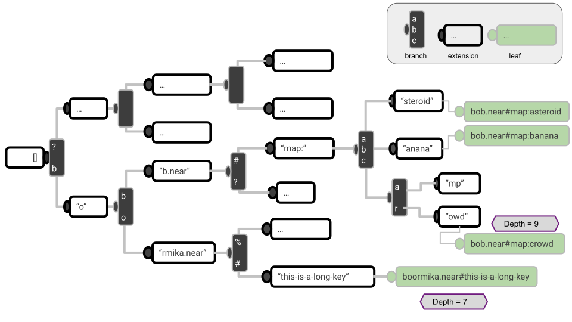

## Summary

Simplify the current gas model formula for storage related operations.
Remove dependencies on other user's traffic and make the cost independent of the momentary trie shape.

The current gas cost is `base_cost + byte_cost * BYTES + key_byte_cost * KEY_LENGTH + touched_trie_node_cost * TTN + cached_trie_node_cost * CACHED_TTN`.

The proposed new gas cost is `base_cost + byte_cost * BYTES +  key_byte_cost * KEY_LENGTH`.

## Motivation

A function call accessing storage today is charged an amount that depends on how many unique nodes of the Merkle Patricia Trie are touched and have not already been touched by other function calls in the same chunk.

This number of touched trie nodes (TTN) is unpredictable because other receipts in the same chunk affect it.
Furthermore, creation of other contracts with a shared prefix in the name can permanently affect the TTN number by inserting extra nodes in the path from the root to the developer's account.

For smart contract developers, the unpredictability means that testing gas usage is very difficult.
They have to either deploy on mainnet directly and pay full cost even while testing.
Or they have to download large parts of the mainnet state and replicate it locally.
And even then, both approaches still cannot predict the actual traffic that the app will face on chain, as this can be different every block

With the simplified gas cost model, gas costs for all function calls can be predicted locally without knowledge of the trie shape or neighbor's traffic.

Besides the problems TTN based gas costs provide to smart contract developers, it is also a burden for NEAR Protocol client implementations.
The exact TTN number must be computed deterministically by all clients.
That means every client has to maintain the exact same caching strategy as nearcore uses today.

This has started to become a problem even for nearcore itself.
Optimizations such as flat storage [NEP-399](https://github.com/near/NEPs/pull/399) do not have to traverse the trie for every storage operation.
But with the current gas cost model, it is necessary to still traverse it and update caches accordingly to adhere with the protocol specification.
This reverse all gains from flat storage.

With the simplified gas cost model, client implementations (e.g. nearcore) can optimize storage layout freely. This will lead to increased stability and may allow lowering gas costs in the future.

## Rationale and alternatives

This proposal solves two problems at once.
Overspecified storage operations and bad developer experience around storage gas costs.

### Overspecified storage operations

The first half has been discussed in the context of flat storage.
One alternative would be to approximate the number of tries that need to be touched by always charging for the maximum depth node of a contract.

This would drastically increase the counted TTN because accessing nodes on a short path would cost the same as accessing long paths. Further, and this has the biggest impact, the trie node cache per chunk could no longer be used to reduce gas costs.

The proposed solution to remove TTN cost faces similar challenges.
Removing the costs without adjusting the remaining parameters is infeasible because it would lead to instability when many contract perform a lot of storage operations at the same time.

Therefore, the specification section increases the base parameters and the per-key-byte parameters.
This is also an approximation of the true cost. But together with [NEP-399](https://github.com/near/NEPs/pull/399) the numbers can be low enough that the total gas cost charged for smart contract function calls are almost always lower or equal to the old behavior.
The same can not be said about the alternative because it still requires some form of counting the depth of trie nodes.

If we do not move forward with this proposal, [NEP-399](https://github.com/near/NEPs/pull/399) is blocked and requires alternative solutions for the gas cost model.
And other potential innovation would be stifled, too.

If [NEP-399](https://github.com/near/NEPs/pull/399) is abandoned, it still makes sense to change the gas cost model.
Even in that case, the parameters can be fine-tuned to be as close as possible to current costs to avoid dramatically increased gas costs for any user.

### Bad user experience

The second half is served best by removing any unpredictable cost entirely.
No alternatives have been proposed to resolve this to the best of my knowledge.

The alternative discussed for flat storage would partially address this because it would disable the per-chunk trie node cache.
But still it would depend on the shape of the trie which can be affected by third-parties.

## Specification

### Gas Cost Formula Without TTN

There are currently four storage related host function calls. These are, `storage_read`, `storage_has_key`, `storage_remove`, and `storage_write`.
The gas formula with removed touched trie node (TTN) cost is listed below.
Note that it is simply the old formula but without the TTN cost.

#### Read (`storage_read`)
`storage_read_base` +
`storage_read_key_byte` * KEY_BYTES +
`storage_read_value_byte` * KEY_BYTES

#### Has Key (`storage_has_key`)
`storage_has_key_base` +
`storage_has_key_byte` * KEY_BYTES

#### Write (`storage_write`)
`storage_write_base` + 
`storage_write_key_byte` * KEY_BYTES +
`storage_write_value_byte` * NEW_VALUE_BYTES +
`storage_write_evicted_byte` * OLD_VALUE_BYTES

#### Remove (`storage_remove`)
`storage_remove_base` +
`storage_remove_key_byte` * KEY_BYTES +
`storage_remove_ret_value_byte`* OLD_VALUE_BYTES

### Paying Gas For Trie Operations
To understand gas costs for storage, we have to quickly reiterate how data is stored.
Every value is stored in a trie.
As explained in the [nomicon](https://nomicon.io/Architecture#trie), this is part of the protocol definition and dictates how state proofs are constructed.
Current implementation details are documented in the [Nearcore Development Guide](https://near.github.io/nearcore/architecture/trie.html).

Storage operations are directly translated to operations on the trie. 
Every operation starts by looking up the respective node.
In the simplest case, this is done by traversing the trie starting from the current chunk state root.
But direct mapping can be maintained by a client as well.

The cost for finding a trie node is related to the key length.
A long key means the node can be deeper down in the trie, which means traversal needs to touch more nodes.
For direct mappings, the key needs to be processed and stored somehow, but otherwise no direct cost is associated with the key length. 

When updating a trie node through `storage_write` or `storage_remove`, an additional cost occurs for updating the hash of the new value and all its ancestor nodes.
No optimization can avoid this cost entirely because every updated hash contributes to the new state root.
But those writes can largely be computed in parallel in the background.

The key length puts an upper limit on the node's depth.
Trie node depth is defined as the distance to the chunk state root measured in number of nodes.
The root itself has depth 0 and its direct children have depth 1.

NEAR's trie is a prefix tree with 4-bit symbols, also known as _nibbles_ or _half-bytes_.
Since each symbol produces at most one node in a prefix tree, a key with `N` bytes has a depth of `2*N` or lower.

To cover the costs for fetching and updating trie nodes, each storage operations has a parameter that scales with the key length.
The specific values are implementation details which are described in the [Reference Implementation](#reference-implementation) section.


### Comparison to Gas Cost Model with TTN
The gas cost model that charges every touched trie node has downsides and benefits.

First, charging gas for the exact number of trie nodes touched means that the user pays precisely for the amount of database requests required.
But only under the assumption that the client traverses the trie for every request.
This is positive if the client implements it in this way but negative if optimizations are implemented that avoid the expensive trie lookup.

One disadvantage of the TTN-free model is for users that store a few but long keys.
If we approximate the number of touched nodes by key length, those users have to pay the same cost per key lookup as users with many long keys.
Whereas in the model that counts TTN, the user with few keys pay less per key lookup because the user's subtrie is smaller and hence less nodes need to be traversed. (Assuming a reasonably balanced trie structure.)

Another disadvantage is for users that access many similar keys.
The TTN-free model has to charge the full cost for each lookup, whereas the TTN counting model can make the first lookup more expensive and those the follow cheaper because most of the nodes required for the trie traversal are cached in memory.

The benefits of the TTN-free model are as mentioned previously.
It allows to optimize client storage implementation and it makes the gas formula deterministic.

### Example

Bob and Boormika both have an account on the NEAR blockchain.
Both want to read a value that is stored in the subtree if their account.

Bob's account is `bob.near` and the key he accesses is `map:crows`.
Boormika's account is `boormika.near` and she reads `this-is-a-long-key` right after Bob, within the same chunk.

The following shows a posisble trie structure that contains these two keys.
For the purpose of this drawing, characters instead of nibbles are used for the trie.



In the example trie structure, Bob's key `map:crows` is stored at depth 9, hence reading it will touch 10 trie nodes including the root. The key length is 9 bytes (or characters).
Let's further assume that the stored value is 100 bytes in length.

Bob's gas cost for reading is

`storage_read_base + storage_read_key_byte * 9 + storage_read_value_byte * 100`

and if TTN is non-zero, additionally

`10 * touching_trie_node`.

Now when Boormika reads her key of length 18, depth 7, and again value size 100, the gas cost is as follows.

`storage_read_base + storage_read_key_byte * 18 + storage_read_value_byte * 100`

plus

`4 * touching_trie_node + 4 * read_cached_trie_node`

Note that the first four trie nodes she touches have already been read by Bob within the same chunk, so for her reading them is charged at a discount. (`read_cached_trie_node` is about 8 times cheaper than `touching_trie_node`.)

In the old model, Bob with the short key ends up paying much more than Boormika.
In the new model, the TTN cost is set to zero and hence Boormika with the long key pays more than Bob.

## Reference Implementation

No code changes are necessary, as we can just change gas parameters and be done.
Mainly, this is to do the following.

```
wasm_touching_trie_node:       16_101_955_926 ->    0
wasm_read_cached_trie_node:     2_280_000_000 ->    0
```

This satisfies the proposed change to remove TTN cost and requires no code changes.

However, some existing parameters need to be increased in order to keep gas costs balanced with the time client need to fulfill storage operations.
Getting these numbers is the main challenge for this proposal.

### Increasing Existing Parameter Values

<!-- On one hand, the new costs should not be cheaper than the old costs, since client implementations (nearcore) are not immediately optimized.
But on the other hand, costs should also not increase significantly, for a number of reasons. 
An obvious reason is that users do not like paying more gas.
Another crucial reason is that we observed transactions on NEAR that are close to the `max_gas_burnt` limit of 300 Tgas. Increasing the cost could cause them to fail. -->

The main factors to consider are:
1. How will a changed gas cost affect current dApps on NEAR?
2. What gas costs are required to guarantee system stability.

As the example above demonstrates, the proposed change is going to affect users differently.
Attempts to make it exactly the same as before for everyone is impossible.
A solution that keeps average costs the same will be cheaper for some and more expensive for others.

A series of experiments have been conducted to explore the parameter space and evaluate its impact on existing dApps.
(TODO: Link to summary)
In conclusion, the following parameters change were found to work without anyone paying significantly more.

```
wasm_storage_read_base:        56_356_845_750 -> 200_000_000_000
wasm_storage_has_key_base:     54_039_896_625 -> 200_000_000_000
wasm_storage_write_base:       64_196_736_000 -> 220_000_000_000
wasm_storage_remove_base:      53_473_030_500 -> 220_000_000_000
```

This increase is necessary because without the touched trie node costs, the base cost has to cover at least a single lookup in the trie.
To cover the case of the uncached case, the gas cost must cover at least one database lookup to make the trie lookup possible.
In our experiments, 200us is the timing we see for that.
(TODO: Final confirmation that 200us is what we want to suggest.)

The write base cost is slightly higher because writes also have to update the value after reading it.
Note that this is an in-memory operation that gets written to disk in the background, so it can be cheap compared to the read.

The new cost for key bytes is as follows:
```
# TODO: These still need to be revisited!
wasm_storage_read_key_byte:    30_952_533 ->   100_000_000
wasm_storage_has_key_byte:     30_790_845 ->   100_000_000
wasm_storage_write_key_byte:   70_482_867 -> 1_000_000_000
wasm_storage_remove_key_byte:  38_220_384 -> 1_000_000_000
```

This change has been the most controversial part in discussions so far.

Reads are relatively easy. 
Reading a longer key does not necessarily cause a increased workload, as it is possible to implement direct lookup.
Therefore, a moderate increase of this cost can be justified and users are not going to feel the affect of it.

For writes, the cost to update all ancestor nodes must be balanced with an increased cost.
The cost of 1 Ggas (~1 us) per byte is what users can stomach.
Going higher would cause severe operational cost increases for many dApps.

Unfortunately, nearcore is not ready yet to support such gas costs for writes.
For now it still has to do an expensive trie traversal for every write before it continues smart contract execution.
This will be optimized in the not-so-distant future and then it will be able to support the cost above.
In the meantime, write costs should keep following the old model.

## Deploying the Feature

### Proposed Strategy
Once this proposal gets accepted, it can immediately be deployed for the read costs.
This means nearcore can start using flat storage which comes with improved system operation stability.

In a second step, the write costs can be adopted once nearcore is ready.
Shipping the read costs first will allow to observe the system's behavior in practice and mitigates risks involved with dramatic changes in the storage costs.

### Alternative Strategy
The alternative would be to wait with the deployment until nearcore is read to support reads and writes.
The downside of this approach is that flat storage will be blocked.
It could only be deployed with a handful of additional optimizations.

The risk associated with grouping up so many complex changes to a single release is much harder to predict than the risk involved with an incremental release.

## Security Implications
If gas costs are set too low, undercharging attacks become possible.

Extensive experiments to evaluate this have been conducted and have lead to the proposed numbers.

TODO: Link to final summary of all the reports written over time.

## Drawbacks

1. Once we have move away from TTN cost, it will be very difficult to go back to it.
2. Gas costs increase for some patterns.
    - Using long keys for storage becomes more expensive.
    - Using many similarly named keys in the same function call becomes more expensive.
    - Reading the same value many time in the same function call becomes more expensive.

## Unresolved Issues
- There are a bunch of TODOs in the text to finalize the benchmarking and gas parameter evaluations.
- The deployment strategy is to do it on two steps, where the second step depends on upcoming optimizations in nearcore.

## Future possibilities
- One of the main motivations for this proposal is to enable [NEP-399](https://github.com/near/NEPs/pull/399).
- On the dApp developer side, the nearcore repository could finally provide them a complete solution to accurately calculate gas costs locally.
- An unlimited range of further optimizations on storage are likely to come up over time. To name a few ideas that are already known:
- Storage operation from different receipts on different accounts no longer need to be strictly ordered within a chunk. (This is necessary today to calculate the correct TTN gas cost.) Therefore, executing multiple receipts concurrently will become theoretically viable.
- Once the need to always count the exact trie nodes is gone, nearcore could use a different format internally while maintaining the hashes according to the trie only to compute the state root and Merkle proofs. A few examples for data layout optimizations to consider:
   - We could try to rearrange the data structure to allow for parallel lookups, whereas today trie traversal is sequential.
   - Nodes across layers could be collapsed to reduce the number of DB requests.
   - Each account's subtrie could be stored as a serialized hash map.
- To mitigate increased gas costs for some usage patterns, we could introduce per function call caches.
  This would allow that only the first `storage_read` is charged fully and following request are served from memory.
  However, it is not clear at this moment whether such optimizations should be done on the protocol level or in the SDK.


## Copyright
[copyright]: #copyright

Copyright and related rights waived via [CC0](https://creativecommons.org/publicdomain/zero/1.0/).
