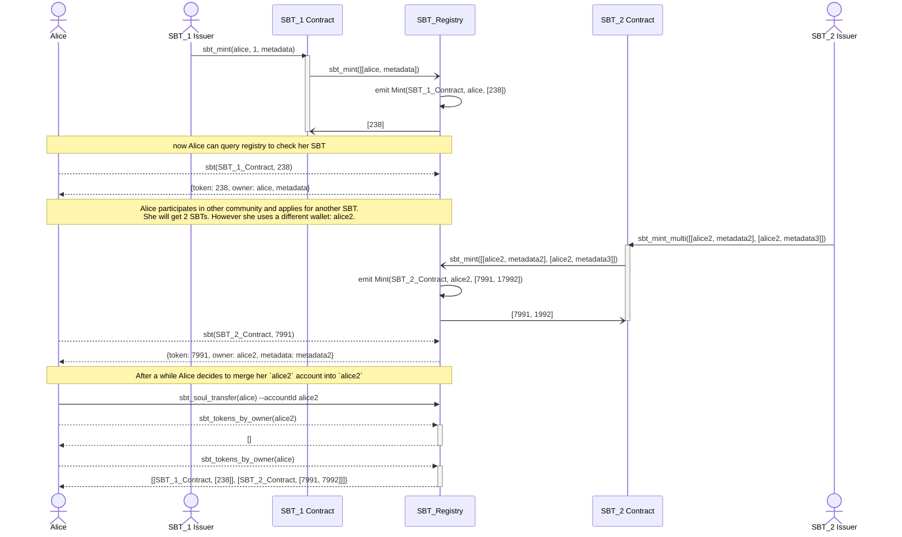

# NEP: Soulbound Token

## Summary

Soulbound Token (SBT) is a form of a NFT which represents an aspect of an account: _soul_. Transferability is limited only to a case of recoverability or transferring the soul - a _soul transfer_ should coordinate with a registry to transfer all SBTs from one account to another, and _banning_ the source account.

SBTs are well suited for carrying proof-of-attendance, proof-of-unique-human "stamps" and other similar credibility-carriers.

## Motivation

Recent [Decentralized Society](https://www.bankless.com/decentralized-society-desoc-explained) trends open a new area of Web3 research to model various aspects of what characterizes humans. Economic and governance value is generated by humans and their relationship. SBTs can represent the commitments, credentials, and affiliations of “Souls” that encode the trust networks of the real economy to establish provenance and reputation.

> More importantly, SBTs enable other applications of increasing ambition, such as community wallet recovery, Sybil-resistant governance, mechanisms for decentralization, and novel markets with decomposable, shared rights. We call this richer, pluralistic ecosystem “Decentralized Society” (DeSoc)—a co-determined sociality, where Souls and communities come together bottom-up, as emergent properties of each other to co-create plural network goods and intelligences, at a range of scales.

Creating a strong primitives is necessary to model new innovative systems and decentralized societies. Examples include reputation protocols, undercollateralized lending, one-person-one-vote, fair airdrops & ICOs, universal basic income, non KYC identity systems, Human DAOs and methods for Sybil attack resistance.

We propose an SBT standard to model protocols described above.

_Verifiable Credentials_ (VC) could be seen as subset of SBT. However there is an important distinction: VC require set of claims and privacy protocols. It would make more sense to model VC with relation to W3 DID standard. SBT is different, it doesn't require a [resolver](https://www.w3.org/TR/did-core/#dfn-did-resolvers) nor [method](https://www.w3.org/TR/did-core/#dfn-did-methods) registry. For SBT, we need something more elastic than VC.

## Specification

Main requirement for Soulbound tokens is to bound an account to a human. A **Soul** is an account with SBTs, which are used to define account identity. Moving SBTs from one account to another should be strictly limited to:

- **recoverability** in case a user's private key is compromised due to extortion, loss, etc;
- **soul transfer** - when a user needs to merge his accounts merge (e.g. he started with few different account but later decides to merge them to increase an account reputation).

This becomes especially important for proof-of-human stamps that can only be issued once per user. Few safeguards against misuse of recovery are contemplated:

1. Users cannot recover an SBT by themselves. The issuer, a DAO or a smart contract (e.g. multisig) dedicated to manage the recovery should be assigned.
2. Whenever a soul transfer is triggered then the SBT registry emits `SoulTransfer` and `Ban` events. The latter signals that the account can't host and receive any SBT in the future. It creates an inherit cost for such action: the account identity is burned.
3. The recovery function is additional economical risk preventing account trading: user should always be able to recover his SBT, and move to another, not banned account.

SBT recover MUST not trigger `SoulTransfer` nor `Ban`: malicious issuer could compromise the system by faking the token recovery and take over all other SBTs from a user. Only the owner of the account can call `soul_transfer` and merge 2 accounts he owns.

Soulbound tokens can have an _expire date_. This is useful for tokens which are related to real world certificates with expire time, or social mechanisms (e.g. community membership). Such tokens SHOULD have an option to be renewable. Examples include mandatory renewal with a frequency to check that the owner is still alive, or renew membership to a DAO that uses SBTs as membership gating.

An issuer can provide a _sbt revocation_ in his contract (eg, when a related certificate or membership should be revoked). When doing so, the SBT registry MUST be updated and `Revoke` event must be emitted. It's up to the registry to define revocation handling (either by burning a token, or changing expire date of it's metadata).

A registry can emit a `Ban` event without doing soul transfer. Handling it depends on the registry governance or registry use cases. One example is to use social governance to identify fake accounts (like bots) - in that case the registry should allow to emit `Ban` and block a scam soul and block future transfers.

### Token Kind

SBT tokens can't be fractionized. Also, by definition there should be only one of a token per token kind per user. Examples: user should not be able to receive few badges of the same kind, or few proof of attendance to the same event.
However we identify a need for having few token kinds in a single contract:

- badges: one contract with multiple badge kind (community lead, OG...);
- certificates: one issuer can create certificates of a different kind (eg school department can create diplomas for each major and each graduation year).

We also see a trend in the NFT community and demand for market places to support multi token contracts.

- In Ethereum community many projects are using [ERC-1155 Multi Token Standard](https://eips.ethereum.org/EIPS/eip-1155). NFT projects are using it for fraction ownership: each token id can have many fungible fractions.
- NEAR [NEP-245](https://github.com/near/NEPs/blob/master/neps/nep-0245.md) has elaborated similar interface for both bridge compatibility with EVM chains as well as flexibility to define different token types with different behavior in a single contract. [DevGovGigs Board](https://near.social/#/mob.near/widget/MainPage.Post.Page?accountId=devgovgigs.near&blockHeight=87938945) recently also shows growing interest to move NEP-245 adoption forward.
- [NEP-454](https://github.com/near/NEPs/pull/454) proposes royalties support for multi token contracts.

We propose that the SBT Standard will support the multi-token idea from the get go. This won't increase the complexity of the contract (in a traditional case, where one contract will only issue tokens of the single kind, the `kind` argument is simply ignored in the state, and in the functions it's required to be of a constant value, eg `1`) but will unify the interface.
It's up to the smart contract design how the token kinds is managed. A smart contract can expose an admin function (example: `sbt_new_kind() -> KindId`) or hard code the pre-registered kinds.

Finally, we require that each token ID is unique within the smart contract. This will allow us to query token only by token ID, without knowing it's kind.

### SBT Registry

Atomicity of _soul transfer_ in current NEAR runtime is not possible if the token balance is kept separately for each SBT smart contract. We need an additional contract: the `SBT Registry`, to provide atomic transfer of all user tokens and efficient way to block accounts in relation to a Ban event. The registry will provide a balance book for all associated SBT tokens.

An SBT smart contract, SHOULD opt-in to a registry using `opt_in` function. One SBT smart contract can opt-in to:

- many registries: it MUST relay all state change functions to all registries.
- or to no registry: it MUST issue the SBT state change emits by itself.

If an SBT smart contract doesn't opt-in to any registry, then we should think about it as a single token registry, and it MUST strictly implement all SBT Registry query functions by itself: the contract address must be part of the arguments, and it must check that it equals to the deployed account address (`require!(ctr == env::current_account_id())`).

Moreover, a registry will provide an efficient way to query multiple tokens for a single user. This will allow implementation of use cases such us:

- SBT based identities (main use case of the `i-am-human` protocol);
- SBT classes;
- decentralized societies.

#### Recovery within an SBT Registry

SBT registry can define it's own mechanism to atomically recover all tokens related to one account and execute soul transfer to another account, without going one by one through each SBT issuer (sometimes that might be even not possible). Example mechanisms a Registry can implement to recovery mechanism:

- KYC based recovery
- Social recovery


SBT Registry based recovery is not part of this specification.

#### Minting authorization

A registry can limit which contracts can mint SBTs by implementing a custom issuer registration methods. Example: a simple access control list managed by a DAO.

### Smart contract interface

For the Token ID type we propose `u64` rather than `U128`. `u64` capacity is more than 1e19. If we will mint 10'000 SBTs per second, than it will take us 58'494'241 years to get into the capacity.
Today, the JS integer limit is `2^53-1 ~ 9e15`. It will take us 28561 years to fill that when minting 10'000 SBTs per second. So, we don't need to u128 nor a String type. However, if for some reason, we will need to get u64 support for JS, then we can always add another set of methods which will return String, so making it compatible with NFT standard (which is using `U128`, which is a string).

```rust
// TokenId and Kind Id must be positive (0 is not a valid id)
pub type TokenId = u64;
pub type KindId = u64;

pub struct Token {
    pub token: TokenId,
    pub owner: AccountId,
    pub metadata: TokenMetadata,
}
```

The Soulbound Token follows the NFT [NEP-171](https://github.com/near/NEPs/blob/master/neps/nep-0171.md) interface, with few differences:

- token ID is `u64` (as discussed above).
- token kind is `u64`, it's required when minting and it's part of the token metadata.
- `TokenMetadata` doesn't have `title`, `description`, `media`, `media_hash`, `copies`, `extra`, `starts_at` nor `updated_at`. All that attributes except the `updated_at` can be part of the document stored at `reference`. `updated_at` can be tracked easily by indexers.
- We don't have normal transferability, we propose to use more targeted events, to better reflect the event nature. Moreover events are emitted by the registry, so we need to include issuer contract address in the event.

```rust
/// ContractMetadata defines contract wide attributes, which describes the whole contract.
pub struct ContractMetadata {
    pub spec: String,              // required, essentially a version like "sbt-1.0.0"
    pub name: String,              // required, ex. "Mosaics"
    pub symbol: String,            // required, ex. "MOSAIC"
    pub icon: Option<String>,      // Data URL
    pub base_uri: Option<String>, // Centralized gateway known to have reliable access to decentralized storage assets referenced by `reference` or `media` URLs
    pub reference: Option<String>, // URL to a JSON file with more info
    pub reference_hash: Option<Base64VecU8>, // Base64-encoded sha256 hash of JSON from reference field. Required if `reference` is included.
}

/// TokenMetadata defines attributes for each SBT token.
pub struct TokenMetadata {
    pub kind: KindId, // Kind of a token
    pub issued_at: Option<u64>, // When token was issued or minted, Unix epoch in milliseconds
    pub expires_at: Option<u64>, // When token expires, Unix epoch in milliseconds
    pub reference: Option<String>, // URL to an off-chain JSON file with more info.
    pub reference_hash: Option<Base64VecU8>, // Base64-encoded sha256 hash of JSON from reference field. Required if `reference` is included.
}


trait SBTRegistry {
    /**********
    * QUERIES
    **********/

    /// get the information about specific token ID issued by `ctr` SBT contract.
    fn sbt(&self, ctr: AccountId, token: TokenId) -> Option<Token>;

    /// returns total amount of tokens issued by `ctr` SBT contract.
    fn sbt_supply(&self, ctr: AccountId) -> u64;

    /// returns total amount of tokens of given kind minted by this contract
    fn sbt_supply_by_kind(&self, ctr: AccountId, kind: KindId) -> u64;

    /// returns total supply of SBTs for a given owner.
    /// If kind is specified, returns only owner supply of the given kind -- must be 0 or 1.
    fn sbt_supply_by_owner(&self, ctr: AccountId, account: AccountId, kind: Option<KindId>) -> u64;

    /// Query sbt tokens issued by a given contract.
    /// If `from_index` is not specified, then `from_index` should be assumed
    /// to be the first valid token id.
    fn sbt_tokens(
        &self,
        ctr: AccountId,
        from_index: Option<u64>,
        limit: Option<u32>,
    ) -> Vec<TokenId>;

    /// Query SBT tokens by owner
    /// If `from_kind` is not specified, then `from_kind` should be assumed to be the first
    /// valid kind id.
    /// Returns list of pairs: `(Contract address, list of token IDs)`.
    fn sbt_tokens_by_owner(
        &self,
        account: AccountId,
        ctr: Option<AccountId>,
        from_kind: Option<u64>,
        limit: Option<u32>,
    ) -> Vec<(AccountId, Vec<TokenId>)>;

    /*************
     * Transactions
     *************/

    /// Creates a new, unique token and assigns it to the `receiver`.
    /// `token_spec` is a vector of pairs: owner AccountId and TokenMetadata.
    /// Each TokenMetadata must have non zero `kind`.
    /// Must be called by an SBT contract.
    /// Must emit `Mint` event.
    /// Must provide enough NEAR to cover registry storage cost.
    // #[payable]
    fn sbt_mint(
        &mut self,
        token_spec: Vec<(AccountId, TokenMetadata)>,
    ) -> Vec<TokenId>;

    /// sbt_recover reassigns all tokens from the old owner to a new owner,
    /// and registers `old_owner` to a burned addresses registry.
    /// Must be called by an SBT contract.
    /// Must emit `Recover` event.
    /// Must be called by an operator.
    /// Must provide enough NEAR to cover registry storage cost.
    /// Requires attaching enough tokens to cover the storage growth.
    // #[payable]
    fn sbt_recover(&mut self, from: AccountId, to: AccountId);

    /// sbt_renew will update the expire time of provided tokens.
    /// `expires_at` is a unix timestamp (in seconds).
    /// Must be called by an SBT contract.
    /// Must emit `Renew` event.
    fn sbt_renew(&mut self, tokens: Vec<TokenId>, expires_at: u64, memo: Option<String>);

    /// Revokes SBT, could potentially burn it or update the expire time.
    /// Must be called by an SBT contract.
    /// Must emit one of `Revoke` or `Burn` event.
    /// Returns true if a token is a valid, active SBT. Otherwise returns false.
    fn sbt_revoke(&mut self, token: u64) -> bool;

    /// Transfers atomically all SBT tokens from one account to another account.
    /// The caller must be an SBT holder and the `to` must not be a banned account.
    /// Must emit `Revoke` event.
    // #[payable]
    fn sbt_soul_transfer(&mut self, to: AccountId) -> bool;
}
```

SBT smart contracts can implement NFT query interface to make it compatible with NFT tools. Note, we use U64 type rather than U128.

```rust
trait SBTNFT {
  fn nft_total_supply(&self) -> U64
  // here we index by token id instead of by kind id (as done in `sbt_tokens_by_owner`)
  fn nft_tokens_for_owner(&self, account_id: AccountId, from_index: Option<U64>, limit: Option<u64>) -> Vec<Token>
  fn nft_supply_for_owner(&self, account_id: AccountId) -> U64
```

### Events

```typescript
type SbtEventKind {
  standard: "nep393";
  version: "1.0.0";
  event: "mint" | "recover" | "renew" | "revoke" | "burn" | "soul_transfer" | "ban";
  data: Mint | Recover | Renew | Revoke | Burn | SoulTransfer | Ban;
}

/// An event minted by the Registry when new SBT is created.
type Mint {
  ctr: AccountId    // SBT Contract recovering the tokens
  owner: AccountId, // holder of the newly minted SBT
  tokens: []u64,    // newly minted token ids
  memo?: string,    // optional message
}


/// An event emitted when a recovery process succeeded to reassign SBT, usually due to account
/// access loss. This action is usually requested by the owner, but executed by an issuer,
/// and doesn't trigger Soul Transfer.
/// Must be emitted by an SBT registry.
type Recover {
  ctr: AccountId         // SBT Contract recovering the tokens
  old_owner: AccountId;  // current holder of the SBT
  new_owner: AccountId;  // destination account.
  tokens: []u64;  // list of token ids.
  memo?: string;  // optional message
}

/// An event emitted when a existing tokens are renewed.
/// Must be emitted by an SBT registry.
type Renew {
  ctr: AccountId  // SBT Contract renewing the tokens
  tokens: []u64;  // list of token ids.
  memo?: string;  // optional message
}

/// An event emitted when an existing tokens are revoked.
/// Revoked tokens should not be listed in a wallet.
/// Must be emitted by an SBT registry.
type Revoke {
  ctr: AccountId  // SBT Contract revoking the tokens
  tokens: []u64;  // list of token ids.
  memo?: string;  // optional message
}

/// An event emitted when an existing tokens are burned.
/// Must be emitted by an SBT registry.
type Burn {
  ctr: AccountId  // SBT Contract revoking the tokens
  tokens: []u64;  // list of token ids.
  memo?: string;  // optional message
}


/// An event emitted when soul transfer is happening: all SBTs owned by `from` are transferred
/// to `to`, and the `from` account is banned (can't receive any new SBT).
/// Must be emitted by an SBT registry.
/// Registry MUST emit `Ban` whenever the soul transfer happens.
type SoulTransfer {
  from: AccountId;
  to: AccountId;
  memo?: string;   // optional message
}

/// An event emitted when the `account` is banned within the emitting registry.
/// Must be emitted by an SBT registry.
/// Registry must add the `account` to a blocklist and prohibit issuing SBTs to this account
/// in the future
/// Must be emitted by an SBT registry.
type Ban {
  account: AccountId;
  memo?: string;   // optional message
}
```

Whenever a recovery is made in a way that an existing SBT is burned, the `Burn` event MUST be emitted. If `Revoke` burns token then `Burn` event MUST be emitted instead of `Revoke`.

### Recommended functions

Although the transaction functions below are not part of the SBT smart contract standard (depending on a use case, they may have different parameters), we recommend them as a part of implementation and we also provide them in the reference implementation.
These functions should emit appropriate events and relay calls to an SBT registry.

```rust
trait SBT {
    /// the function should overwrite `metadata.kind = kind`.
    /// Must provide enough NEAR to cover registry storage cost.
    // #[payable]
    fn sbt_mint(
        &mut self,
        account: AccountId,
        kind: u64,
        metadata: TokenMetadata,
    ) -> TokenId;

    /// Creates a new, unique token and assigns it to the `receiver`.
    /// `token_spec` is a vector of pairs: owner AccountId and TokenMetadata.
    /// Must provide enough NEAR to cover registry storage cost.
    // #[payable]
    fn sbt_mint_multi(
        &mut self,
        token_spec: Vec<(AccountId, TokenMetadata)>,
    ) -> Vec<TokenId>;

    // #[payable]
    fn sbt_recover(&mut self, from: AccountId, to: AccountId);

    fn sbt_renew(&mut self, tokens: Vec<TokenId>, expires_at: u64, memo: Option<String>);

    fn sbt_revoke(token: u64) -> bool;
}
```

## Reference Implementation

- Common [type definitions](https://github.com/alpha-fi/i-am-human/tree/master/contracts/sbt) (events, traits).
- https://github.com/alpha-fi/i-am-human/tree/master/contracts/soulbound

## Example Flows



## Consequences

### Positive

- Template and set of guidelines for creating SBT tokens.
- Ability to create SBT aggregators.
- Ability to use SBT as a primitive to model non KYC identity, badges, certificates etc...
- SBT can be further used for "lego" protocols, like: Proof of Humanity (discussed for NDC Governance), undercollateralized lending, role based authentication systems, innovative economic and social applications...
- Standard recoverability mechanism.
- SBT are considered as a basic primitive for Decentralized Societies.
- new way to implement Sybil attack resistance.

### Neutral

- The API partially follows the NEP-171 (NFT) standard. The proposed design is to have native SBT API and also support NFT based queries.
  NOTE: we can decide to use `nft_` prefix whenever possible.

### Negative

- new set of events to be handled by the indexer and wallets.
- complexity of integration with a registry: all SBT related transactions must go through Registry.

## Considerations

Being fully compatible with NFT standard is a desirable. However, given the requirements related to _soul transfer_ we didn't find an applaudable solution. Also we decided to use u64 as a Token ID, diverging further from the NFT NEP-171 standard.

Give that our requirements are much striker, we need to reconsider the level of compatibility with NEP-171 NFT.
There are so many examples where NFT standards are poorly or improperly implemented, adding another standard with differing functionality but equal naming in there will cause lots of misclassifications between NFTs/SBTs, and then recover methods called on NFT contracts, SBTs attempted to be listed on NFT marketplaces and so on.

CALL FOR ACTION: Shall the events be issued by the registry or by the issuing contract?

- registry: we query registry, so it makes sense to use registry. If we emit the event by the registry, we need to add smart contract argument as a field of the events.
- maybe we should reduce amount of tokens: merge {mint, renew}?
- Should we use NEP-171 Mint and NEP-171 Burn (instead of revoke) events? If the events will be emitted by registry, then we need new events to include the contract address. Since the native token ID is different in SBT and NFT, we should probably keep SBT events version. Also, with registry, it makes less sense to issue NEP-171 Mint and Burn.
- Confirm that only the registry emits the events.
- Decide if we need to keep memo in the events (it's already in the transaction).
- Should we keep the proposed multi-token approach?

## Copyright

[Creative Commons Attribution 4.0 International Public License (CC BY 4.0)](https://creativecommons.org/licenses/by/4.0/)
